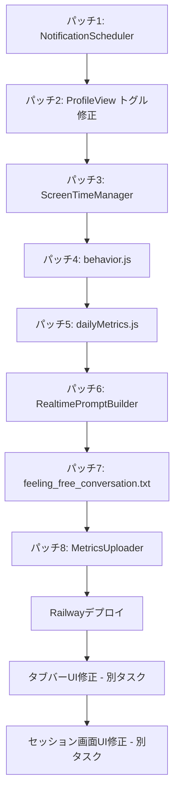

# iOS複数問題修正プラン

このドキュメントには、すべての問題に対する**完全なパッチ**が含まれています。

各パッチはそのまま適用可能です。

---

## 問題一覧

| # | 問題 | ファイル | ステータス |
|---|------|----------|-----------|
| 1 | AlarmKitダイアログが通知許可後に出る | NotificationScheduler.swift | パッチあり |
| 2 | HealthKit/ScreenTime/Motionトグル状態管理 + 即時アップロード | ProfileView.swift | パッチあり |
| 3 | ScreenTimeManager - FamilyControls API未実装 | ScreenTimeManager.swift | パッチあり |
| 4 | behavior.js - Prismaエラー | behavior.js | パッチあり |
| 5 | dailyMetrics.js - Prismaエラー | dailyMetrics.js | パッチあり |
| 6 | RealtimePromptBuilder - common.txt重複 | VoiceSessionController.swift | パッチあり |
| 7 | feeling_free_conversation.txt - 内容不足 | feeling_free_conversation.txt | パッチあり |
| 8 | MetricsUploader - force引数追加 | MetricsUploader.swift | パッチあり |
| 9 | Family Controls警告 | - | コード変更不要（Releaseビルドで解決） |
| 10 | タブバーUIがFigmaと違う | MainTabView.swift | 別途対応 |
| 11 | セッション画面UIがFigmaと違う | SessionView.swift | 別途対応 |

---

## 完全なパッチ

---

### パッチ1: AlarmKitダイアログが通知許可後に出る問題

**ファイル**: `aniccaios/aniccaios/Notifications/NotificationScheduler.swift`

**原因**: `requestAuthorization()`内でAlarmKit許可リクエストが呼ばれている。通知許可とAlarmKit許可は別々に行うべき。

**修正**: AlarmKit許可リクエストを削除する。

```diff
    // MARK: Authorization
    @discardableResult
    func requestAuthorization() async -> Bool {
        do {
            let notificationsGranted = try await center.requestAuthorization(options: [.alert, .sound, .badge])
-#if canImport(AlarmKit)
-            if #available(iOS 26.0, *) {
-                _ = await AlarmKitHabitCoordinator.shared.requestAuthorizationIfNeeded()
-            }
-#endif
            return notificationsGranted
        } catch {
            logger.error("Notification authorization failed: \(error.localizedDescription)")
            return false
        }
    }
```

---

### パッチ2: HealthKit/ScreenTime/Motionトグル状態管理 + 即時アップロード

**ファイル**: `aniccaios/aniccaios/Views/Profile/ProfileView.swift`

**原因**:
1. HealthKitは「Sleep」と「Steps」をまとめて許可するが、トグルは一方のみ更新されていた
2. Motionで「許可しない」を選んでもトグルがオンのまま
3. 許可後にデータが即座にアップロードされない

**修正後のユーザー体験**:
- ユーザーがSleepまたはStepsのトグルをオンにする
- HealthKitの許可シートが表示される
- 「すべてオン」を選択すると、**両方のトグルが自動的にオン**になる
- 許可を拒否すると、**両方のトグルが自動的にオフ**になる
- 許可成功時は**即座にデータがバックエンドにアップロード**される

**修正1**: dataToggleRowの呼び出しを変更

```diff
                    dataToggleRow(
                        title: String(localized: "profile_toggle_screen_time"),
                        isOn: $screenTimeEnabled,
-                       onEnable: { Task { await ScreenTimeManager.shared.requestAuthorization() } }
+                       onEnable: { Task { await requestScreenTimeAndUpdateToggle() } }
                    )
                    divider
                    dataToggleRow(
                        title: String(localized: "profile_toggle_sleep"),
                        isOn: $sleepEnabled,
-                       onEnable: { Task { await HealthKitManager.shared.requestAuthorization() } }
+                       onEnable: { Task { await requestHealthKitAndUpdateToggles() } }
                    )
                    divider
                    dataToggleRow(
                        title: String(localized: "profile_toggle_steps"),
                        isOn: $stepsEnabled,
-                       onEnable: { Task { await HealthKitManager.shared.requestAuthorization() } }
+                       onEnable: { Task { await requestHealthKitAndUpdateToggles() } }
                    )
                    divider
                    dataToggleRow(
                        title: String(localized: "profile_toggle_movement"),
                        isOn: $motionEnabled,
-                       onEnable: { Task { await MotionManager.shared.requestAuthorization() } }
+                       onEnable: { Task { await requestMotionAndUpdateToggle() } }
                    )
```

**修正2**: 以下のメソッドをProfileView構造体内（`deleteAccount()`の後あたり）に追加

```swift
    /// HealthKit許可をリクエストし、成功したらSleepとSteps両方のトグルをオンにする
    private func requestHealthKitAndUpdateToggles() async {
        let granted = await HealthKitManager.shared.requestAuthorization()
        await MainActor.run {
            if granted {
                sleepEnabled = true
                stepsEnabled = true
            } else {
                // 許可が拒否された場合、両方オフにする
                sleepEnabled = false
                stepsEnabled = false
            }
        }
        // 許可された場合、即座にデータをアップロード
        if granted {
            await MetricsUploader.shared.runUploadIfDue(force: true)
        }
    }
    
    /// ScreenTime許可をリクエストし、結果に応じてトグルを更新する
    private func requestScreenTimeAndUpdateToggle() async {
        let granted = await ScreenTimeManager.shared.requestAuthorization()
        await MainActor.run {
            screenTimeEnabled = granted
        }
        if granted {
            await MetricsUploader.shared.runUploadIfDue(force: true)
        }
    }
    
    /// Motion許可をリクエストし、結果に応じてトグルを更新する
    private func requestMotionAndUpdateToggle() async {
        let granted = await MotionManager.shared.requestAuthorization()
        await MainActor.run {
            motionEnabled = granted
        }
        if granted {
            await MetricsUploader.shared.runUploadIfDue(force: true)
        }
    }
```

---

### パッチ3: ScreenTimeManager - FamilyControls API実装

**ファイル**: `aniccaios/aniccaios/Services/ScreenTimeManager.swift`

**原因**: コードがスタブ（placeholder）で、常に`false`を返している

**修正**: ファイル全体を以下に置き換え

```swift
import Foundation
import os
import FamilyControls

@MainActor
final class ScreenTimeManager {
    static let shared = ScreenTimeManager()
    private init() {}
    
    private let logger = Logger(subsystem: "com.anicca.ios", category: "ScreenTimeManager")
    
    struct DailySummary {
        var totalMinutes: Int?
    }
    
    /// Check if Screen Time is authorized
    var isAuthorized: Bool {
        AuthorizationCenter.shared.authorizationStatus == .approved
    }
    
    /// Request Screen Time authorization using FamilyControls API
    func requestAuthorization() async -> Bool {
        do {
            // Request authorization for individual (not child)
            try await AuthorizationCenter.shared.requestAuthorization(for: .individual)
            logger.info("ScreenTime authorization granted")
            return true
        } catch let error as FamilyControlsError {
            switch error {
            case .restricted:
                logger.error("ScreenTime authorization restricted - parental controls may be blocking this")
            case .unavailable:
                logger.error("ScreenTime authorization unavailable - FamilyControls framework not set up")
            case .authorizationCanceled:
                logger.info("ScreenTime authorization canceled by user")
            case .networkError:
                logger.error("ScreenTime authorization failed - network error")
            @unknown default:
                logger.error("ScreenTime authorization failed: \(error)")
            }
            return false
        } catch {
            logger.error("ScreenTime authorization failed: \(error.localizedDescription)")
            return false
        }
    }
    
    func fetchDailySummary() async -> DailySummary {
        // DeviceActivityReport extension is needed to get actual screen time data
        // For now, return nil as placeholder
        return DailySummary(totalMinutes: nil)
    }
}
```

---

### パッチ4: behavior.js - Prismaインポートと使い方の修正

**ファイル**: `apps/api/src/routes/mobile/behavior.js`

**原因**:
- Dynamic importで`client.js`を読み込んでいるが、`.default`が`undefined`
- モデル名が間違い: `dailyMetrics` → `dailyMetric`
- フィールド名が間違い: `screenTimeMinutes` → `snsMinutesTotal`

**修正1**: ファイル先頭のimportにPrismaClientを追加

```diff
import express from 'express';
import baseLogger from '../../utils/logger.js';
import extractUserId from '../../middleware/extractUserId.js';
import { buildContextSnapshot } from '../../modules/realtime/contextSnapshot.js';
import { buildHighlights, buildTimeline, pickTodayInsight } from '../../modules/metrics/stateBuilder.js';
import { generateFutureScenario } from '../../modules/simulation/futureScenario.js';
+import { PrismaClient } from '../../generated/prisma/index.js';

const router = express.Router();
const logger = baseLogger.withContext('MobileBehavior');
+const prisma = new PrismaClient();
```

**修正2**: calculateStreaks関数を以下に置き換え

```javascript
async function calculateStreaks(userId) {
  try {
    // Get last 30 days of metrics
    const thirtyDaysAgo = new Date();
    thirtyDaysAgo.setDate(thirtyDaysAgo.getDate() - 30);
    
    const metrics = await prisma.dailyMetric.findMany({
      where: {
        userId,
        date: { gte: thirtyDaysAgo }
      },
      orderBy: { date: 'desc' }
    });
    
    // Calculate consecutive days for each category
    let wake = 0, screen = 0, workout = 0, rumination = 0;
    
    for (const m of metrics) {
      // Wake streak: has wakeAt recorded
      if (m.wakeAt) wake++;
      else break;
    }
    
    // Reset and calculate screen streak
    for (const m of metrics) {
      if (m.snsMinutesTotal !== null && m.snsMinutesTotal < 180) screen++;
      else break;
    }
    
    // Workout streak: steps >= 5000
    for (const m of metrics) {
      if (m.steps !== null && m.steps >= 5000) workout++;
      else break;
    }
    
    // Rumination streak: check mindSummary for low rumination
    for (const m of metrics) {
      // mindSummary is JSON, extract rumination value if exists
      const ruminationValue = m.mindSummary?.rumination;
      if (typeof ruminationValue === 'number' && ruminationValue < 0.5) rumination++;
      else break;
    }
    
    return { wake, screen, workout, rumination };
  } catch (e) {
    logger.warn('Failed to calculate streaks', e);
    return { wake: 0, screen: 0, workout: 0, rumination: 0 };
  }
}
```

---

### パッチ5: dailyMetrics.js - モデル名とフィールド名の修正

**ファイル**: `apps/api/src/routes/mobile/dailyMetrics.js`

**原因**:
- モデル名が間違い: `dailyMetrics` → `dailyMetric`
- フィールド名がスキーマと一致しない

**DailyMetricスキーマの正しいフィールド名**:
```
userId, date, sleepDurationMin, sleepStartAt, wakeAt, snsMinutesTotal, 
snsMinutesNight, steps, sedentaryMinutes, activitySummary, mindSummary, 
insights, createdAt, updatedAt
```

**修正**: ファイル全体を以下に置き換え

```javascript
import express from 'express';
import baseLogger from '../../utils/logger.js';
import extractUserId from '../../middleware/extractUserId.js';
import { PrismaClient } from '../../generated/prisma/index.js';

const prisma = new PrismaClient();
const router = express.Router();
const logger = baseLogger.withContext('DailyMetrics');

// POST /api/mobile/daily_metrics
router.post('/', async (req, res) => {
  const deviceId = (req.get('device-id') || '').toString().trim();
  const userId = await extractUserId(req, res);
  if (!userId) return;

  try {
    const {
      date,
      sleep_minutes,
      steps,
      screen_time_minutes,
      sedentary_minutes
    } = req.body;

    // Upsert daily_metrics for this user + date
    const parsedDate = new Date(date);
    const startOfDay = new Date(parsedDate.toISOString().split('T')[0] + 'T00:00:00Z');

    await prisma.dailyMetric.upsert({
      where: {
        userId_date: {
          userId,
          date: startOfDay
        }
      },
      update: {
        sleepDurationMin: sleep_minutes ?? null,
        steps: steps ?? null,
        snsMinutesTotal: screen_time_minutes ?? null,
        sedentaryMinutes: sedentary_minutes ?? null,
        updatedAt: new Date()
      },
      create: {
        userId,
        date: startOfDay,
        sleepDurationMin: sleep_minutes ?? null,
        steps: steps ?? null,
        snsMinutesTotal: screen_time_minutes ?? null,
        sedentaryMinutes: sedentary_minutes ?? null
      }
    });

    logger.info(`Saved daily_metrics for user ${userId} on ${date}`);
    return res.status(200).json({ success: true });
  } catch (e) {
    logger.error('Failed to save daily_metrics', e);
    return res.status(500).json({ error: 'Internal server error' });
  }
});

export default router;
```

---

### パッチ6: RealtimePromptBuilder - [Profile]セクションを削除

**ファイル**: `aniccaios/aniccaios/VoiceSessionController.swift`

**原因**: `RealtimePromptBuilder.buildFeelingInstructions`で`HabitPromptBuilder.buildPrompt()`を呼んでいるが、これにも`common.txt`が含まれるため重複する。

**正しい構成**:
```
1. common.txt（言語設定、ユーザー情報、話し方のルール）
2. talk_session.txt（Aniccaの役割、禁止事項）
3. feeling_xxx.txt（感情別のopener）
```

**修正**: `RealtimePromptBuilder`全体を以下に置き換え

```swift
private enum RealtimePromptBuilder {
    static func buildFeelingInstructions(topic: FeelingTopic, profile: UserProfile) -> String {
        let openerName: String = {
            switch topic {
            case .selfLoathing: return "feeling_self_loathing"
            case .anxiety: return "feeling_anxiety"
            case .irritation: return "feeling_irritation"
            case .freeConversation: return "feeling_free_conversation"
            }
        }()
        let opener = (load(name: openerName, ext: "txt") ?? "").trimmingCharacters(in: .whitespacesAndNewlines)
        
        let commonTemplate = (load(name: "common", ext: "txt") ?? "").trimmingCharacters(in: .whitespacesAndNewlines)
        let talkTemplate = (load(name: "talk_session", ext: "txt") ?? "").trimmingCharacters(in: .whitespacesAndNewlines)
        
        // common.txt + talk_session.txt + feeling_xxx.txt を結合
        let mergedTemplate = "\(commonTemplate)\n\n\(talkTemplate)\n\n\(opener)"
        
        // 変数置換を実行
        let rendered = renderTemplate(mergedTemplate, profile: profile)
        return rendered
    }

    private static func load(name: String, ext: String) -> String? {
        guard let url = Bundle.main.url(forResource: name, withExtension: ext) else { return nil }
        return try? String(contentsOf: url, encoding: .utf8)
    }
    
    private static func renderTemplate(_ template: String, profile: UserProfile) -> String {
        var result = template
        
        // 言語設定
        result = result.replacingOccurrences(of: "${LANGUAGE_LINE}", with: profile.preferredLanguage.languageLine)
        
        // ユーザー名
        let userName = profile.displayName.isEmpty
            ? NSLocalizedString("common_user_fallback", comment: "")
            : profile.displayName
        result = result.replacingOccurrences(of: "${USER_NAME}", with: userName)
        
        // 時刻
        let timeString = Date().formatted(.dateTime.hour().minute())
        result = result.replacingOccurrences(of: "${TASK_TIME}", with: timeString)
        result = result.replacingOccurrences(of: "${TASK_DESCRIPTION}", with: "Talk Session")
        
        // 理想の自分
        if !profile.idealTraits.isEmpty {
            result = result.replacingOccurrences(of: "${IDEAL_TRAITS}", with: profile.idealTraits.joined(separator: ", "))
        } else {
            result = result.replacingOccurrences(of: "${IDEAL_TRAITS}", with: "")
        }
        
        // 問題・課題
        if !profile.problems.isEmpty {
            let localizedProblems = profile.problems.map { NSLocalizedString("problem_\($0)", comment: "") }
            result = result.replacingOccurrences(of: "${PROBLEMS}", with: localizedProblems.joined(separator: ", "))
        } else {
            result = result.replacingOccurrences(of: "${PROBLEMS}", with: "")
        }
        
        // 未置換のプレースホルダーを削除
        let placeholderPattern = "\\$\\{[^}]+\\}"
        if let regex = try? NSRegularExpression(pattern: placeholderPattern, options: []) {
            result = regex.stringByReplacingMatches(in: result, options: [], range: NSRange(location: 0, length: result.utf16.count), withTemplate: "")
        }
        
        return result
    }
}
```

---

### パッチ7: feeling_free_conversation.txt の改善

**ファイル**: `aniccaios/aniccaios/Resources/Prompts/feeling_free_conversation.txt`

**原因**: 現在の内容が短すぎて、「どうしたの？」と聞く指示がない。

**修正**: ファイル全体を以下に置き換え

```txt
[Feeling: free_conversation]

The user has chosen "Something else" - they may be experiencing feelings that don't fit into specific categories, or they may not be able to name what they're feeling.

Your opening approach:
1. Start with a warm, gentle greeting
2. Ask openly what's on their mind: "What's going on?" / "What's on your mind?" / "Tell me what you're feeling"
3. Let them know there's no pressure to label their emotions

Important guidelines:
- Listen more than you speak
- Don't assume what they're feeling - let them tell you
- Validate whatever they share, even if it seems unclear or contradictory
- If they struggle to articulate, gently help them explore: "Can you describe what that feels like?"
- The user may be in distress but unable to categorize it - be patient and supportive
- Follow their lead in the conversation

Remember: Your role is to be a supportive, non-judgmental listener. They chose "something else" because the predefined options didn't fit - honor that by staying open to whatever they bring.
```

---

### パッチ8: MetricsUploader - force引数追加

**ファイル**: `aniccaios/aniccaios/Services/MetricsUploader.swift`

**原因**: 現在の`runUploadIfDue()`は「今日既にアップロード済み」の場合にスキップする。トグルをオンにした直後は強制的にアップロードしたい。

**修正**: `runUploadIfDue`メソッドを以下に変更

```diff
-   func runUploadIfDue() async {
+   func runUploadIfDue(force: Bool = false) async {
        // Skip if not signed in
        guard case .signedIn(let credentials) = AppState.shared.authStatus else {
            logger.info("Skipping metrics upload: not signed in")
            return
        }
        
-       // Check if already uploaded today
-       let lastUpload = UserDefaults.standard.object(forKey: lastUploadKey) as? Date
-       if let last = lastUpload, Calendar.current.isDateInToday(last) {
-           logger.info("Already uploaded today, skipping")
-           return
+       // Check if already uploaded today (unless force is true)
+       if !force {
+           let lastUpload = UserDefaults.standard.object(forKey: lastUploadKey) as? Date
+           if let last = lastUpload, Calendar.current.isDateInToday(last) {
+               logger.info("Already uploaded today, skipping")
+               return
+           }
        }
        
        // ... 以下同じ（データ取得とアップロード処理）
    }
```

---

## コード変更不要の問題

### Family Controls (Distribution)の警告

**原因**: Debug/Stagingスキームでビルドしているため、Development用プロファイルが使われている。

**解決方法**:
- **Release**スキームでビルドすれば、Distribution用プロファイルが自動的に使われる
- App Store/TestFlight提出時は問題なし
- Development用のチェックを外す必要はない（開発時に必要）

---

## 別途対応が必要な問題

### タブバーUI（Figmaデザイン準拠）

**ファイル**: `aniccaios/aniccaios/MainTabView.swift`

Figmaデザインの特徴:
- 背景色: `#fdfcfc`
- 上部ボーダー: `rgba(200,198,191,0.2)`
- 選択中タブ: 丸い背景 `#e9e6e0`、ラベル太字
- 非選択タブ: 背景なし、テキスト色 `#898783`
- カスタムSVGアイコン

→ カスタムタブバーコンポーネントの実装が必要（大規模変更のため別タスク）

### セッション画面UI（Figmaデザイン準拠）

**ファイル**: `aniccaios/aniccaios/Views/Session/SessionView.swift`

Figmaデザインの特徴:
- フルスクリーン（タブバーなし）
- 上部にトピックピル
- 中央に大きなグラデーションOrb
- 左下: マイクボタン、右下: 閉じるボタン（赤）

→ UIの大規模変更のため別タスク

---

## 実装順序



---

## To-dos

- [ ] パッチ1: NotificationSchedulerからAlarmKit許可リクエストを削除
- [ ] パッチ2: ProfileViewのトグル状態管理と即時アップロードを実装
- [ ] パッチ3: ScreenTimeManagerにFamilyControls APIを実装
- [ ] パッチ4: behavior.jsのPrismaインポートとモデル名を修正
- [ ] パッチ5: dailyMetrics.jsのモデル名とフィールド名を修正
- [ ] パッチ6: RealtimePromptBuilderから[Profile]セクションを削除
- [ ] パッチ7: feeling_free_conversation.txtを改善
- [ ] パッチ8: MetricsUploaderにforce引数を追加
- [ ] 変更をRailwayにデプロイ
- [ ] タブバーUIをFigmaデザインに準拠させる（別タスク）
- [ ] セッション画面UIをFigmaデザインに準拠させる（別タスク）

---

## データが表示されない理由（補足）

調査した結果：

1. **バックエンドのPrismaエラー**: インポートが間違っていて`prisma`が`undefined`になっている（パッチ4, 5で解決）
2. **即時アップロードがない**: 許可後にデータがすぐにアップロードされない（パッチ2, 8で解決）

HealthKitの過去データ取得の仕様:
- **Sleep**: 過去データ取得可能（HealthKit経由）
- **Steps**: 過去データ取得可能（HealthKit経由）
- **Motion**: 許可時点からのみ（CoreMotion）
- **ScreenTime**: 許可時点からのみ（DeviceActivity）

パッチ適用後、トグルをオンにすると即座にデータがバックエンドにアップロードされ、Behaviorタブに表示されるようになります。