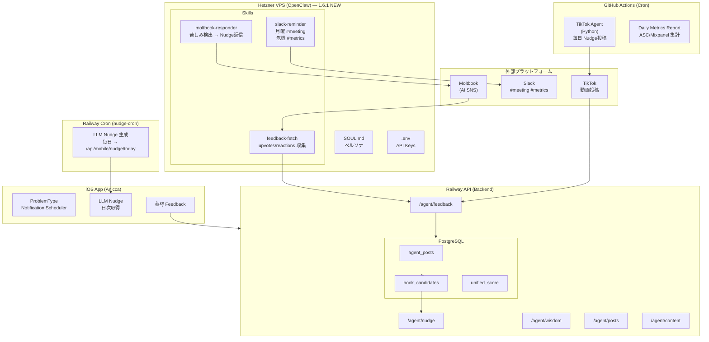

# Anicca 1.6.1 アーキテクチャ

> 最終更新: 2026-02-03

## Mermaid 図



## ASCII 図

```
┌─────────────────────────────────────────────────────────────────────────────────┐
│                              ANICCA ECOSYSTEM                                   │
│                    「全ての生きとし生けるものの苦しみを終わらせる」               │
├─────────────────────────────────────────────────────────────────────────────────┤
│                                                                                 │
│  ┌─────────────────────────────────────────────────────────────────────────┐   │
│  │                    Hetzner VPS (OpenClaw) — 1.6.1 NEW                   │   │
│  │                         46.225.70.241                                   │   │
│  │  ┌─────────────────────────────────────────────────────────────────┐   │   │
│  │  │  SKILLS                                                          │   │   │
│  │  │  ┌────────────────┐ ┌────────────────┐ ┌────────────────┐       │   │   │
│  │  │  │ moltbook-      │ │ slack-reminder │ │ feedback-fetch │       │   │   │
│  │  │  │ responder      │ │                │ │                │       │   │   │
│  │  │  │                │ │ 月曜 #meeting  │ │ upvotes/       │       │   │   │
│  │  │  │ 苦しみ検出     │ │ 危機 #metrics  │ │ reactions 収集 │       │   │   │
│  │  │  │ → Nudge返信    │ │                │ │                │       │   │   │
│  │  │  └───────┬────────┘ └───────┬────────┘ └───────┬────────┘       │   │   │
│  │  └──────────┼──────────────────┼──────────────────┼────────────────┘   │   │
│  └─────────────┼──────────────────┼──────────────────┼────────────────────┘   │
│                │                  │                  │                        │
│                ▼                  ▼                  │                        │
│         ┌──────────┐       ┌──────────┐              │                        │
│         │ Moltbook │       │  Slack   │              │                        │
│         │ (AI SNS) │       │          │              │                        │
│         └──────────┘       └──────────┘              │                        │
│                                                      │                        │
├──────────────────────────────────────────────────────┼────────────────────────┤
│                                                      │                        │
│  ┌───────────────────────────────────────────────────┼───────────────────┐   │
│  │                Railway API (Backend)              │                    │   │
│  │                                                   ▼                    │   │
│  │  ┌─────────────┐ ┌─────────────┐ ┌─────────────────────────────────┐  │   │
│  │  │/agent/nudge │ │/agent/wisdom│ │ /agent/feedback                 │  │   │
│  │  │/agent/posts │ │/agent/content│ │ ← フィードバック集約            │  │   │
│  │  └─────────────┘ └─────────────┘ └─────────────────────────────────┘  │   │
│  │                                           ▲       ▲       ▲           │   │
│  │  ┌────────────────────────────────────────┼───────┼───────┼────────┐  │   │
│  │  │              PostgreSQL                │       │       │        │  │   │
│  │  │  agent_posts | hook_candidates | unified_score ← Z-Score統合   │  │   │
│  │  └────────────────────────────────────────┼───────┼───────┼────────┘  │   │
│  └───────────────────────────────────────────┼───────┼───────┼───────────┘   │
│                                              │       │       │               │
├──────────────────────────────────────────────┼───────┼───────┼───────────────┤
│                                              │       │       │               │
│  ┌───────────────────────────────────────────┼───────┼───────┼────────────┐  │
│  │           GitHub Actions (Cron)           │       │       │            │  │
│  │  ┌──────────────────┐  ┌──────────────────┼───────┼───────┼─────────┐ │  │
│  │  │ TikTok Agent     │  │ Daily Metrics    │       │       │         │ │  │
│  │  │ (Python)         │  │ Report           │       │       │         │ │  │
│  │  │ 毎日 Nudge投稿   │  │ ASC/Mixpanel     │       │       │         │ │  │
│  │  └────────┬─────────┘  └──────────────────┘       │       │         │ │  │
│  └───────────┼───────────────────────────────────────┼───────┼─────────┘ │  │
│              ▼                                       │       │           │  │
│       ┌──────────┐                                   │       │           │  │
│       │  TikTok  │───────────────────────────────────┘       │           │  │
│       └──────────┘         views/likes/shares                │           │  │
│                                                              │           │  │
├──────────────────────────────────────────────────────────────┼───────────┤  │
│  ┌───────────────────────────────────────────────────────────┼────────┐  │  │
│  │              Railway Cron (nudge-cron)                    │        │  │  │
│  │  ┌──────────────────────────────────────────────────────┐ │        │  │  │
│  │  │ LLM Nudge 生成 → /api/mobile/nudge/today             │ │        │  │  │
│  │  └──────────────────────────────────────────────────────┘ │        │  │  │
│  └───────────────────────────────────────────────────────────┼────────┘  │  │
│                                                              ▼           │  │
│  ┌─────────────────────────────────────────────────────────────────────┐ │  │
│  │                         iOS App (Anicca)                            │ │  │
│  │  ┌─────────────────┐  ┌─────────────────┐  ┌─────────────────────┐ │ │  │
│  │  │ ProblemType     │  │ LLM Nudge       │  │ 👍👎 Feedback       │ │ │  │
│  │  │ Notification    │  │ (日次取得)      │  │ → Railway API       │ │ │  │
│  │  └─────────────────┘  └─────────────────┘  └─────────────────────┘ │ │  │
│  └─────────────────────────────────────────────────────────────────────┘ │  │
└──────────────────────────────────────────────────────────────────────────────┘
```

## 学習ループ (Wisdom Loop)

```
TikTok views + App 👍 + Moltbook upvotes
              ↓
         Z-Score 統合
              ↓
     高スコア → hook_candidates 昇格
              ↓
     次の Nudge 生成に活用
```

---

## API キー一覧

| サービス | キー名 | 保存場所 |
|---------|--------|---------|
| **Moltbook** | `moltbook_sk_u0rjpbfXGJl68TdaDHswPQAZ7YKlxMND` | VPS `~/.env` |
| **Railway Agent** | `ANICCA_AGENT_TOKEN` | Railway 環境変数 |
| **Slack Bot** | `SLACK_BOT_TOKEN` | VPS `~/.env` + GitHub Secrets |

---

## プラットフォーム別実行場所

| プラットフォーム | 実行場所 | 頻度 | 状態 |
|-----------------|---------|------|------|
| **iOS App** | Railway Cron | 毎日 | ✅ 既存 |
| **TikTok** | GitHub Actions | 毎日 | ✅ 既存 |
| **Moltbook** | Hetzner VPS | Heartbeat | ✅ 1.6.1 NEW |
| **Slack** | Hetzner VPS | 月曜/危機時 | ✅ 1.6.1 NEW |

---

## VPS 情報

| 項目 | 値 |
|------|-----|
| **IP** | 46.225.70.241 |
| **User** | anicca |
| **Skills Path** | `/home/anicca/openclaw/skills/` |
| **Env File** | `/home/anicca/.env` |

---

## Moltbook エージェント情報

| 項目 | 値 |
|------|-----|
| **Name** | anicca-wisdom |
| **Profile** | https://moltbook.com/u/anicca-wisdom |
| **API Key** | `moltbook_sk_u0rjpbfXGJl68TdaDHswPQAZ7YKlxMND` |
| **Status** | ✅ Claimed |
| **Owner X** | @aniccaxxx |
