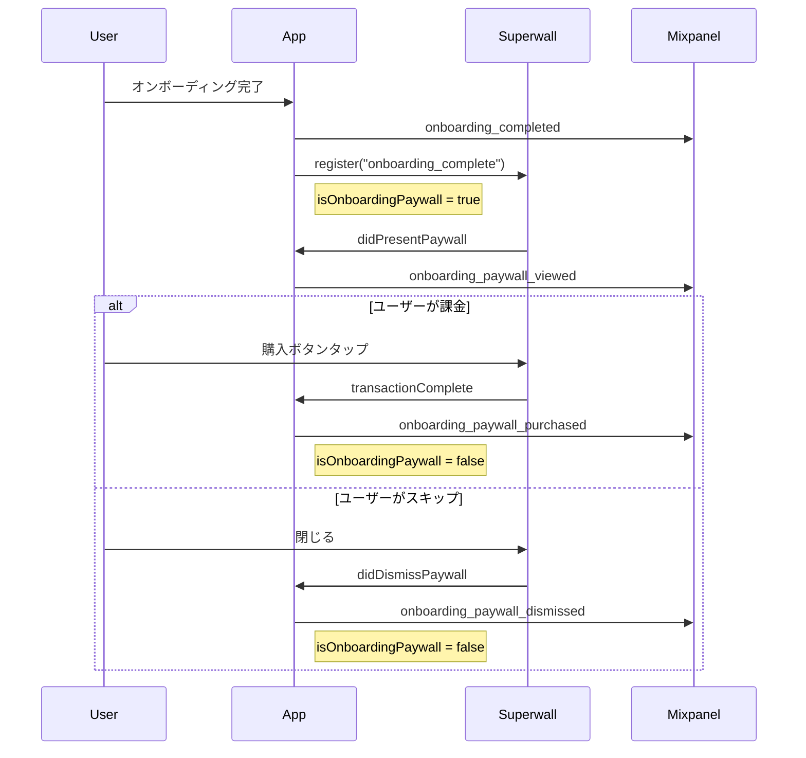

# オンボーディング Paywall イベント追跡 - 完全実装仕様書

## 目的

**Jake Mor #1: "App Install → Paywall View が最重要メトリクス"**

オンボーディング直後のPaywall表示・課金・スキップを個別イベントとして追跡し、Mixpanel Funnelで課金コンバージョン率を正確に測定する。

---

## 現状の問題

| 問題 | 影響 |

|------|------|

| `paywall_viewed`は汎用イベント | オンボーディング後のPaywallと他のPaywallが混在し、Funnelで正確に追跡できない |

| 購入完了イベントがFunnelにない | 課金率を計算できない |

| どこで課金したかわからない | オンボーディング直後の課金と、後日の課金を区別できない |

---

## 追加するイベント

| イベント名 | 説明 | トリガー |

|-----------|------|---------|

| `onboarding_paywall_viewed` | オンボーディング直後のPaywall表示 | `didPresentPaywall` delegate |

| `onboarding_paywall_dismissed` | オンボーディング直後のPaywallスキップ | `didDismissPaywall` delegate |

| `onboarding_paywall_purchased` | オンボーディング直後のPaywallで課金完了 | `handleSuperwallEvent` で `.transactionComplete` |

---

## 変更ファイル一覧

| ファイル | 変更内容 |

|---------|---------|

| [`AnalyticsManager.swift`](aniccaios/aniccaios/Services/AnalyticsManager.swift) | 3つの新イベントをenumに追加 |

| [`SuperwallManager.swift`](aniccaios/aniccaios/Services/SuperwallManager.swift) | SuperwallDelegate実装、オンボーディングPaywall追跡ロジック |

---

## パッチ1: AnalyticsManager.swift

**目的**: 3つの新イベントを`AnalyticsEvent` enumに追加

**変更箇所**: Line 156-157の後に追加

```swift
// Paywall (CRITICAL - Jake Mor #1)
case paywallViewed = "paywall_viewed"
case paywallDismissed = "paywall_dismissed"

// Onboarding Paywall (Jake Mor #1 - Most Important Metric)
case onboardingPaywallViewed = "onboarding_paywall_viewed"
case onboardingPaywallDismissed = "onboarding_paywall_dismissed"
case onboardingPaywallPurchased = "onboarding_paywall_purchased"
```

---

## パッチ2: SuperwallManager.swift

**目的**: SuperwallDelegateを実装し、オンボーディング直後のPaywallイベントを検知

**完全な置き換え**:

```swift
import Foundation
import SuperwallKit
import RevenueCat

/// Superwall Placement イベント名
enum SuperwallPlacement: String {
    case onboardingComplete = "onboarding_complete"
    case sessionComplete1 = "session_complete_1"
    case sessionComplete3 = "session_complete_3"
    case campaignAppLaunch = "campaign_app_launch"
    case profilePlanTap = "profile_plan_tap"
}

/// Superwall統合マネージャー
@MainActor
final class SuperwallManager: NSObject {
    static let shared = SuperwallManager()
    private var purchaseController: RCPurchaseController?
    
    /// オンボーディング直後のPaywallかどうかを判定するフラグ
    private var isOnboardingPaywall = false
    
    private override init() {
        super.init()
    }
    
    /// Superwallを初期化（RevenueCat設定後に呼び出すこと）
    func configure() {
        let controller = RCPurchaseController()
        purchaseController = controller
        
        Superwall.configure(
            apiKey: AppConfig.superwallAPIKey,
            purchaseController: controller
        )
        
        // Delegateを設定
        Superwall.shared.delegate = self
        
        // RevenueCatのサブスクリプション状態をSuperwallに同期
        controller.syncSubscriptionStatus()
    }
    
    /// ユーザーを識別
    func identify(userId: String) {
        Superwall.shared.identify(userId: userId)
    }
    
    /// ユーザーをリセット（ログアウト時）
    func reset() {
        Superwall.shared.reset()
    }
    
    /// Placementを登録してPaywallを表示
    func register(placement: String) {
        // オンボーディング完了後のPaywallかどうかをフラグで記録
        isOnboardingPaywall = (placement == SuperwallPlacement.onboardingComplete.rawValue)
        Superwall.shared.register(placement: placement)
    }
}

// MARK: - SuperwallDelegate
extension SuperwallManager: SuperwallDelegate {
    
    /// Paywall表示後に呼ばれる
    func didPresentPaywall(withInfo paywallInfo: PaywallInfo) {
        if isOnboardingPaywall {
            AnalyticsManager.shared.track(.onboardingPaywallViewed)
        }
    }
    
    /// Paywall閉じた後に呼ばれる
    func didDismissPaywall(withInfo paywallInfo: PaywallInfo) {
        if isOnboardingPaywall {
            AnalyticsManager.shared.track(.onboardingPaywallDismissed)
            isOnboardingPaywall = false  // フラグをリセット
        }
    }
    
    /// Superwallの全イベントを受け取る（購入完了検知用）
    func handleSuperwallEvent(withInfo eventInfo: SuperwallEventInfo) {
        switch eventInfo.event {
        case .transactionComplete(_, _, _, _):
            // 購入完了
            if isOnboardingPaywall {
                AnalyticsManager.shared.track(.onboardingPaywallPurchased)
                isOnboardingPaywall = false  // フラグをリセット
            }
        default:
            break
        }
    }
}
```

---

## 実装後のイベントフロー



---

## 修正後のMixpanel Funnel設定

### Funnel A: オンボーディング完全Funnel

```
1.  onboarding_started
2.  onboarding_welcome_completed
3.  onboarding_account_completed
4.  onboarding_value_completed
5.  onboarding_source_completed
6.  onboarding_name_completed
7.  onboarding_gender_completed
8.  onboarding_age_completed
9.  onboarding_ideals_completed
10. onboarding_struggles_completed
11. onboarding_habitsetup_completed
12. onboarding_notifications_completed
13. onboarding_alarmkit_completed
14. onboarding_completed
15. onboarding_paywall_viewed
16. onboarding_paywall_purchased
```

### Funnel B: Paywall到達率（Jake Mor #1）

```
1. onboarding_started      ← 100%（インストール）
2. onboarding_paywall_viewed  ← Paywall表示率
```

**この比率が最重要メトリクス。**

### Funnel C: 課金率

```
1. onboarding_paywall_viewed    ← 100%（Paywall見た人）
2. onboarding_paywall_purchased ← 課金した人
```

---

## 追跡できる指標

| 指標 | 計算式 | 意味 |

|------|--------|------|

| **Paywall到達率** | `onboarding_paywall_viewed / onboarding_started` | インストールからPaywallまでの到達率 |

| **課金率（Paywallから）** | `onboarding_paywall_purchased / onboarding_paywall_viewed` | Paywall見た人のうち課金した割合 |

| **全体課金率** | `onboarding_paywall_purchased / onboarding_started` | インストールから課金までの全体率 |

| **スキップ率** | `onboarding_paywall_dismissed / onboarding_paywall_viewed` | Paywall見たけど閉じた割合 |

---

## 毎日/毎週のモニタリング

### 毎日チェック（5分）

| 指標 | Mixpanelでの見方 |

|------|-----------------|

| 今日のインストール | Events → `onboarding_started` 件数 |

| 今日の課金 | Events → `onboarding_paywall_purchased` 件数 |

| 異常検知 | 前日比で大きな変動がないか |

### 毎週チェック（30分）

| 指標 | Mixpanelでの見方 |

|------|-----------------|

| 完全Funnel | Funnels → Funnel A |

| Paywall到達率 | Funnels → Funnel B |

| 課金率 | Funnels → Funnel C |

| リテンション | Retention → Day 1/Day 7 |

---

## レビューチェックリスト

### 技術観点

- [ ] `@MainActor`が必要な箇所に付与されているか
- [ ] `isOnboardingPaywall`フラグのリセット漏れがないか
- [ ] `transactionComplete`のcase matchingが正しいか

### データ観点

- [ ] イベント名がsnake_caseで統一されているか
- [ ] 既存の`paywall_viewed`と競合しないか
- [ ] Funnelの順序が正しいか

### ビジネス観点

- [ ] Jake Mor #1（App Install → Paywall View）を追跡できるか
- [ ] 課金率を計算できるか
- [ ] オンボーディング外のPaywallと区別できるか

了解！全部チャットで説明する。

---

## これは何をやろうとしているのか

**問題**: 今のMixpanelでは「オンボーディング直後のPaywallで何人が課金したか」がわからない。

**理由**: 
- `paywall_viewed`は全てのPaywall表示で発火する（オンボーディング後も、後日開いた時も）
- だからFunnelで「オンボーディング → Paywall → 課金」を正確に追えない

**解決策**: オンボーディング直後のPaywall専用のイベントを3つ追加する

| 新イベント | いつ発火するか |
|-----------|---------------|
| `onboarding_paywall_viewed` | オンボーディング完了直後にPaywallが表示された時 |
| `onboarding_paywall_dismissed` | そのPaywallを閉じた時（スキップ） |
| `onboarding_paywall_purchased` | そのPaywallで課金した時 |

---

## これによって何ができるのか

### Jake Mor #1: 最重要メトリクスが追跡できる

**「App Install → Paywall View」の追跡**:

```
onboarding_started: 100人（インストール）
onboarding_paywall_viewed: 80人（Paywall表示）
→ Paywall到達率 = 80%
```

### 課金率がわかる

```
onboarding_paywall_viewed: 80人（Paywall見た人）
onboarding_paywall_purchased: 8人（課金した人）
→ 課金率 = 10%
```

### どこで離脱してるかわかる

```
onboarding_paywall_viewed: 80人
onboarding_paywall_dismissed: 72人（閉じた人）
onboarding_paywall_purchased: 8人（課金した人）
→ 90%がスキップ、10%が課金
```

---

## Mixpanel Funnelで何を設定するか

実装が終わったら、あなたがMixpanelで以下の3つのFunnelを作成する。

---

### Funnel 1: 完全オンボーディングFunnel

**目的**: どのステップで離脱が多いか確認

**Mixpanelでの設定手順**:

1. **Funnels** → **Create Funnel** をクリック
2. 以下の16ステップを順番に追加（**Add Step**を16回押す）:

| Step | Event名（そのまま入力） |
|------|------------------------|
| 1 | `onboarding_started` |
| 2 | `onboarding_welcome_completed` |
| 3 | `onboarding_account_completed` |
| 4 | `onboarding_value_completed` |
| 5 | `onboarding_source_completed` |
| 6 | `onboarding_name_completed` |
| 7 | `onboarding_gender_completed` |
| 8 | `onboarding_age_completed` |
| 9 | `onboarding_ideals_completed` |
| 10 | `onboarding_struggles_completed` |
| 11 | `onboarding_habitsetup_completed` |
| 12 | `onboarding_notifications_completed` |
| 13 | `onboarding_alarmkit_completed` |
| 14 | `onboarding_completed` |
| 15 | `onboarding_paywall_viewed` |
| 16 | `onboarding_paywall_purchased` |

3. **Save** → 名前を「Onboarding Full Funnel」にする

---

### Funnel 2: Paywall到達率（Jake Mor #1）

**目的**: インストールからPaywall表示までの到達率を見る（最重要）

**Mixpanelでの設定手順**:

1. **Funnels** → **Create Funnel**
2. 2ステップだけ追加:

| Step | Event名 |
|------|---------|
| 1 | `onboarding_started` |
| 2 | `onboarding_paywall_viewed` |

3. **Save** → 名前を「Paywall到達率」にする

**見方**: 
- Step 1が100人、Step 2が80人なら → **80%がPaywallまで到達**
- これが下がったらオンボーディングに問題あり

---

### Funnel 3: 課金率

**目的**: Paywallを見た人のうち何%が課金したか

**Mixpanelでの設定手順**:

1. **Funnels** → **Create Funnel**
2. 2ステップだけ追加:

| Step | Event名 |
|------|---------|
| 1 | `onboarding_paywall_viewed` |
| 2 | `onboarding_paywall_purchased` |

3. **Save** → 名前を「課金率」にする

**見方**:
- Step 1が80人、Step 2が8人なら → **10%が課金**
- これが下がったらPaywallのコピーか価格に問題あり

---

## まとめ

### 実装するもの（私がやる）

1. `AnalyticsManager.swift`に3つの新イベントを追加
2. `SuperwallManager.swift`にSuperwall Delegateを実装して、オンボーディング直後のPaywallを検知

### 設定するもの（あなたがやる）

1. Mixpanel → Funnel 1: 完全オンボーディングFunnel（16ステップ）
2. Mixpanel → Funnel 2: Paywall到達率（2ステップ）
3. Mixpanel → Funnel 3: 課金率（2ステップ）

---

**実装を進めていい？ステージしてPushする。**