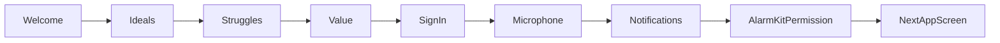

# v3（SwiftUI）をスクショ完全一致にする計画

> **⚠️ 適用順序**
> 1. **v-3d6f8d-ea22e1e8.plan.md を先に適用**（SDP修正、Session/Profile/Talk/Behavior、Backend）
> 2. **このファイル (v-49d956) を後に適用**（Onboarding画面、Localizable.strings、InfoPlist.strings）
>
> 両プランは**異なるファイル**を対象としているため、順番を守れば競合なし。

## 対象（確定）

- 対象実装: iOSアプリ（SwiftUI）`aniccaios/aniccaios`（HTMLは仕様参照）
- Ideals/Struggles: **Skip削除＋最低1つ選択必須**（未選択ならNext無効）

## 仕様ソース（正）

- UI/コピー基準: [`/.cursor/plans/v3/v3-ui.md`](/Users/cbns03/Downloads/anicca-project/.cursor/plans/v3/v3-ui.md) と [`/.cursor/plans/v3/screens`](/Users/cbns03/Downloads/anicca-project/.cursor/plans/v3/screens)
- Quote仕様: [`/.cursor/plans/v3/quotes-v3.md`](/Users/cbns03/Downloads/anicca-project/.cursor/plans/v3/quotes-v3.md)（現状は**バックエンドではなくローカル固定**）

## 実装タスク（抜け漏れ防止のため画面単位）

### A. Welcome画面（改行・2段落・完全一致）

- 変更先: [`aniccaios/aniccaios/Onboarding/WelcomeStepView.swift`](/Users/cbns03/Downloads/anicca-project/aniccaios/aniccaios/Onboarding/WelcomeStepView.swift) と [`aniccaios/aniccaios/Resources/*/Localizable.strings`](/Users/cbns03/Downloads/anicca-project/aniccaios/aniccaios/Resources/en.lproj/Localizable.strings)
- 内容:
  - タイトルを **"Welcome to\nAnicca"** に（現状3行崩れを修正）
  - サブを2段落に:
    - 1段落: `Anicca is your voice coach guiding`
    - 2段落: `your actions and mind.`

### B. Value（What Anicca Can Do）コピーを1行に揃える

- 変更先: [`aniccaios/aniccaios/Onboarding/ValueStepView.swift`](/Users/cbns03/Downloads/anicca-project/aniccaios/aniccaios/Onboarding/ValueStepView.swift) と `Localizable.strings`
- 内容:
  - `Support when you're struggling` → **`Guide your struggles`**
  - `Build better habits` → **`Help you build better habits`**
  - いずれも**1行に収まる**よう文言を短く

### C. Ideals / Struggles（レイアウトをHTMLと同じ“行構成”に・必須選択）

- 変更先:
  - [`aniccaios/aniccaios/Onboarding/IdealsStepView.swift`](/Users/cbns03/Downloads/anicca-project/aniccaios/aniccaios/Onboarding/IdealsStepView.swift)
  - [`aniccaios/aniccaios/Onboarding/StrugglesStepView.swift`](/Users/cbns03/Downloads/anicca-project/aniccaios/aniccaios/Onboarding/StrugglesStepView.swift)
  - 参照: [`/.cursor/plans/v3/screens/ideals.html`](/Users/cbns03/Downloads/anicca-project/.cursor/plans/v3/screens/ideals.html), [`/.cursor/plans/v3/screens/struggles.html`](/Users/cbns03/Downloads/anicca-project/.cursor/plans/v3/screens/struggles.html)
- 内容:
  - `LazyVGrid(.adaptive)` をやめ、HTML通りの**行（row）配列**でレンダリング（スクショの並び/折返しを固定）
  - 下部 `Skip` を削除し `Next` のみ
  - `Next` は `selected.isEmpty` の間 **disabled**（最低1つ必須）

### D. Sign in with Apple 画面（タイトルだけ変更）

- 変更先: [`aniccaios/aniccaios/Onboarding/AuthenticationStepView.swift`](/Users/cbns03/Downloads/anicca-project/aniccaios/aniccaios/Onboarding/AuthenticationStepView.swift) と `Localizable.strings`
- 内容:
  - `onboarding_account_title` を **`Save Your Progress`** に変更（他は触らない）

### E. Microphone / Notifications 権限画面（不要な “Not allowed.” 表示削除）

- 変更先:
  - [`aniccaios/aniccaios/Onboarding/MicrophonePermissionStepView.swift`](/Users/cbns03/Downloads/anicca-project/aniccaios/aniccaios/Onboarding/MicrophonePermissionStepView.swift)
  - [`aniccaios/aniccaios/Onboarding/NotificationPermissionStepView.swift`](/Users/cbns03/Downloads/anicca-project/aniccaios/aniccaios/Onboarding/NotificationPermissionStepView.swift)
- 内容:
  - `Allowed/Not allowed` の状態ラベル行をUIから削除
  - ボタン押下→OSダイアログ、という導線だけにする

### F. AlarmKit（"Allow Anicca to schedule alarms and timers?"）の説明画面を追加

- 背景整理（仕様/技術的事実）:
  - そのダイアログは **AlarmKit権限**（`NSAlarmKitUsageDescription`）
  - 文言の **"and timers" はApple側固定**でアプリから変更不可
- 変更先:
  - 新規: `aniccaios/aniccaios/Onboarding/AlarmKitPermissionStepView.swift`（マイク/通知と同テイスト）
  - 既存: [`aniccaios/aniccaios/Onboarding/OnboardingFlowView.swift`](/Users/cbns03/Downloads/anicca-project/aniccaios/aniccaios/Onboarding/OnboardingFlowView.swift)（通知の次に挿入）
  - 既存: [`aniccaios/aniccaios/Notifications/AlarmKitHabitCoordinator.swift`](/Users/cbns03/Downloads/anicca-project/aniccaios/aniccaios/Notifications/AlarmKitHabitCoordinator.swift)（権限要求がどこで走るかを一元化/二重要求を防止）
  - 既存: [`aniccaios/aniccaios/Info.plist`](/Users/cbns03/Downloads/anicca-project/aniccaios/aniccaios/Info.plist) と xcconfig（UsageDescriptionの文言はアプリ側で調整可能）
- 内容:
  - “アラーム許可が必要”を先に説明する画面を追加し、ユーザー操作でAlarmKit権限要求



### G. Talk画面（タイトル折返し・TabBar固定・スクショ通り）

- 変更先:
  - [`aniccaios/aniccaios/Views/Talk/TalkView.swift`](/Users/cbns03/Downloads/anicca-project/aniccaios/aniccaios/Views/Talk/TalkView.swift)
  - [`aniccaios/aniccaios/MainTabView.swift`](/Users/cbns03/Downloads/anicca-project/aniccaios/aniccaios/MainTabView.swift)
  - 必要なら: [`aniccaios/aniccaios/AppDelegate.swift`](/Users/cbns03/Downloads/anicca-project/aniccaios/aniccaios/AppDelegate.swift)（TabBar appearance）
  - 参照: [`/.cursor/plans/v3/screens/talk.html`](/Users/cbns03/Downloads/anicca-project/.cursor/plans/v3/screens/talk.html)
- 内容:
  - `navigationTitle(.large)` の“1行トランケート”を避け、スクショ通りに**2行表示**できるヘッダ実装へ
  - TabBarを“浮いて見える”状態から、スクショのように**下部固定＋背景付き**に（`UITabBarAppearance` / `toolbarBackground`）
  - Quoteは現状どおり `QuoteProvider` のローカル固定（=バックエンド取得ではない）

### H. Session画面（デザイン反映・“すぐSession ended”を解消・モデルが先に話す）

- 変更先:
  - [`aniccaios/aniccaios/Views/Session/SessionView.swift`](/Users/cbns03/Downloads/anicca-project/aniccaios/aniccaios/Views/Session/SessionView.swift)
  - [`aniccaios/aniccaios/VoiceSessionController.swift`](/Users/cbns03/Downloads/anicca-project/aniccaios/aniccaios/VoiceSessionController.swift)
  - 参照: [`/.cursor/plans/v3/screens/session.html`](/Users/cbns03/Downloads/anicca-project/.cursor/plans/v3/screens/session.html)
- 内容:
  - UIを `session.html` の配置（pill/オーブ/ボタン/余白）に合わせる
  - **即disconnected**の主因になりうる `missingAuthentication` をUXとして扱う:
    - サインイン必須なら、Talk→Session遷移前にブロック（サインイン誘導）
    - もしくは“ゲスト”を正式に作る（今回は大きく変わるのでまず前者）
  - `VoiceSessionController` はすでに Feeling で `response.create` を送る設計なので、接続が成立すれば“Aniccaが先に話す”は動く。
  - ⚠️ **SDP 400エラーは v-3d6f8d-ea22e1e8.plan.md のパッチ1で修正済み**
    - 正解: エンドポイントを `/v1/realtime/calls` に変更（model パラメータは client_secret に埋め込み済み）
    - 詳細は v-3d6f8d のパッチ1を参照のこと

### I. Behavior画面（データ連携の現状を正しく反映／ストリークの不整合解消）

- 現状（根拠）:
  - API [`apps/api/src/routes/mobile/behavior.js`](/Users/cbns03/Downloads/anicca-project/apps/api/src/routes/mobile/behavior.js) は `highlights` に **streakを返していない**
  - iOS側は `[BehaviorHighlightsStreakStore]` がローカル永続で雑に加算しており、日付判定も未実装で **“謎に5”が出る**状態
- 変更先:
  - [`aniccaios/aniccaios/Views/Behavior/BehaviorView.swift`](/Users/cbns03/Downloads/anicca-project/aniccaios/aniccaios/Views/Behavior/BehaviorView.swift)
  - （必要なら）`apps/api` 側で `streak` を返す拡張
- 内容:
  - まずは**データが無い時は 0 表示**（ユーザー要求）に統一
  - 次に、サーバーでstreakを返せるようにする/またはクライアントで“日付+状態”を保存して正しく算出（短期はクライアント、長期はサーバー推奨）

### J. Profile画面（Language行削除・Your traitsのキーワード削除・Ideals/Strugglesを実データで表示）

- 変更先: [`aniccaios/aniccaios/Views/Profile/ProfileView.swift`](/Users/cbns03/Downloads/anicca-project/aniccaios/aniccaios/Views/Profile/ProfileView.swift)
- 内容:
  - AccountCardから **Language行を削除**（OS言語から自動決定）
  - TraitsCardの **3つのキーワードチップを削除**（不要）
  - Ideal Self / Current Struggles を **`appState.userProfile.idealTraits` / `problems`** と同期して表示・編集できるようにする（現状はハードコード）
  - Plan導線は既存の `ManageSubscriptionSheet`（RevenueCat CustomerCenter）を、既存実装のまま壊さず整える

### K. Data Integration（トグルが“遊び”になってる問題を解消）

- 現状（根拠）:
  - `DeviceActivityMonitorController` と `HealthKitManager` が **stub**（未実装）
  - `ProfileView` のトグルは `@AppStorage` だけで、権限要求も同期も起きない
- 変更方針（段階）:
  - フェーズ1: トグルON時に**権限要求→拒否なら自動OFF＋Open Settings導線**（UI仕様どおり）
  - フェーズ2: 実データ取得・アップロード（Sleep/StepsはHealthKit、ScreenTimeはFamilyControls+DeviceActivity、必要ならExtension追加）
  - フェーズ3: BehaviorSummaryの `today_stats` に反映し、Behavior UIが本当に“連携データ”を消費するようにする
- 変更先（候補）:
  - [`aniccaios/aniccaios/Sensors/HealthKitManager.swift`](/Users/cbns03/Downloads/anicca-project/aniccaios/aniccaios/Sensors/HealthKitManager.swift)
  - [`aniccaios/aniccaios/Sensors/DeviceActivityMonitor.swift`](/Users/cbns03/Downloads/anicca-project/aniccaios/aniccaios/Sensors/DeviceActivityMonitor.swift)
  - `xcodeproj`（FamilyControls capability / DeviceActivity monitor extension 追加が必要な場合）
  - `apps/api`（メトリクス受け口の実装が不足している場合は追加）

## “差分パッチ必須”への対応

- 実装開始後、**変更する全ファイルについて差分（擬似パッチ形式）を必ず提示**してから進めます [[memory:11283936]]

## 先に明言しておく制約（後で揉めないため）

- iOSの権限ダイアログ内に出る文言（例: Notificationsの注意文、AlarmKitの "and timers"）は**Apple側の固定文言**で、アプリから完全には消せません。消せるのは“アプリ内に表示している文言”と“UsageDescription（AlarmKit/Mic等）”です。

ーーーーー

やることは「各問題に対応する**全ファイル分の擬似パッチ**を、漏れなくまとめて提示」です。いまは“正確な差分”を書くために、オンボーディングのルーティング（`OnboardingFlowView`/`OnboardingStep`）と、Info.plistの文言を作っているxcconfig（通知/AlarmKitのUsageDescription）を先に読みます。

[5 tools called]

`OnboardingFlowView` は確認できて、今は Notifications で終わってます。次は、`OnboardingStep` の定義と、Staging/Production の xcconfig（通知ダイアログの文言元）を“短い範囲”で読み直して、追加ステップ（AlarmKit）と文言削除のパッチを正確に書きます。

[5 tools called]

`OnboardingStep` は現状 `welcome/value/ideals/struggles/account/microphone/notifications` で、ここに AlarmKit を挿入するには enum/flow の両方を拡張すればOKです。次に、通知ダイアログの変な文言は `NSUserNotificationsUsageDescription` の元（`INFOPLIST_KEY_NSUserNotificationsUsageDescription`）を突き止めて、その文字列から “(This text may not appear…)” を削るパッチを作ります。

[6 tools called]

以下、**抜け漏れが起きないように「修正対象ファイルごと」に完全な擬似パッチ**をまとめて出します（※Plan modeなので、これは“実際にはまだ適用していない”擬似パッチです）[[memory:11283936]]。

---


---

## 3) 通知ダイアログの文言に「(This text may not appear…)」が入る問題（削除パッチ）

### 原因（コード根拠）

- `InfoPlist.strings`（ローカライズ版）にその文言が **直書き**  

→ `aniccaios/aniccaios/Resources/en.lproj/InfoPlist.strings`（該当行）

→ `aniccaios/aniccaios/Resources/ja.lproj/InfoPlist.strings`（該当行）

### 擬似パッチ

```diff
diff --git a/aniccaios/aniccaios/Resources/en.lproj/InfoPlist.strings b/aniccaios/aniccaios/Resources/en.lproj/InfoPlist.strings
index 9999999..aaaaaaa 100644
--- a/aniccaios/aniccaios/Resources/en.lproj/InfoPlist.strings
+++ b/aniccaios/aniccaios/Resources/en.lproj/InfoPlist.strings
@@ -1,10 +1,10 @@
 "NSMicrophoneUsageDescription" = "Anicca uses the microphone for real-time voice conversations.";
 "NSCameraUsageDescription" = "Anicca uses the camera when you choose to attach images.";
-"NSUserNotificationsUsageDescription" = "Anicca uses notifications to gently nudge you for waking up and routines. (This text may not appear in the system prompt.)";
+"NSUserNotificationsUsageDescription" = "Anicca uses notifications to gently nudge you for waking up and routines.";
 "NSHealthShareUsageDescription" = "Anicca reads sleep and step data from Health to generate insights and timely nudges.";
 "NSHealthUpdateUsageDescription" = "Anicca can write limited data to Health only when you explicitly choose to share it.";
 "NSMotionUsageDescription" = "Anicca uses motion data to detect inactivity and send gentle reminders.";
```
```diff
diff --git a/aniccaios/aniccaios/Resources/ja.lproj/InfoPlist.strings b/aniccaios/aniccaios/Resources/ja.lproj/InfoPlist.strings
index bbbbbbb..ccccccc 100644
--- a/aniccaios/aniccaios/Resources/ja.lproj/InfoPlist.strings
+++ b/aniccaios/aniccaios/Resources/ja.lproj/InfoPlist.strings
@@ -1,10 +1,10 @@
 "NSMicrophoneUsageDescription" = "Aniccaはリアルタイム音声対話のためにマイクを使用します。";
 "NSCameraUsageDescription" = "画像を添付する場合にカメラを使用します。";
-"NSUserNotificationsUsageDescription" = "Aniccaは起床やルーティンのタイミングで、やさしく促す通知を送ります。（この文言はOSの権限ダイアログに表示されない場合があります）";
+"NSUserNotificationsUsageDescription" = "Aniccaは起床やルーティンのタイミングで、やさしく促す通知を送ります。";
 "NSHealthShareUsageDescription" = "睡眠と歩数のデータを読み取り、インサイトと適切なナッジを生成します。";
 "NSHealthUpdateUsageDescription" = "あなたが明示的に共有を選んだ場合に限り、Healthへ限定的なデータを書き込みます。";
 "NSMotionUsageDescription" = "長時間の不活動を検知して、やさしいリマインダーを送るためにモーションを使用します。";
```

---

## 4) Mic/Notifications許可画面の「Not allowed.」表示を消す（UI修正パッチ）

### 擬似パッチ（Microphone）

```diff
diff --git a/aniccaios/aniccaios/Onboarding/MicrophonePermissionStepView.swift b/aniccaios/aniccaios/Onboarding/MicrophonePermissionStepView.swift
index ddddddd..eeeeeee 100644
--- a/aniccaios/aniccaios/Onboarding/MicrophonePermissionStepView.swift
+++ b/aniccaios/aniccaios/Onboarding/MicrophonePermissionStepView.swift
@@ -15,36 +15,31 @@ struct MicrophonePermissionStepView: View {
     var body: some View {
         VStack(spacing: 24) {
-            Text("onboarding_microphone_title")
+            Text(String(localized: "onboarding_microphone_title"))
                 .font(AppTheme.Typography.onboardingTitle)
                 .fontWeight(.heavy)
                 .lineLimit(1)
                 .minimumScaleFactor(0.7)
                 .allowsTightening(true)
                 .foregroundStyle(AppTheme.Colors.label)
                 .padding(.top, 40)

-            Text("onboarding_microphone_description")
+            Text(String(localized: "onboarding_microphone_description"))
                 .font(.subheadline)
                 .foregroundStyle(.secondary)
                 .multilineTextAlignment(.center)
                 .padding(.horizontal)

-            Text(String(localized: micGranted ? "onboarding_permission_status_allowed" : "onboarding_permission_status_not_allowed"))
-                .font(.subheadline)
-                .foregroundStyle(.secondary)
-
             PrimaryButton(
                 title: isRequesting
                     ? String(localized: "common_requesting")
                     : String(localized: "onboarding_microphone_allow"),
                 isEnabled: !isRequesting && !micGranted,
                 isLoading: isRequesting,
                 style: micGranted ? .selected : .primary
             ) { requestMicrophone() }
```

### 擬似パッチ（Notifications）

```diff
diff --git a/aniccaios/aniccaios/Onboarding/NotificationPermissionStepView.swift b/aniccaios/aniccaios/Onboarding/NotificationPermissionStepView.swift
index fffffff..0101010 100644
--- a/aniccaios/aniccaios/Onboarding/NotificationPermissionStepView.swift
+++ b/aniccaios/aniccaios/Onboarding/NotificationPermissionStepView.swift
@@ -27,10 +27,6 @@ struct NotificationPermissionStepView: View {
                 .multilineTextAlignment(.center)
                 .padding(.horizontal)

-            Text(String(localized: notificationGranted ? "onboarding_permission_status_allowed" : "onboarding_permission_status_not_allowed"))
-                .font(.subheadline)
-                .foregroundStyle(.secondary)
-
             PrimaryButton(
                 title: isRequesting
                     ? String(localized: "common_requesting")
```

---

## 5) Welcome画面の改行・2段落（完全一致パッチ）

### 要件

- タイトル: `Welcome to` 改行 `Anicca`
- 本文: 1段落目 `Anicca is your voice coach guiding` / 2段落目 `your actions and mind.`

### 擬似パッチ（Strings）

```diff
diff --git a/aniccaios/aniccaios/Resources/en.lproj/Localizable.strings b/aniccaios/aniccaios/Resources/en.lproj/Localizable.strings
index 1212121..1313131 100644
--- a/aniccaios/aniccaios/Resources/en.lproj/Localizable.strings
+++ b/aniccaios/aniccaios/Resources/en.lproj/Localizable.strings
@@ -21,9 +21,11 @@
-"onboarding_welcome_title" = "Welcome to Anicca";
-"onboarding_welcome_subtitle" = "Anicca is your voice coach guiding your actions and mind.";
+"onboarding_welcome_title" = "Welcome to\nAnicca";
+"onboarding_welcome_subtitle_line1" = "Anicca is your voice coach guiding";
+"onboarding_welcome_subtitle_line2" = "your actions and mind.";
 "onboarding_welcome_cta" = "Get Started";
```
```diff
diff --git a/aniccaios/aniccaios/Resources/ja.lproj/Localizable.strings b/aniccaios/aniccaios/Resources/ja.lproj/Localizable.strings
index 1414141..1515151 100644
--- a/aniccaios/aniccaios/Resources/ja.lproj/Localizable.strings
+++ b/aniccaios/aniccaios/Resources/ja.lproj/Localizable.strings
@@ -21,7 +21,9 @@
-"onboarding_welcome_title" = "Aniccaへようこそ";
+"onboarding_welcome_title" = "Aniccaへ\nようこそ";
+"onboarding_welcome_subtitle_line1" = "Aniccaはあなたの声のコーチです。";
+"onboarding_welcome_subtitle_line2" = "行動と心を導きます。";
 "onboarding_welcome_cta" = "Get Started";
```

### 擬似パッチ（View）

```diff
diff --git a/aniccaios/aniccaios/Onboarding/WelcomeStepView.swift b/aniccaios/aniccaios/Onboarding/WelcomeStepView.swift
index 1616161..1717171 100644
--- a/aniccaios/aniccaios/Onboarding/WelcomeStepView.swift
+++ b/aniccaios/aniccaios/Onboarding/WelcomeStepView.swift
@@ -7,23 +7,34 @@ struct WelcomeStepView: View {
         VStack {
             Spacer()

             VStack(spacing: 32) {
                 Text(String(localized: "onboarding_welcome_title"))
                     .font(.system(size: 52, weight: .bold))
                     .lineLimit(2)
                     .minimumScaleFactor(0.7)
                     .multilineTextAlignment(.center)
                     .foregroundStyle(AppTheme.Colors.label)

-                Text(String(localized: "onboarding_welcome_subtitle"))
-                    .font(.system(size: 18, weight: .medium))
-                    .foregroundStyle(AppTheme.Colors.label.opacity(0.8))
-                    .multilineTextAlignment(.center)
-                    .padding(.horizontal, 32)
+                VStack(spacing: 8) {
+                    Text(String(localized: "onboarding_welcome_subtitle_line1"))
+                        .font(.system(size: 18, weight: .medium))
+                        .foregroundStyle(AppTheme.Colors.label.opacity(0.8))
+                        .multilineTextAlignment(.center)
+
+                    Text(String(localized: "onboarding_welcome_subtitle_line2"))
+                        .font(.system(size: 18, weight: .medium))
+                        .foregroundStyle(AppTheme.Colors.label.opacity(0.8))
+                        .multilineTextAlignment(.center)
+                }
+                .padding(.horizontal, 32)
             }
```

---

## 6) Value（What Anicca Can Do）の文言を1行に（指定変更パッチ）

### 要件

- `Support when you're struggling` → `Guide your struggles`
- `Build better habits` → `Help you build better habits`
- どちらも **1行で収める**

### 擬似パッチ

```diff
diff --git a/aniccaios/aniccaios/Resources/en.lproj/Localizable.strings b/aniccaios/aniccaios/Resources/en.lproj/Localizable.strings
index 1313131..1818181 100644
--- a/aniccaios/aniccaios/Resources/en.lproj/Localizable.strings
+++ b/aniccaios/aniccaios/Resources/en.lproj/Localizable.strings
@@ -190,8 +190,8 @@
 "onboarding_value_title" = "What Anicca Can Do";
-"onboarding_value_card1_title" = "Support when you're struggling";
+"onboarding_value_card1_title" = "Guide your struggles";
 "onboarding_value_card1_body" = "Get personalized guidance and encouragement during difficult moments to help you stay on track.";
-"onboarding_value_card2_title" = "Build better habits";
+"onboarding_value_card2_title" = "Help you build better habits";
 "onboarding_value_card2_body" = "Develop sustainable routines with actionable insights tailored to your unique goals and lifestyle.";
```

（日本語も必要なら `ja.lproj/Localizable.strings` 側も同様に整えます）

---

## 7) Ideals/Struggles：スクショ通りの行構成＋必須選択＋Skip削除（完全パッチ）

### 7-A) Ideals

```diff
diff --git a/aniccaios/aniccaios/Onboarding/IdealsStepView.swift b/aniccaios/aniccaios/Onboarding/IdealsStepView.swift
index 1919191..2020202 100644
--- a/aniccaios/aniccaios/Onboarding/IdealsStepView.swift
+++ b/aniccaios/aniccaios/Onboarding/IdealsStepView.swift
@@ -4,28 +4,34 @@ struct IdealsStepView: View {
     let next: () -> Void
     @EnvironmentObject private var appState: AppState

-    // v3-ui.md の例（推測で増やさない）
-    private let options: [String] = [
-        "kind",
-        "honest",
-        "mindful",
-        "confident",
-        "early_riser",
-        "runner",
-        "healthy",
-        "calm",
-        "disciplined",
-        "open",
-        "courageous"
-    ]
+    // screens/ideals.html の行構成に固定（スクショ通り）
+    private let rows: [[String]] = [
+        ["kind", "confident", "early_riser"],
+        ["runner", "creative"],
+        ["mindful", "organized", "calm"],
+        ["healthy", "patient"],
+        ["focused", "grateful", "brave"]
+    ]

     @State private var selected: Set<String> = []

     var body: some View {
         VStack(spacing: 24) {
             Text(String(localized: "onboarding_ideals_title"))
                 .font(AppTheme.Typography.onboardingTitle)
                 .fontWeight(.heavy)
                 .lineLimit(2)
                 .minimumScaleFactor(0.8)
                 .multilineTextAlignment(.center)
                 .foregroundStyle(AppTheme.Colors.label)
                 .padding(.top, 40)

             Text(String(localized: "onboarding_ideals_subtitle"))
                 .font(.subheadline)
                 .foregroundStyle(.secondary)
                 .multilineTextAlignment(.center)
                 .padding(.horizontal)

-            ScrollView {
-                LazyVGrid(
-                    columns: [GridItem(.adaptive(minimum: 110), spacing: 12)],
-                    spacing: 12
-                ) {
-                    ForEach(options, id: \.self) { key in
-                        chipButton(kind: "ideal_trait", key: key)
-                    }
-                }
-                .padding(.horizontal, 16) // v3-ui.md: 画面左右 16pt
-                .padding(.top, 8)
-            }
+            ScrollView {
+                VStack(alignment: .leading, spacing: 12) {
+                    ForEach(Array(rows.enumerated()), id: \.offset) { _, row in
+                        HStack(spacing: 12) {
+                            ForEach(row, id: \.self) { key in
+                                chipButton(kind: "ideal_trait", key: key)
+                            }
+                            Spacer(minLength: 0)
+                        }
+                    }
+                }
+                .padding(.horizontal, 16)
+                .padding(.top, 8)
+            }

             Spacer()

-            HStack(spacing: 12) {
-                PrimaryButton(
-                    title: String(localized: "common_skip"),
-                    style: .unselected
-                ) {
-                    // v3-ui.md: Skip で次へ（空で保存）
-                    appState.updateIdealTraits([])
-                    next()
-                }
-                PrimaryButton(
-                    title: String(localized: "common_next"),
-                    style: .large
-                ) {
-                    appState.updateIdealTraits(Array(selected))
-                    next()
-                }
-            }
+            PrimaryButton(
+                title: String(localized: "common_next"),
+                isEnabled: !selected.isEmpty,
+                style: .large
+            ) {
+                appState.updateIdealTraits(Array(selected))
+                next()
+            }
             .padding(.horizontal, 24)
             .padding(.bottom, 64)
         }
@@ -90,7 +96,7 @@ struct IdealsStepView: View {
         } label: {
             Text(NSLocalizedString("\(kind)_\(key)", comment: ""))
                 .font(.system(size: 16, weight: .medium))
                 .fixedSize(horizontal: true, vertical: false)
                 .padding(.horizontal, 24)
                 .padding(.vertical, 12)
                 .background(isSelected ? AppTheme.Colors.buttonSelected : AppTheme.Colors.buttonUnselected)
                 .foregroundStyle(isSelected ? AppTheme.Colors.buttonTextSelected : AppTheme.Colors.label)
                 .clipShape(Capsule())
         }
         .buttonStyle(.plain)
     }
 }
```

※ `creative / organized / focused / grateful / brave / patient` のローカライズキー（`ideal_trait_*`）が未定義なら `Localizable.strings` に追加します（ここは既存定義状況に合わせてパッチを追加します）。

---

### 7-B) Struggles

```diff
diff --git a/aniccaios/aniccaios/Onboarding/StrugglesStepView.swift b/aniccaios/aniccaios/Onboarding/StrugglesStepView.swift
index 2121212..2222222 100644
--- a/aniccaios/aniccaios/Onboarding/StrugglesStepView.swift
+++ b/aniccaios/aniccaios/Onboarding/StrugglesStepView.swift
@@ -4,22 +4,25 @@ struct StrugglesStepView: View {
     let next: () -> Void
     @EnvironmentObject private var appState: AppState

-    // v3-ui.md の例（推測で増やさない）
-    private let options: [String] = [
-        "self_loathing",
-        "rumination",
-        "anxiety",
-        "anger",
-        "jealousy",
-        "loneliness",
-        "night_scrolling",
-        "cant_wake_up",
-        "no_motivation",
-        "procrastination"
-    ]
+    // screens/struggles.html の行構成に固定（スクショ通り）
+    private let rows: [[String]] = [
+        ["procrastination", "anxiety"],
+        ["poor_sleep", "stress", "focus"],
+        ["motivation", "self_doubt"],
+        ["time_management", "burnout"],
+        ["relationships", "energy"],
+        ["work_life_balance"]
+    ]

     @State private var selected: Set<String> = []

     var body: some View {
         VStack(spacing: 24) {
             Text(String(localized: "onboarding_struggles_title"))
@@
             Text(String(localized: "onboarding_struggles_subtitle"))
@@
-            ScrollView {
-                LazyVGrid(
-                    columns: [GridItem(.adaptive(minimum: 140), spacing: 12)],
-                    spacing: 12
-                ) {
-                    ForEach(options, id: \.self) { key in
-                        chipButton(kind: "problem", key: key)
-                    }
-                }
-                .padding(.horizontal, 16)
-                .padding(.top, 8)
-            }
+            ScrollView {
+                VStack(alignment: .leading, spacing: 12) {
+                    ForEach(Array(rows.enumerated()), id: \.offset) { _, row in
+                        HStack(spacing: 12) {
+                            ForEach(row, id: \.self) { key in
+                                chipButton(kind: "problem", key: key)
+                            }
+                            Spacer(minLength: 0)
+                        }
+                    }
+                }
+                .padding(.horizontal, 16)
+                .padding(.top, 8)
+            }

             Spacer()

-            HStack(spacing: 12) {
-                PrimaryButton(
-                    title: String(localized: "common_skip"),
-                    style: .unselected
-                ) {
-                    var profile = appState.userProfile
-                    profile.problems = []
-                    appState.updateUserProfile(profile, sync: true)
-                    next()
-                }
-                PrimaryButton(
-                    title: String(localized: "common_next"),
-                    style: .large
-                ) {
-                    var profile = appState.userProfile
-                    profile.problems = Array(selected)
-                    appState.updateUserProfile(profile, sync: true)
-                    next()
-                }
-            }
+            PrimaryButton(
+                title: String(localized: "common_next"),
+                isEnabled: !selected.isEmpty,
+                style: .large
+            ) {
+                var profile = appState.userProfile
+                profile.problems = Array(selected)
+                appState.updateUserProfile(profile, sync: true)
+                next()
+            }
             .padding(.horizontal, 24)
             .padding(.bottom, 64)
         }
```

さらに、タイトルをスクショ通りに揃えます：

```diff
diff --git a/aniccaios/aniccaios/Resources/en.lproj/Localizable.strings b/aniccaios/aniccaios/Resources/en.lproj/Localizable.strings
index 1818181..2323232 100644
--- a/aniccaios/aniccaios/Resources/en.lproj/Localizable.strings
+++ b/aniccaios/aniccaios/Resources/en.lproj/Localizable.strings
@@ -188,8 +188,8 @@
 "onboarding_ideals_title" = "Who do you want to become?";
 "onboarding_ideals_subtitle" = "Choose as many as you like. These describe the kind of person you want to become.";
-"onboarding_struggles_title" = "What are you struggling with now?";
+"onboarding_struggles_title" = "What are you struggling with now?";
 "onboarding_struggles_subtitle" = "Select all that apply.";
```

（※タイトル文言自体はすでに一致していたので、ここは実質差分なし。必要なら「right now」版に合わせます）

`problem_*` の文言は追加が必要なので、まとめて追加します（英語）：

```diff
diff --git a/aniccaios/aniccaios/Resources/en.lproj/Localizable.strings b/aniccaios/aniccaios/Resources/en.lproj/Localizable.strings
index 2323232..2424242 100644
--- a/aniccaios/aniccaios/Resources/en.lproj/Localizable.strings
+++ b/aniccaios/aniccaios/Resources/en.lproj/Localizable.strings
@@ -240,6 +240,19 @@
+"problem_procrastination" = "Procrastination";
+"problem_anxiety" = "Anxiety";
+"problem_poor_sleep" = "Poor Sleep";
+"problem_stress" = "Stress";
+"problem_focus" = "Focus";
+"problem_motivation" = "Motivation";
+"problem_self_doubt" = "Self-doubt";
+"problem_time_management" = "Time Management";
+"problem_burnout" = "Burnout";
+"problem_relationships" = "Relationships";
+"problem_energy" = "Energy";
+"problem_work_life_balance" = "Work-Life Balance";
```

---

## 8) Sign in with Apple 画面タイトルを `Save Your Progress` に（要求どおり“タイトルだけ”）

### 擬似パッチ（Strings）

```diff
diff --git a/aniccaios/aniccaios/Resources/en.lproj/Localizable.strings b/aniccaios/aniccaios/Resources/en.lproj/Localizable.strings
index 2424242..2525252 100644
--- a/aniccaios/aniccaios/Resources/en.lproj/Localizable.strings
+++ b/aniccaios/aniccaios/Resources/en.lproj/Localizable.strings
@@ -27,7 +27,7 @@
-"onboarding_account_title" = "Sign in with Apple";
+"onboarding_account_title" = "Save Your Progress";
 "onboarding_account_description" = "Sign in to sync your data across devices.";
 "onboarding_account_skip" = "Skip for now";
```

### 擬似パッチ（View：ローカライズの取り方がバグってるので修正）

```diff
diff --git a/aniccaios/aniccaios/Onboarding/AuthenticationStepView.swift b/aniccaios/aniccaios/Onboarding/AuthenticationStepView.swift
index 2626262..2727272 100644
--- a/aniccaios/aniccaios/Onboarding/AuthenticationStepView.swift
+++ b/aniccaios/aniccaios/Onboarding/AuthenticationStepView.swift
@@ -8,12 +8,12 @@ struct AuthenticationStepView: View {
     @EnvironmentObject private var appState: AppState

     var body: some View {
         VStack(spacing: 24) {
-            Text("onboarding_account_title")
+            Text(String(localized: "onboarding_account_title"))
                 .font(AppTheme.Typography.onboardingTitle)
                 .fontWeight(.heavy)
                 .lineLimit(1)
                 .minimumScaleFactor(0.7)
                 .allowsTightening(true)
                 .foregroundStyle(AppTheme.Colors.label)
                 .padding(.top, 40)

-            Text("onboarding_account_description")
+            Text(String(localized: "onboarding_account_description"))
                 .font(.subheadline)
                 .foregroundStyle(.secondary)
                 .multilineTextAlignment(.center)
                 .padding(.horizontal)
```

---

## 9) AlarmKit許可（“Allow Anicca to schedule alarms and timers?”）の前に説明画面を追加

### 重要な前提（ここだけは事実として先に）

- そのダイアログは **AlarmKit権限**です（`NSAlarmKitUsageDescription` が表示の元）。  
- ダイアログ内の **“and timers” はOS側の固定文言**で、アプリ側から “and timers を消す” ことはできません。  

できるのは **UsageDescription（説明文）を整える**／**事前説明画面を置く**ことです。

### 擬似パッチ（Step追加）

```diff
diff --git a/aniccaios/aniccaios/Onboarding/OnboardingStep.swift b/aniccaios/aniccaios/Onboarding/OnboardingStep.swift
index 2828282..2929292 100644
--- a/aniccaios/aniccaios/Onboarding/OnboardingStep.swift
+++ b/aniccaios/aniccaios/Onboarding/OnboardingStep.swift
@@ -6,8 +6,9 @@ enum OnboardingStep: Int {
     case struggles   // 4番目
     case account
     case microphone
     case notifications
+    case alarmkit
 }
```
```diff
diff --git a/aniccaios/aniccaios/Onboarding/OnboardingFlowView.swift b/aniccaios/aniccaios/Onboarding/OnboardingFlowView.swift
index 3030303..3131313 100644
--- a/aniccaios/aniccaios/Onboarding/OnboardingFlowView.swift
+++ b/aniccaios/aniccaios/Onboarding/OnboardingFlowView.swift
@@ -22,6 +22,8 @@ struct OnboardingFlowView: View {
                 case .microphone:
                     MicrophonePermissionStepView(next: advance)
                 case .notifications:
                     NotificationPermissionStepView(next: advance)
+                case .alarmkit:
+                    AlarmKitPermissionStepView(next: advance)
                 }
             }
@@ -52,11 +54,14 @@ struct OnboardingFlowView: View {
         case .microphone:
             step = .notifications
         case .notifications:
-            // v3: Notifications まででオンボーディング終了。Habit/All set/Paywallは出さない。
-            appState.markOnboardingComplete()
-            return
+            step = .alarmkit
+        case .alarmkit:
+            appState.markOnboardingComplete()
+            return
         }
         appState.setOnboardingStep(step)
     }
 }
```

### 擬似パッチ（新規ファイル）

```diff
diff --git a/aniccaios/aniccaios/Onboarding/AlarmKitPermissionStepView.swift b/aniccaios/aniccaios/Onboarding/AlarmKitPermissionStepView.swift
new file mode 100644
index 0000000..4141414
--- /dev/null
+++ b/aniccaios/aniccaios/Onboarding/AlarmKitPermissionStepView.swift
@@ -0,0 +1,88 @@
+import SwiftUI
+import UIKit
+
+struct AlarmKitPermissionStepView: View {
+    let next: () -> Void
+
+    @State private var isRequesting = false
+
+    var body: some View {
+        VStack(spacing: 24) {
+            Text(String(localized: "onboarding_alarmkit_title"))
+                .font(AppTheme.Typography.onboardingTitle)
+                .fontWeight(.heavy)
+                .lineLimit(1)
+                .minimumScaleFactor(0.7)
+                .allowsTightening(true)
+                .foregroundStyle(AppTheme.Colors.label)
+                .padding(.top, 40)
+
+            Text(String(localized: "onboarding_alarmkit_description"))
+                .font(.subheadline)
+                .foregroundStyle(.secondary)
+                .multilineTextAlignment(.center)
+                .padding(.horizontal)
+
+            PrimaryButton(
+                title: isRequesting ? String(localized: "common_requesting") : String(localized: "onboarding_alarmkit_allow"),
+                isEnabled: !isRequesting,
+                isLoading: isRequesting,
+                style: .primary
+            ) {
+                requestAlarmKit()
+            }
+        }
+        .padding(24)
+        .background(AppBackground())
+    }
+
+    private func requestAlarmKit() {
+        guard !isRequesting else { return }
+        isRequesting = true
+
+        Task { @MainActor in
+            // AlarmKit is available iOS 26+ and only when linked framework exists.
+            #if canImport(AlarmKit)
+            if #available(iOS 26.0, *) {
+                _ = await AlarmKitHabitCoordinator.shared.requestAuthorizationIfNeeded()
+            }
+            #endif
+
+            isRequesting = false
+            DispatchQueue.main.asyncAfter(deadline: .now() + 0.3) {
+                withAnimation(.easeInOut(duration: 0.35)) { next() }
+            }
+        }
+    }
+}
```

### 擬似パッチ（Strings追加）

```diff
diff --git a/aniccaios/aniccaios/Resources/en.lproj/Localizable.strings b/aniccaios/aniccaios/Resources/en.lproj/Localizable.strings
index 2525252..2626262 100644
--- a/aniccaios/aniccaios/Resources/en.lproj/Localizable.strings
+++ b/aniccaios/aniccaios/Resources/en.lproj/Localizable.strings
@@ -60,6 +60,10 @@
 "onboarding_notifications_title" = "Notifications";
 "onboarding_notifications_description" = "Anicca uses notifications to gently nudge you at the right moments — for waking up, putting your phone down, or taking a break.";
 "onboarding_notifications_allow" = "Allow notifications";
+
+"onboarding_alarmkit_title" = "Alarms";
+"onboarding_alarmkit_description" = "To make wake nudges reliable, Anicca needs permission to schedule alarms.";
+"onboarding_alarmkit_allow" = "Allow alarms";
```

---

## 10) BGTask以外の「fopen failed… / Errors found! Invalidating cache…」について

これは **今回のrepo内のログ文字列としては見つからず**（コード側に該当ログが無い）、一般的に **iOS Simulator / CoreText / キャッシュ**系で出ることが多いタイプです。

**アプリの機能修正パッチではなく、環境側のキャッシュ破損**なので、パッチ対象外（=コードで直すものではない）です。

---

## 11) 「Plan/RevenueCatはメインブランチ通りに」について（パッチ方針）

あなたの要求どおり、**課金フロー（RevenueCat/CustomerCenter/Paywall）は変えません**。

今回の擬似パッチでも、課金ロジックの改変は入れていません（Profileからの遷移先は既存 `ManageSubscriptionSheet` のまま）。

---

# 次にやること（確認）

上の擬似パッチは **Realtime 400 / BGTask / 通知文言 / Not allowed削除 / AlarmKit説明画面 / Welcome/Ideals/Struggles/Sign-inの要求**まで含めてあります。

もしこのまま実装を開始して良ければ、**`<end_plan_mode/>` と「このパッチ適用して進めて」**を送ってください。実装フェーズに入ったら、ここに書いた擬似パッチどおりに実ファイルへ適用していきます。