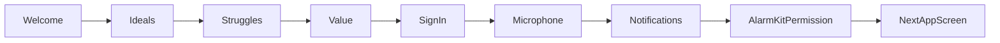

<!-- fb649cb7-68ad-4f47-87e4-f254aacf033f 911e4082-4189-499b-8d77-008388482f46 -->
# v3（SwiftUI）をスクショ完全一致にする計画

## 対象（確定）

- 対象実装: iOSアプリ（SwiftUI）`aniccaios/aniccaios`（HTMLは仕様参照）
- Ideals/Struggles: **Skip削除＋最低1つ選択必須**（未選択ならNext無効）

## 仕様ソース（正）

- UI/コピー基準: [`/.cursor/plans/v3/v3-ui.md`](/Users/cbns03/Downloads/anicca-project/.cursor/plans/v3/v3-ui.md) と [`/.cursor/plans/v3/screens`](/Users/cbns03/Downloads/anicca-project/.cursor/plans/v3/screens)
- Quote仕様: [`/.cursor/plans/v3/quotes-v3.md`](/Users/cbns03/Downloads/anicca-project/.cursor/plans/v3/quotes-v3.md)（現状は**バックエンドではなくローカル固定**）

## 実装タスク（抜け漏れ防止のため画面単位）

### A. Welcome画面（改行・2段落・完全一致）

- 変更先: [`aniccaios/aniccaios/Onboarding/WelcomeStepView.swift`](/Users/cbns03/Downloads/anicca-project/aniccaios/aniccaios/Onboarding/WelcomeStepView.swift) と [`aniccaios/aniccaios/Resources/*/Localizable.strings`](/Users/cbns03/Downloads/anicca-project/aniccaios/aniccaios/Resources/en.lproj/Localizable.strings)
- 内容:
  - タイトルを **"Welcome to\nAnicca"** に（現状3行崩れを修正）
  - サブを2段落に:
    - 1段落: `Anicca is your voice coach guiding`
    - 2段落: `your actions and mind.`

### B. Value（What Anicca Can Do）コピーを1行に揃える

- 変更先: [`aniccaios/aniccaios/Onboarding/ValueStepView.swift`](/Users/cbns03/Downloads/anicca-project/aniccaios/aniccaios/Onboarding/ValueStepView.swift) と `Localizable.strings`
- 内容:
  - `Support when you're struggling` → **`Guide your struggles`**
  - `Build better habits` → **`Help you build better habits`**
  - いずれも**1行に収まる**よう文言を短く

### C. Ideals / Struggles（レイアウトをHTMLと同じ“行構成”に・必須選択）

- 変更先:
  - [`aniccaios/aniccaios/Onboarding/IdealsStepView.swift`](/Users/cbns03/Downloads/anicca-project/aniccaios/aniccaios/Onboarding/IdealsStepView.swift)
  - [`aniccaios/aniccaios/Onboarding/StrugglesStepView.swift`](/Users/cbns03/Downloads/anicca-project/aniccaios/aniccaios/Onboarding/StrugglesStepView.swift)
  - 参照: [`/.cursor/plans/v3/screens/ideals.html`](/Users/cbns03/Downloads/anicca-project/.cursor/plans/v3/screens/ideals.html), [`/.cursor/plans/v3/screens/struggles.html`](/Users/cbns03/Downloads/anicca-project/.cursor/plans/v3/screens/struggles.html)
- 内容:
  - `LazyVGrid(.adaptive)` をやめ、HTML通りの**行（row）配列**でレンダリング（スクショの並び/折返しを固定）
  - 下部 `Skip` を削除し `Next` のみ
  - `Next` は `selected.isEmpty` の間 **disabled**（最低1つ必須）

### D. Sign in with Apple 画面（タイトルだけ変更）

- 変更先: [`aniccaios/aniccaios/Onboarding/AuthenticationStepView.swift`](/Users/cbns03/Downloads/anicca-project/aniccaios/aniccaios/Onboarding/AuthenticationStepView.swift) と `Localizable.strings`
- 内容:
  - `onboarding_account_title` を **`Save Your Progress`** に変更（他は触らない）

### E. Microphone / Notifications 権限画面（不要な “Not allowed.” 表示削除）

- 変更先:
  - [`aniccaios/aniccaios/Onboarding/MicrophonePermissionStepView.swift`](/Users/cbns03/Downloads/anicca-project/aniccaios/aniccaios/Onboarding/MicrophonePermissionStepView.swift)
  - [`aniccaios/aniccaios/Onboarding/NotificationPermissionStepView.swift`](/Users/cbns03/Downloads/anicca-project/aniccaios/aniccaios/Onboarding/NotificationPermissionStepView.swift)
- 内容:
  - `Allowed/Not allowed` の状態ラベル行をUIから削除
  - ボタン押下→OSダイアログ、という導線だけにする

### F. AlarmKit（"Allow Anicca to schedule alarms and timers?"）の説明画面を追加

- 背景整理（仕様/技術的事実）:
  - そのダイアログは **AlarmKit権限**（`NSAlarmKitUsageDescription`）
  - 文言の **"and timers" はApple側固定**でアプリから変更不可
- 変更先:
  - 新規: `aniccaios/aniccaios/Onboarding/AlarmKitPermissionStepView.swift`（マイク/通知と同テイスト）
  - 既存: [`aniccaios/aniccaios/Onboarding/OnboardingFlowView.swift`](/Users/cbns03/Downloads/anicca-project/aniccaios/aniccaios/Onboarding/OnboardingFlowView.swift)（通知の次に挿入）
  - 既存: [`aniccaios/aniccaios/Notifications/AlarmKitHabitCoordinator.swift`](/Users/cbns03/Downloads/anicca-project/aniccaios/aniccaios/Notifications/AlarmKitHabitCoordinator.swift)（権限要求がどこで走るかを一元化/二重要求を防止）
  - 既存: [`aniccaios/aniccaios/Info.plist`](/Users/cbns03/Downloads/anicca-project/aniccaios/aniccaios/Info.plist) と xcconfig（UsageDescriptionの文言はアプリ側で調整可能）
- 内容:
  - “アラーム許可が必要”を先に説明する画面を追加し、ユーザー操作でAlarmKit権限要求

### G. Talk画面（タイトル折返し・TabBar固定・スクショ通り）

- 変更先:
  - [`aniccaios/aniccaios/Views/Talk/TalkView.swift`](/Users/cbns03/Downloads/anicca-project/aniccaios/aniccaios/Views/Talk/TalkView.swift)
  - [`aniccaios/aniccaios/MainTabView.swift`](/Users/cbns03/Downloads/anicca-project/aniccaios/aniccaios/MainTabView.swift)
  - 必要なら: [`aniccaios/aniccaios/AppDelegate.swift`](/Users/cbns03/Downloads/anicca-project/aniccaios/aniccaios/AppDelegate.swift)（TabBar appearance）
  - 参照: [`/.cursor/plans/v3/screens/talk.html`](/Users/cbns03/Downloads/anicca-project/.cursor/plans/v3/screens/talk.html)
- 内容:
  - `navigationTitle(.large)` の“1行トランケート”を避け、スクショ通りに**2行表示**できるヘッダ実装へ
  - TabBarを“浮いて見える”状態から、スクショのように**下部固定＋背景付き**に（`UITabBarAppearance` / `toolbarBackground`）
  - Quoteは現状どおり `QuoteProvider` のローカル固定（=バックエンド取得ではない）

### H. Session画面（デザイン反映・“すぐSession ended”を解消・モデルが先に話す）

- 変更先:
  - [`aniccaios/aniccaios/Views/Session/SessionView.swift`](/Users/cbns03/Downloads/anicca-project/aniccaios/aniccaios/Views/Session/SessionView.swift)
  - [`aniccaios/aniccaios/VoiceSessionController.swift`](/Users/cbns03/Downloads/anicca-project/aniccaios/aniccaios/VoiceSessionController.swift)
  - 参照: [`/.cursor/plans/v3/screens/session.html`](/Users/cbns03/Downloads/anicca-project/.cursor/plans/v3/screens/session.html)
- 内容:
  - UIを `session.html` の配置（pill/オーブ/ボタン/余白）に合わせる
  - **即disconnected**の主因になりうる `missingAuthentication` をUXとして扱う:
    - サインイン必須なら、Talk→Session遷移前にブロック（サインイン誘導）
    - もしくは“ゲスト”を正式に作る（今回は大きく変わるのでまず前者）
  - `VoiceSessionController` はすでに Feeling で `response.create` を送る設計なので、接続が成立すれば“Aniccaが先に話す”は動く。接続失敗の理由（401/402/ネットワーク）をUIに分かる形で出す

### I. Behavior画面（データ連携の現状を正しく反映／ストリークの不整合解消）

- 現状（根拠）:
  - API [`apps/api/src/routes/mobile/behavior.js`](/Users/cbns03/Downloads/anicca-project/apps/api/src/routes/mobile/behavior.js) は `highlights` に **streakを返していない**
  - iOS側は `[BehaviorHighlightsStreakStore]` がローカル永続で雑に加算しており、日付判定も未実装で **“謎に5”が出る**状態
- 変更先:
  - [`aniccaios/aniccaios/Views/Behavior/BehaviorView.swift`](/Users/cbns03/Downloads/anicca-project/aniccaios/aniccaios/Views/Behavior/BehaviorView.swift)
  - （必要なら）`apps/api` 側で `streak` を返す拡張
- 内容:
  - まずは**データが無い時は 0 表示**（ユーザー要求）に統一
  - 次に、サーバーでstreakを返せるようにする/またはクライアントで“日付+状態”を保存して正しく算出（短期はクライアント、長期はサーバー推奨）

### J. Profile画面（Language行削除・Your traitsのキーワード削除・Ideals/Strugglesを実データで表示）

- 変更先: [`aniccaios/aniccaios/Views/Profile/ProfileView.swift`](/Users/cbns03/Downloads/anicca-project/aniccaios/aniccaios/Views/Profile/ProfileView.swift)
- 内容:
  - AccountCardから **Language行を削除**（OS言語から自動決定）
  - TraitsCardの **3つのキーワードチップを削除**（不要）
  - Ideal Self / Current Struggles を **`appState.userProfile.idealTraits` / `problems`** と同期して表示・編集できるようにする（現状はハードコード）
  - Plan導線は既存の `ManageSubscriptionSheet`（RevenueCat CustomerCenter）を、既存実装のまま壊さず整える

### K. Data Integration（トグルが“遊び”になってる問題を解消）

- 現状（根拠）:
  - `DeviceActivityMonitorController` と `HealthKitManager` が **stub**（未実装）
  - `ProfileView` のトグルは `@AppStorage` だけで、権限要求も同期も起きない
- 変更方針（段階）:
  - フェーズ1: トグルON時に**権限要求→拒否なら自動OFF＋Open Settings導線**（UI仕様どおり）
  - フェーズ2: 実データ取得・アップロード（Sleep/StepsはHealthKit、ScreenTimeはFamilyControls+DeviceActivity、必要ならExtension追加）
  - フェーズ3: BehaviorSummaryの `today_stats` に反映し、Behavior UIが本当に“連携データ”を消費するようにする
- 変更先（候補）:
  - [`aniccaios/aniccaios/Sensors/HealthKitManager.swift`](/Users/cbns03/Downloads/anicca-project/aniccaios/aniccaios/Sensors/HealthKitManager.swift)
  - [`aniccaios/aniccaios/Sensors/DeviceActivityMonitor.swift`](/Users/cbns03/Downloads/anicca-project/aniccaios/aniccaios/Sensors/DeviceActivityMonitor.swift)
  - `xcodeproj`（FamilyControls capability / DeviceActivity monitor extension 追加が必要な場合）
  - `apps/api`（メトリクス受け口の実装が不足している場合は追加）

## “差分パッチ必須”への対応

- 実装開始後、**変更する全ファイルについて差分（擬似パッチ形式）を必ず提示**してから進めます [[memory:11283936]]

## 先に明言しておく制約（後で揉めないため）

- iOSの権限ダイアログ内に出る文言（例: Notificationsの注意文、AlarmKitの "and timers"）は**Apple側の固定文言**で、アプリから完全には消せません。消せるのは“アプリ内に表示している文言”と“UsageDescription（AlarmKit/Mic等）”です。

### To-dos

- [ ] Welcomeのタイトル/サブコピーを指定の改行・段落に合わせる（strings+View）
- [ ] Value画面のカードタイトルを指定文言に変更し1行に収める
- [ ] IdealsをHTML行構成に合わせ、Skip削除・最低1つ必須にする
- [ ] StrugglesをHTML行構成に合わせ、Skip削除・最低1つ必須にする
- [ ] Sign in画面のタイトルをSave Your Progressに変更
- [ ] Mic/Notifications権限画面からNot allowed/Allowed表示を削除
- [ ] AlarmKit権限の説明画面を新規追加し、通知の後に遷移させる（権限要求の二重発火防止）
- [ ] Talkタイトルの折返しとTabBar固定/背景をスクショ通りにする
- [ ] Session UIをsession.htmlに合わせ、即Session endedの原因（認証/エラー扱い）を解消する
- [ ] Behaviorのストリーク表示が“謎に増える”問題を解消し、データ未連携時は0にする
- [ ] ProfileからLanguage行とTraitsキーワードを削除し、Ideals/Strugglesを実データと同期する
- [ ] Data Integrationトグルを権限要求に接続（拒否時OFF/Settings導線）。必要に応じてHealthKit/ScreenTimeの実装とバックエンド連携も追加