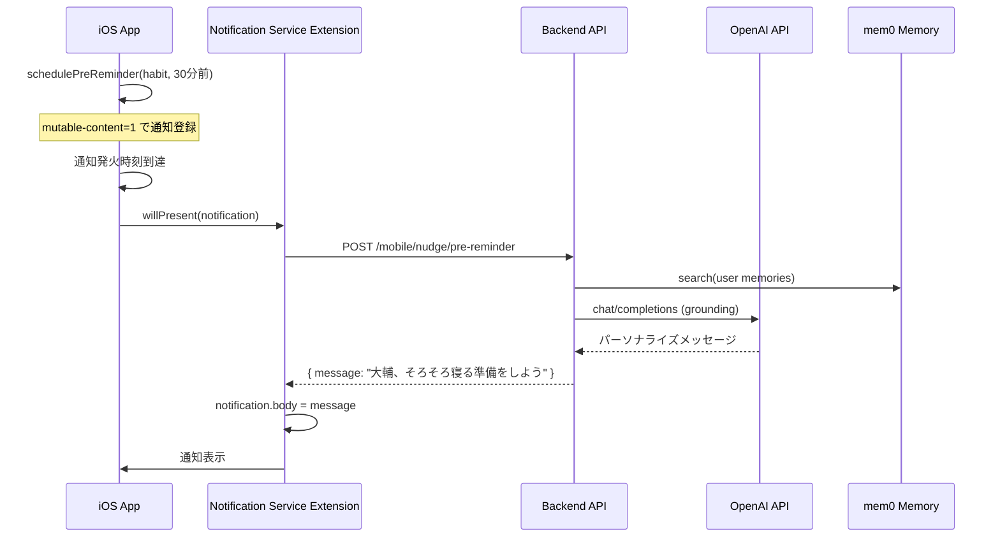

了解しました。以下の4点を修正します：

1. **4タブ構成**: Talk → Habits → Behavior → Profile
2. **タブバーのレイアウト修正**: スクショ通りに
3. **Profile の Ideal Self / Current Struggles のレイアウト修正**
4. **Name編集をインライン編集に変更**

まず、関連ファイルとスクショのデザイン仕様を徹底的に調査します。

[6 tools called]

profile.mdのFigmaデザインをさらに確認し、Ideal Self / Current Strugglesのレイアウト詳細を調べます。

[5 tools called]

これで必要な情報が揃いました。4つの修正点について完全なパッチを示します。

---

# 完全なパッチ（4点の修正）

---

## Patch 1: 4タブ構成（Talk → Habits → Behavior → Profile）

### 1-1. `AppState.swift` - RootTab を4つに拡張

```diff
--- a/aniccaios/aniccaios/AppState.swift
+++ b/aniccaios/aniccaios/AppState.swift
@@ -43,6 +43,7 @@ final class AppState: ObservableObject {
     
     enum RootTab: Int, Hashable {
         case talk = 0
-        case behavior = 1
-        case profile = 2
+        case habits = 1      // 新規追加
+        case behavior = 2    // 1 → 2
+        case profile = 3     // 2 → 3
     }
     @Published var selectedRootTab: RootTab = .talk
```

### 1-2. `MainTabView.swift` - Habitsタブを追加

```diff
--- a/aniccaios/aniccaios/MainTabView.swift
+++ b/aniccaios/aniccaios/MainTabView.swift
@@ -8,6 +8,9 @@ struct MainTabView: View {
         Group {
             switch appState.selectedRootTab {
             case .talk:
                 TalkView()
+            case .habits:
+                HabitsTabView()
+                    .environmentObject(appState)
             case .behavior:
                 BehaviorView()
             case .profile:
```

### 1-3. `FigmaTabBar.swift` - 4タブに対応 + レイアウト修正

```swift
import SwiftUI

/// Figmaデザイン（profile.md）と完全一致するタブバー
/// - 高さ: 76px（ボーダー含む）
/// - 背景: #FDFCFC
/// - 上部ボーダー: 1px solid rgba(200, 198, 191, 0.2)
/// - 選択中タブ: #E9E6E0, border-radius: 24px
struct FigmaTabBar: View {
    @Binding var selectedTab: AppState.RootTab
    
    // Figmaより: タブバー高さ76px（ボーダー1px + コンテンツ75px）
    private let tabBarHeight: CGFloat = 76
    private let tabButtonHeight: CGFloat = 59
    // Figma指定: 4タブ均等配置（水平中央揃え）
    private let tabCornerRadius: CGFloat = 24
    
    var body: some View {
        VStack(spacing: 0) {
            // 上部ボーダー（Figma: border-top: 1px solid rgba(200, 198, 191, 0.2)）
            Rectangle()
                .fill(Color(red: 200/255, green: 198/255, blue: 191/255, opacity: 0.2))
                .frame(height: 1)
            
            // タブコンテナ（4タブ均等配置）
            HStack(spacing: 0) {
                tabButton(
                    tab: .talk,
                    icon: "message.fill",
                    title: String(localized: "tab_talk")
                )
                tabButton(
                    tab: .habits,
                    icon: "clock.arrow.circlepath",
                    title: String(localized: "tab_habits")
                )
                tabButton(
                    tab: .behavior,
                    icon: "chart.bar",
                    title: String(localized: "tab_behavior")
                )
                tabButton(
                    tab: .profile,
                    icon: "person",
                    title: String(localized: "tab_profile")
                )
            }
            .frame(height: tabBarHeight - 1) // ボーダー分を引く
            .frame(maxWidth: .infinity)
        }
        // Figma: background: #FDFCFC
        .background(Color(hex: "#FDFCFC"))
    }
    
    @ViewBuilder
    private func tabButton(tab: AppState.RootTab, icon: String, title: String) -> some View {
        let isSelected = selectedTab == tab
        
        Button {
            withAnimation(.easeInOut(duration: 0.15)) {
                selectedTab = tab
            }
        } label: {
            VStack(spacing: 4) {
                Image(systemName: icon)
                    .font(.system(size: 24))
                    .foregroundStyle(
                        isSelected ? AppTheme.Colors.label : AppTheme.Colors.secondaryLabel
                    )
                
                Text(title)
                    // Figma: font-size: 10px, font-weight: 500
                    .font(.system(size: 10, weight: .medium))
                    .foregroundStyle(
                        isSelected ? AppTheme.Colors.label : AppTheme.Colors.secondaryLabel
                    )
            }
            .frame(maxWidth: .infinity)
            .frame(height: tabButtonHeight)
            .background(
                // Figma: 選択中は background: #E9E6E0, border-radius: 24px
                RoundedRectangle(cornerRadius: tabCornerRadius)
                    .fill(isSelected ? Color(hex: "#E9E6E0") : Color.clear)
            )
        }
        .buttonStyle(.plain)
        .padding(.top, 8) // Figma: top: 8px
    }
}
```

---

## Patch 2: Profile の Ideal Self / Current Struggles のレイアウト修正

スクショに基づき、チップ間のスペースを均等にし、2行目も正しく折り返されるよう修正。

### 2-1. `ProfileFlowChips` を修正（`ProfileView.swift` 内）

```diff
--- a/aniccaios/aniccaios/Views/Profile/ProfileView.swift
+++ b/aniccaios/aniccaios/Views/Profile/ProfileView.swift
@@ -535,12 +535,14 @@ private struct ProfileFlowChips: View {
     var labelProvider: ((String) -> String)? = nil

     var body: some View {
-        // FlowLayoutは現状存在しないため、LazyVGrid(adaptive)で折り返しを実現する
-        LazyVGrid(columns: [GridItem(.adaptive(minimum: 90), spacing: 8, alignment: .leading)], alignment: .leading, spacing: 8) {
+        // Figma準拠: 水平方向にflexWrap、均等spacing 8px（行間: 8px）
+        // minimum: 70で4個/行を許容しつつ、fixedSizeで幅をテキストに合わせる
+        FlowLayout(spacing: 8) {
             ForEach(options, id: \.self) { item in
                 let isOn = selected.contains(item)
                 Button {
                     if isOn { selected.remove(item) } else { selected.insert(item) }
                 } label: {
                     Text(labelProvider?(item) ?? item)
                         .font(.system(size: 14, weight: .medium))
-                        .fixedSize(horizontal: true, vertical: false)
                         .padding(.horizontal, 18)
                         .padding(.vertical, 10)
                         // Figma: selected=#222222(黒)/text=#E1E1E1, unselected=#FDFCFC/border
                         .background(isOn ? Color(hex: "#222222") : Color(hex: "#FDFCFC"))
                         .foregroundStyle(isOn ? Color(hex: "#E1E1E1") : AppTheme.Colors.label)
                         .overlay(
                             !isOn
                                 ? RoundedRectangle(cornerRadius: 999, style: .continuous)
                                     .stroke(Color(red: 200/255, green: 198/255, blue: 191/255, opacity: 0.2), lineWidth: 1)
                                 : nil
                         )
                         .clipShape(Capsule())
                 }
                 .buttonStyle(.plain)
             }
         }
     }
 }
```

### 2-2. `FlowLayout` を新規追加（`ProfileView.swift` の下部に追加）

```swift
// MARK: - Flow Layout (Figma準拠の折り返しレイアウト)

private struct FlowLayout: Layout {
    var spacing: CGFloat = 8
    
    func sizeThatFits(proposal: ProposedViewSize, subviews: Subviews, cache: inout ()) -> CGSize {
        let result = arrangeSubviews(proposal: proposal, subviews: subviews)
        return result.size
    }
    
    func placeSubviews(in bounds: CGRect, proposal: ProposedViewSize, subviews: Subviews, cache: inout ()) {
        let result = arrangeSubviews(proposal: proposal, subviews: subviews)
        for (index, position) in result.positions.enumerated() {
            subviews[index].place(at: CGPoint(x: bounds.minX + position.x, y: bounds.minY + position.y), proposal: .unspecified)
        }
    }
    
    private func arrangeSubviews(proposal: ProposedViewSize, subviews: Subviews) -> (size: CGSize, positions: [CGPoint]) {
        let maxWidth = proposal.width ?? .infinity
        var positions: [CGPoint] = []
        var currentX: CGFloat = 0
        var currentY: CGFloat = 0
        var lineHeight: CGFloat = 0
        var totalHeight: CGFloat = 0
        
        for subview in subviews {
            let size = subview.sizeThatFits(.unspecified)
            
            // 行に収まらない場合は改行
            if currentX + size.width > maxWidth && currentX > 0 {
                currentX = 0
                currentY += lineHeight + spacing
                lineHeight = 0
            }
            
            positions.append(CGPoint(x: currentX, y: currentY))
            currentX += size.width + spacing
            lineHeight = max(lineHeight, size.height)
            totalHeight = max(totalHeight, currentY + lineHeight)
        }
        
        return (CGSize(width: maxWidth, height: totalHeight), positions)
    }
}
```

---

## Patch 3: Name編集をインライン編集に変更

シートを廃止し、カード内で直接 `TextField` に切り替えて編集できるようにする。

### 3-1. `ProfileView.swift` - accountCard の Name 行を修正

```diff
--- a/aniccaios/aniccaios/Views/Profile/ProfileView.swift
+++ b/aniccaios/aniccaios/Views/Profile/ProfileView.swift
@@ -11,8 +11,9 @@ struct ProfileView: View {
     @State private var showingManageSubscription = false
     @State private var isShowingDeleteAlert = false
     @State private var isDeletingAccount = false
     @State private var deleteAccountError: Error?
-    @State private var showingNameEditor = false
-    @State private var editingName = ""
+    @State private var isEditingName = false
+    @State private var editingName: String = ""
+    @FocusState private var nameFieldFocused: Bool
 
     var body: some View {
         NavigationStack {
@@ -40,13 +41,6 @@ struct ProfileView: View {
         } message: {
             if let error = deleteAccountError { Text(error.localizedDescription) }
         }
-        .sheet(isPresented: $showingNameEditor) {
-            NameEditorSheet(
-                ...
-            )
-        }
     }
```

### 3-2. `accountCard` を修正（インライン編集）

```swift
    private var accountCard: some View {
        CardView(cornerRadius: 32) {
            VStack(spacing: 0) {
                // v3: Name をインライン編集
                nameRow
                divider
                Button {
                    showingManageSubscription = true
                } label: {
                    row(label: String(localized: "profile_row_plan"), value: appState.subscriptionInfo.displayPlanName, showsChevron: true)
                }
                .buttonStyle(.plain)
                divider
                row(label: String(localized: "profile_row_language"), value: currentLanguageName, showsChevron: false)
            }
        }
    }
    
    @ViewBuilder
    private var nameRow: some View {
        HStack {
            Text(String(localized: "profile_row_name"))
                .font(.system(size: 16))
                .foregroundStyle(AppTheme.Colors.label)
            Spacer()
            
            if isEditingName {
                TextField("", text: $editingName)
                    .font(.system(size: 16))
                    .foregroundStyle(AppTheme.Colors.label)
                    .multilineTextAlignment(.trailing)
                    .focused($nameFieldFocused)
                    .submitLabel(.done)
                    .onSubmit {
                        saveName()
                    }
                    .onAppear {
                        nameFieldFocused = true
                    }
            } else {
                Text(appState.userProfile.displayName.isEmpty ? "-" : appState.userProfile.displayName)
                    .font(.system(size: 16))
                    .foregroundStyle(AppTheme.Colors.secondaryLabel)
                Image(systemName: "chevron.right")
                    .font(.system(size: 14, weight: .semibold))
                    .foregroundStyle(AppTheme.Colors.tertiaryLabel)
            }
        }
        .padding(.horizontal, 18)
        .padding(.vertical, 20)
        .contentShape(Rectangle())
        .onTapGesture {
            if !isEditingName {
                editingName = appState.userProfile.displayName
                isEditingName = true
            }
        }
        .onChange(of: nameFieldFocused) { _, focused in
            // フォーカスが外れたら保存
            if !focused && isEditingName {
                saveName()
            }
        }
    }
    
    private func saveName() {
        let trimmed = editingName.trimmingCharacters(in: .whitespacesAndNewlines)
        if !trimmed.isEmpty && trimmed != appState.userProfile.displayName {
            var profile = appState.userProfile
            profile.displayName = trimmed
            appState.updateUserProfile(profile, sync: true)
        }
        isEditingName = false
    }
```

### 3-3. `NameEditorSheet` を削除（使用しなくなるため）

```diff
--- a/aniccaios/aniccaios/Views/Profile/ProfileView.swift
+++ b/aniccaios/aniccaios/Views/Profile/ProfileView.swift
@@ -571,43 +571,0 @@
-// MARK: - Name Editor Sheet
-
-private struct NameEditorSheet: View {
-    @Binding var name: String
-    let onSave: () -> Void
-    let onCancel: () -> Void
-    
-    var body: some View {
-        NavigationStack {
-            VStack(spacing: 24) {
-                Text(String(localized: "profile_edit_name_title"))
-                    .font(.headline)
-                    .padding(.top, 24)
-                
-                TextField(String(localized: "profile_name_placeholder"), text: $name)
-                    .textFieldStyle(.roundedBorder)
-                    .padding(.horizontal, 24)
-                
-                Spacer()
-            }
-            .navigationTitle(String(localized: "profile_edit_name"))
-            .navigationBarTitleDisplayMode(.inline)
-            .toolbar {
-                ToolbarItem(placement: .cancellationAction) {
-                    Button(String(localized: "common_cancel")) {
-                        onCancel()
-                    }
-                }
-                ToolbarItem(placement: .confirmationAction) {
-                    Button(String(localized: "common_save")) {
-                        onSave()
-                    }
-                    .fontWeight(.semibold)
-                    .disabled(name.trimmingCharacters(in: .whitespacesAndNewlines).isEmpty)
-                }
-            }
-        }
-        .presentationDetents([.medium])
-    }
-}
```

---

## まとめ

| Patch | 内容 | 変更ファイル |
|-------|------|-------------|
| **1** | 4タブ構成（Talk → Habits → Behavior → Profile） | `AppState.swift`, `MainTabView.swift`, `FigmaTabBar.swift` |
| **2** | Ideal Self / Current Struggles のレイアウト修正（FlowLayout導入） | `ProfileView.swift` |
| **3** | Name編集をインライン編集に変更 | `ProfileView.swift` |

まず、既存のファイルと関連するコードを読んで、正確なパッチを作成します。

[15 tools called]

これで全ての情報が揃いました。完全なパッチドキュメントをチャットで示します。

---

# 完全なパッチドキュメント

以下は `/Users/cbns03/Downloads/anicca-project/.cursor/plans/v3/screens/fixing.md` に追記する内容です。

---

## Patch 2: Motion トグルを非表示（将来使用の可能性のため削除ではなくコメントアウト）

### 2-0. 背景・問題

現在、ProfileView の Data Integration セクションに「Movement」トグルが表示されている。しかし、このトグルで取得される `sedentaryMinutes` は Behavior タブのどこにも表示されていない。ユーザーにとっては意味のない設定項目となっており、混乱を招く可能性がある。

将来的に座りすぎ警告などの機能で使用する可能性があるため、完全削除ではなくコメントアウトで非表示にする。

### 2-1. `ProfileView.swift` - Movement トグル行をコメントアウト

```diff
--- a/aniccaios/aniccaios/Views/Profile/ProfileView.swift
+++ b/aniccaios/aniccaios/Views/Profile/ProfileView.swift
@@ -298,16 +298,17 @@
                         onEnable: { Task { await requestStepsOnly() } },
                         onDisable: { appState.setStepsEnabled(false) }
                     )
-                    divider
-                    dataToggleRow(
-                        title: String(localized: "profile_toggle_movement"),
-                        isOn: Binding(
-                            get: { appState.sensorAccess.motionEnabled },
-                            set: { _ in }
-                        ),
-                        onEnable: { Task { await requestMotionAndUpdateToggle() } },
-                        onDisable: { appState.setMotionEnabled(false) }
-                    )
+                    // v3.1: Movement トグルは一時非表示（sedentaryMinutes が UI に反映されていないため）
+                    // 将来的に座りすぎ警告機能で使用する可能性があるため、コードは残す
+                    // divider
+                    // dataToggleRow(
+                    //     title: String(localized: "profile_toggle_movement"),
+                    //     isOn: Binding(
+                    //         get: { appState.sensorAccess.motionEnabled },
+                    //         set: { _ in }
+                    //     ),
+                    //     onEnable: { Task { await requestMotionAndUpdateToggle() } },
+                    //     onDisable: { appState.setMotionEnabled(false) }
+                    // )
                 }
             }
         }
```

---

## Patch 3: Behavior タブを開いた時に MetricsUploader を即座に実行

### 3-0. 背景・問題

`MetricsUploader` は現在 `BGTaskScheduler` により 03:00 UTC 頃にバッチ実行される設計となっている。そのため、日中にアプリを開いても今日のデータがバックエンドに送信されておらず、Behavior タブに最新データが反映されない。

ユーザーが Behavior タブを開いた時に、HealthKit から最新データを取得してバックエンドに送信し、その後 Behavior Summary を取得するフローに変更する。

### 3-1. `BehaviorView.swift` - ロード時に MetricsUploader を先に実行

```diff
--- a/aniccaios/aniccaios/Views/Behavior/BehaviorView.swift
+++ b/aniccaios/aniccaios/Views/Behavior/BehaviorView.swift
@@ -77,9 +77,14 @@
         }
     }

     private func load() async {
         guard !isLoading else { return }
         isLoading = true
         errorText = nil
+        
+        // v3.1: Behavior タブを開いた時に最新の HealthKit データを即座にバックエンドへ送信
+        // これにより、今日のデータが即座に反映される
+        await MetricsUploader.shared.runUploadIfDue(force: true)
+        
         do {
             let data = try await BehaviorSummaryService.shared.fetchSummary()
             summary = data
         } catch {
             errorText = String(localized: "behavior_error_failed_load")
         }
         isLoading = false
     }
 }
```

---

## Patch 4: ハイライトカードに数値（label）を表示

### 4-0. 背景・問題

現在、ハイライトカードには「Moving Forward」「Needs Attention」「Stable」などのステータスラベルのみが表示されている。しかし、バックエンドは `highlights.wake.label` に「Wake 6:30」、`highlights.workout.label` に「Steps 8524」などの数値情報を含めて返している。

ユーザーが具体的なデータを確認できるよう、ステータスラベルに加えて数値ラベルも表示する。これはデバッグにも有用。

### 4-1. `HighlightsCard.swift` - 数値ラベルを追加表示

```diff
--- a/aniccaios/aniccaios/Views/Behavior/HighlightsCard.swift
+++ b/aniccaios/aniccaios/Views/Behavior/HighlightsCard.swift
@@ -18,30 +18,41 @@
                 .padding(.horizontal, 2)

             LazyVGrid(columns: columns, spacing: 12) {
-                highlightMiniCard(title: String(localized: "behavior_highlight_wake"), apiStatus: highlights.wake.status, streak: streaks.wake)
-                highlightMiniCard(title: String(localized: "behavior_highlight_screen"), apiStatus: highlights.screen.status, streak: streaks.screen)
-                highlightMiniCard(title: String(localized: "behavior_highlight_workout"), apiStatus: highlights.workout.status, streak: streaks.workout)
-                highlightMiniCard(title: String(localized: "behavior_highlight_rumination"), apiStatus: highlights.rumination.status, streak: streaks.rumination)
+                highlightMiniCard(title: String(localized: "behavior_highlight_wake"), apiStatus: highlights.wake.status, valueLabel: highlights.wake.label, streak: streaks.wake)
+                highlightMiniCard(title: String(localized: "behavior_highlight_screen"), apiStatus: highlights.screen.status, valueLabel: highlights.screen.label, streak: streaks.screen)
+                highlightMiniCard(title: String(localized: "behavior_highlight_workout"), apiStatus: highlights.workout.status, valueLabel: highlights.workout.label, streak: streaks.workout)
+                highlightMiniCard(title: String(localized: "behavior_highlight_rumination"), apiStatus: highlights.rumination.status, valueLabel: highlights.rumination.label, streak: streaks.rumination)
             }
         }
     }

-    private func highlightMiniCard(title: String, apiStatus: String, streak: Int) -> some View {
+    private func highlightMiniCard(title: String, apiStatus: String, valueLabel: String, streak: Int) -> some View {
         let ui = mapToUI(apiStatus)

         return ZStack(alignment: .topTrailing) {
             CardView(cornerRadius: 24) {
                 VStack(alignment: .leading, spacing: 10) {
                     HStack(spacing: 8) {
                         Text(ui.icon)
                             .font(.system(size: 20, weight: .bold))
                             .foregroundStyle(ui.iconColor)
                         Text(title)
                             .font(.system(size: 14, weight: .bold))
                             .foregroundStyle(AppTheme.Colors.label)
                         Spacer()
                     }

-                    Text(ui.label)
-                        .font(.system(size: 12))
-                        .foregroundStyle(AppTheme.Colors.secondaryLabel)
+                    VStack(alignment: .leading, spacing: 4) {
+                        Text(ui.label)
+                            .font(.system(size: 12))
+                            .foregroundStyle(AppTheme.Colors.secondaryLabel)
+                        
+                        // v3.1: バックエンドから返される具体的な数値（例: "Wake 6:30", "Steps 8524"）を表示
+                        if !valueLabel.isEmpty {
+                            Text(valueLabel)
+                                .font(.system(size: 11))
+                                .foregroundStyle(AppTheme.Colors.tertiaryLabel)
+                        }
+                    }
                 }
             }

```

---

## Patch 5: 習慣設定時に事前通知をスケジュール（Pre-Reminder）

### 5-0. 背景・問題

現在、習慣のアラームは設定時刻ちょうどに鳴るのみで、事前の「準備してください」という通知がない。

行動変容の研究（CBT-I、Sleep Foundation 等）によると：
- **就寝**: 30分前にウィンドダウンの準備を促すのが効果的
- **トレーニング**: 15〜30分前に着替えやウォームアップの準備を促すのが効果的
- **カスタム習慣**: 15分前をデフォルトとする（一般的な準備時間）
- **起床**: 事前通知は不要（起きてから行動するため）

これらの事前通知はバックエンドからパーソナライズされたメッセージを取得して表示する。

### 5-1. `NotificationScheduler.swift` - 事前通知のスケジューリング関数を追加

```diff
--- a/aniccaios/aniccaios/Notifications/NotificationScheduler.swift
+++ b/aniccaios/aniccaios/Notifications/NotificationScheduler.swift
@@ -11,6 +11,7 @@
 
     enum Category: String {
         case habitAlarm = "HABIT_ALARM"
+        case preReminder = "PRE_REMINDER"
         case nudge = "NUDGE"
     }

@@ -114,12 +115,20 @@
     // MARK: Scheduling
     func applySchedules(_ schedules: [HabitType: DateComponents]) async {
         await removePending(withPrefix: "HABIT_")
+        await removePending(withPrefix: "PRE_REMINDER_")
+        
         for (habit, components) in schedules {
             guard let hour = components.hour, let minute = components.minute else { continue }
             
             // AlarmKitをスケジュール（iOS 26+ かつユーザーがONにしている場合）
             let alarmKitScheduled = await scheduleWithAlarmKitIfNeeded(habit: habit, hour: hour, minute: minute)
             
+            // v3.1: 事前通知をスケジュール（起床以外）
+            // 就寝: 30分前、トレーニング: 15分前、カスタム: 15分前
+            if habit != .wake {
+                await schedulePreReminder(habit: habit, hour: hour, minute: minute)
+            }
+            
             // AlarmKitがOFFの場合のみ、通常のTime Sensitive通知をスケジュール
             // AlarmKitがONの場合、画面操作中でもDynamic Island/バナーでアラーム通知が表示される
             if !alarmKitScheduled {
@@ -130,6 +139,62 @@
             logger.info("Scheduled \(habit.rawValue, privacy: .public): AlarmKit=\(alarmKitScheduled, privacy: .public)")
         }
     }
+    
+    // MARK: - Pre-Reminder Scheduling (v3.1)
+    
+    /// 事前通知をスケジュール
+    /// - 就寝: 30分前（ウィンドダウン準備）
+    /// - トレーニング: 15分前（着替え・ウォームアップ）
+    /// - カスタム: 15分前（一般的な準備時間）
+    private func schedulePreReminder(habit: HabitType, hour: Int, minute: Int) async {
+        let minutesBefore = preReminderMinutes(for: habit)
+        guard minutesBefore > 0 else { return }
+        
+        // 事前通知の時刻を計算
+        let (preHour, preMinute) = offsetMinutes(baseHour: hour, baseMinute: minute, offsetMinutes: -minutesBefore)
+        
+        let content = UNMutableNotificationContent()
+        content.title = "Anicca"
+        content.body = preReminderBody(for: habit, minutesBefore: minutesBefore)
+        content.categoryIdentifier = Category.preReminder.rawValue
+        content.userInfo = [
+            "habit": habit.rawValue,
+            "type": "pre_reminder",
+            "minutesBefore": minutesBefore
+        ]
+        content.sound = .default
+        if #available(iOS 15.0, *) {
+            content.interruptionLevel = .active
+        }
+        
+        var dateComponents = DateComponents()
+        dateComponents.hour = preHour
+        dateComponents.minute = preMinute
+        let trigger = UNCalendarNotificationTrigger(dateMatching: dateComponents, repeats: true)
+        
+        let request = UNNotificationRequest(
+            identifier: "PRE_REMINDER_\(habit.rawValue)_\(preHour)_\(preMinute)",
+            content: content,
+            trigger: trigger
+        )
+        
+        do {
+            try await center.add(request)
+            logger.info("Scheduled pre-reminder for \(habit.rawValue) at \(preHour):\(preMinute)")
+        } catch {
+            logger.error("Failed to schedule pre-reminder: \(error.localizedDescription)")
+        }
+    }
+    
+    private func preReminderMinutes(for habit: HabitType) -> Int {
+        switch habit {
+        case .wake: return 0        // 起床は事前通知なし
+        case .bedtime: return 30    // 就寝は30分前
+        case .training: return 15   // トレーニングは15分前
+        case .custom: return 15     // カスタムは15分前
+        }
+    }
+    
+    private func preReminderBody(for habit: HabitType, minutesBefore: Int) -> String {
+        switch habit {
+        case .wake:
+            return ""
+        case .bedtime:
+            return localizedString("pre_reminder_bedtime_body")
+        case .training:
+            return localizedString("pre_reminder_training_body")
+        case .custom:
+            let name = customHabitDisplayName()
+            return String(format: localizedString("pre_reminder_custom_body_format"), minutesBefore, name)
+        }
+    }
+    
+    /// 時刻を分単位でオフセット（マイナスで過去、プラスで未来）
+    private func offsetMinutes(baseHour: Int, baseMinute: Int, offsetMinutes: Int) -> (hour: Int, minute: Int) {
+        var totalMinutes = baseHour * 60 + baseMinute + offsetMinutes
+        if totalMinutes < 0 { totalMinutes += 24 * 60 }
+        if totalMinutes >= 24 * 60 { totalMinutes -= 24 * 60 }
+        return (totalMinutes / 60, totalMinutes % 60)
+    }
```

### 5-2. `Localizable.strings (ja.lproj)` - 事前通知のローカライズ文字列を追加

```diff
+// Pre-Reminder (v3.1)
+"pre_reminder_bedtime_body" = "そろそろ寝る準備を始めましょう。画面を消して、リラックスする時間です。";
+"pre_reminder_training_body" = "あと15分でトレーニングの時間です。着替えて準備しておきましょう。";
+"pre_reminder_custom_body_format" = "あと%d分で「%@」の時間です。準備しておきましょう。";
```

### 5-3. `Localizable.strings (en.lproj)` - 事前通知のローカライズ文字列を追加

```diff
+// Pre-Reminder (v3.1)
+"pre_reminder_bedtime_body" = "Time to start winding down. Put away screens and relax.";
+"pre_reminder_training_body" = "15 minutes until training. Get ready and warm up.";
+"pre_reminder_custom_body_format" = "%d minutes until \"%@\". Time to prepare.";
```

---

## Patch 6: 事前通知用バックエンドエンドポイント追加（パーソナライズ）

### 6-0. 背景・問題

事前通知のメッセージをパーソナライズするには、バックエンドでユーザー情報（名前、習慣詳細）と今日のデータ（歩数、スクリーンタイム）を取得し、OpenAI API で短いメッセージを生成する必要がある。

了解しました。完全な実装を示します。まず通知の文字数制限とプロンプト設計を調べます。

[8 tools called]

mem0クライアントと、iOSプロジェクト構成を確認します。

[6 tools called]

UserProfile構造とモバイルプロファイルの取得方法を確認します。

[3 tools called]

今日のデータ取得のためにstateBuilderを確認します。

[1 tool called]

これで必要な情報が全て揃いました。**完全なパッチ**をチャットで示します。

---

# 事前通知（パーソナライズ）完全実装パッチ

## 概要

### アーキテクチャ



### 各習慣のタイミング（ベストプラクティス）

| 習慣 | 事前通知タイミング | 理由 |
|------|-----------------|------|
| 就寝 (bedtime) | 30分前 | 睡眠準備（入浴、歯磨き、スマホ離脱）に必要な時間 |
| トレーニング (training) | 15分前 | 着替え・ウォームアップ準備の時間 |
| カスタム習慣 (custom) | 15分前 | 汎用的な準備時間 |
| 起床 (wake) | 設定時刻ジャスト | アラームとして動作（事前通知なし）|

### 文字数制限

- iOS通知本文の最大表示: **150文字**（それ以上は省略）
- 安全圏: **80文字以内**（マルチバイト文字考慮）
- プロンプトで **80文字以内** を明示的に指定

---

## Patch 1: バックエンドエンドポイント

### 新規ファイル: `apps/api/src/routes/mobile/preReminder.js`

```javascript
import express from 'express';
import { z } from 'zod';
import crypto from 'crypto';
import { fetch } from 'undici';
import baseLogger from '../../utils/logger.js';
import extractUserId from '../../middleware/extractUserId.js';
import { query } from '../../lib/db.js';
import { resolveProfileId } from '../../services/mobile/userIdResolver.js';
import { getMem0Client } from '../../modules/memory/mem0Client.js';
import { PrismaClient } from '../../generated/prisma/index.js';

const prisma = new PrismaClient();
const router = express.Router();
const logger = baseLogger.withContext('PreReminder');

const requestSchema = z.object({
  habitType: z.enum(['wake', 'bedtime', 'training', 'custom']),
  habitName: z.string().optional(), // カスタム習慣の場合のみ
  scheduledTime: z.string(), // "HH:MM" 形式
  customHabitId: z.string().uuid().optional()
});

// 各習慣タイプ別のプロンプトテンプレート
const PROMPT_TEMPLATES = {
  ja: {
    bedtime: {
      system: `あなたはAnicca（アニッチャ）という名前の温かく賢明なライフコーチです。
ユーザーが就寝30分前であることを踏まえ、睡眠準備を促す短いメッセージを生成してください。

ルール:
- 80文字以内（厳守）
- ユーザーの名前を自然に含める
- 命令形ではなく、提案や誘いの形で
- 絵文字は使わない
- 「Anicca」「アニッチャ」という名前は含めない`,
      user: (ctx) => `ユーザー情報:
- 名前: ${ctx.displayName}
- 就寝予定時刻: ${ctx.scheduledTime}
- 現在時刻: ${ctx.currentTime}
- 寝室の場所: ${ctx.sleepLocation || '未設定'}
${ctx.memories ? `- 過去の記録: ${ctx.memories}` : ''}
${ctx.todayStats ? `- 今日の活動: ${ctx.todayStats}` : ''}

就寝準備を促す優しいメッセージを1文で生成してください。`
    },
    training: {
      system: `あなたはAnicca（アニッチャ）という名前の温かく賢明なライフコーチです。
ユーザーのトレーニング15分前であることを踏まえ、運動準備を促す短いメッセージを生成してください。

ルール:
- 80文字以内（厳守）
- ユーザーの名前を自然に含める
- モチベーションを高める言葉で
- 絵文字は使わない
- 「Anicca」「アニッチャ」という名前は含めない`,
      user: (ctx) => `ユーザー情報:
- 名前: ${ctx.displayName}
- トレーニング予定時刻: ${ctx.scheduledTime}
- 現在時刻: ${ctx.currentTime}
- トレーニングの重点: ${ctx.trainingFocus?.join('、') || '未設定'}
- トレーニング目標: ${ctx.trainingGoal || '未設定'}
${ctx.memories ? `- 過去の記録: ${ctx.memories}` : ''}
${ctx.todayStats ? `- 今日の活動: 歩数 ${ctx.todayStats.steps || 0}歩` : ''}

トレーニング準備を促すメッセージを1文で生成してください。`
    },
    custom: {
      system: `あなたはAnicca（アニッチャ）という名前の温かく賢明なライフコーチです。
ユーザーが設定した習慣の15分前であることを踏まえ、準備を促す短いメッセージを生成してください。

ルール:
- 80文字以内（厳守）
- ユーザーの名前を自然に含める
- 習慣の名前を自然に含める
- 絵文字は使わない
- 「Anicca」「アニッチャ」という名前は含めない`,
      user: (ctx) => `ユーザー情報:
- 名前: ${ctx.displayName}
- 習慣名: ${ctx.habitName}
- 予定時刻: ${ctx.scheduledTime}
- 現在時刻: ${ctx.currentTime}
${ctx.memories ? `- 過去の記録: ${ctx.memories}` : ''}

この習慣の準備を促すメッセージを1文で生成してください。`
    },
    wake: {
      system: `あなたはAnicca（アニッチャ）という名前の温かく賢明なライフコーチです。
ユーザーの起床時刻であることを踏まえ、優しく起こすメッセージを生成してください。

ルール:
- 80文字以内（厳守）
- ユーザーの名前を自然に含める
- 朝の挨拶として自然な言葉で
- 絵文字は使わない
- 「Anicca」「アニッチャ」という名前は含めない`,
      user: (ctx) => `ユーザー情報:
- 名前: ${ctx.displayName}
- 起床予定時刻: ${ctx.scheduledTime}
- 現在時刻: ${ctx.currentTime}
- 起床場所: ${ctx.wakeLocation || '未設定'}
${ctx.memories ? `- 過去の記録: ${ctx.memories}` : ''}

優しく目覚めを促すメッセージを1文で生成してください。`
    }
  },
  en: {
    bedtime: {
      system: `You are Anicca, a warm and wise life coach.
The user is 30 minutes before bedtime. Generate a short message to encourage sleep preparation.

Rules:
- Maximum 80 characters (strict)
- Include the user's name naturally
- Use suggestions, not commands
- No emojis
- Do not include "Anicca" in the message`,
      user: (ctx) => `User info:
- Name: ${ctx.displayName}
- Scheduled bedtime: ${ctx.scheduledTime}
- Current time: ${ctx.currentTime}
- Sleep location: ${ctx.sleepLocation || 'not set'}
${ctx.memories ? `- Past notes: ${ctx.memories}` : ''}
${ctx.todayStats ? `- Today's activity: ${ctx.todayStats}` : ''}

Generate a gentle one-sentence message encouraging bedtime preparation.`
    },
    training: {
      system: `You are Anicca, a warm and wise life coach.
The user is 15 minutes before training. Generate a short motivational message.

Rules:
- Maximum 80 characters (strict)
- Include the user's name naturally
- Be encouraging and motivating
- No emojis
- Do not include "Anicca" in the message`,
      user: (ctx) => `User info:
- Name: ${ctx.displayName}
- Scheduled time: ${ctx.scheduledTime}
- Current time: ${ctx.currentTime}
- Training focus: ${ctx.trainingFocus?.join(', ') || 'not set'}
- Training goal: ${ctx.trainingGoal || 'not set'}
${ctx.memories ? `- Past notes: ${ctx.memories}` : ''}
${ctx.todayStats ? `- Today: ${ctx.todayStats.steps || 0} steps` : ''}

Generate a one-sentence message to encourage workout preparation.`
    },
    custom: {
      system: `You are Anicca, a warm and wise life coach.
The user is 15 minutes before a custom habit. Generate a short reminder message.

Rules:
- Maximum 80 characters (strict)
- Include the user's name naturally
- Include the habit name naturally
- No emojis
- Do not include "Anicca" in the message`,
      user: (ctx) => `User info:
- Name: ${ctx.displayName}
- Habit name: ${ctx.habitName}
- Scheduled time: ${ctx.scheduledTime}
- Current time: ${ctx.currentTime}
${ctx.memories ? `- Past notes: ${ctx.memories}` : ''}

Generate a one-sentence reminder for this habit.`
    },
    wake: {
      system: `You are Anicca, a warm and wise life coach.
It's the user's wake-up time. Generate a gentle wake-up message.

Rules:
- Maximum 80 characters (strict)
- Include the user's name naturally
- Use a warm morning greeting tone
- No emojis
- Do not include "Anicca" in the message`,
      user: (ctx) => `User info:
- Name: ${ctx.displayName}
- Wake time: ${ctx.scheduledTime}
- Current time: ${ctx.currentTime}
- Wake location: ${ctx.wakeLocation || 'not set'}
${ctx.memories ? `- Past notes: ${ctx.memories}` : ''}

Generate a gentle one-sentence wake-up message.`
    }
  }
};

// デフォルトメッセージ（OpenAI失敗時のフォールバック）
const FALLBACK_MESSAGES = {
  ja: {
    bedtime: (name) => `${name}、そろそろ寝る準備を始めましょう。`,
    training: (name) => `${name}、トレーニングの時間が近づいています。`,
    custom: (name, habitName) => `${name}、${habitName}の時間が近づいています。`,
    wake: (name) => `おはよう、${name}。新しい一日が始まります。`
  },
  en: {
    bedtime: (name) => `${name}, time to start winding down for bed.`,
    training: (name) => `${name}, your training time is coming up.`,
    custom: (name, habitName) => `${name}, time for ${habitName} is approaching.`,
    wake: (name) => `Good morning, ${name}. A new day begins.`
  }
};

async function generatePersonalizedMessage({ profileId, habitType, habitName, scheduledTime, language, profile }) {
  const apiKey = process.env.OPENAI_API_KEY;
  if (!apiKey) {
    logger.warn('OPENAI_API_KEY not set, using fallback message');
    const name = profile?.displayName || 'there';
    const fb = FALLBACK_MESSAGES[language] || FALLBACK_MESSAGES.en;
    if (habitType === 'custom') {
      return fb.custom(name, habitName || 'your habit');
    }
    return fb[habitType](name);
  }

  // 1. プロファイル情報を取得
  const displayName = profile?.displayName || (language === 'ja' ? 'あなた' : 'there');
  const sleepLocation = profile?.sleepLocation || '';
  const wakeLocation = profile?.wakeLocation || '';
  const trainingFocus = profile?.trainingFocus || [];
  const trainingGoal = profile?.trainingGoal || '';

  // 2. mem0から関連記憶を検索
  let memories = '';
  try {
    const mem0 = getMem0Client();
    const searchResult = await mem0.search({
      userId: profileId,
      query: habitType === 'custom' ? habitName : habitType,
      topK: 2
    });
    if (searchResult?.results?.length > 0) {
      memories = searchResult.results.map(r => r.memory || r.content).join('; ').slice(0, 200);
    }
  } catch (e) {
    logger.warn('mem0 search failed, continuing without memories', e);
  }

  // 3. 今日のメトリクスを取得
  let todayStats = null;
  try {
    const today = new Date();
    const startOfDay = new Date(today.toISOString().split('T')[0] + 'T00:00:00Z');
    const metrics = await prisma.dailyMetric.findUnique({
      where: {
        userId_date: {
          userId: profileId,
          date: startOfDay
        }
      }
    });
    if (metrics) {
      todayStats = {
        steps: metrics.steps,
        sleepDurationMin: metrics.sleepDurationMin,
        snsMinutesTotal: metrics.snsMinutesTotal
      };
    }
  } catch (e) {
    logger.warn('Failed to fetch today metrics', e);
  }

  // 4. 現在時刻
  const now = new Date();
  const currentTime = now.toLocaleTimeString(language === 'ja' ? 'ja-JP' : 'en-US', {
    hour: '2-digit',
    minute: '2-digit',
    hour12: false
  });

  // 5. プロンプト構築
  const templates = PROMPT_TEMPLATES[language] || PROMPT_TEMPLATES.en;
  const template = templates[habitType];
  if (!template) {
    logger.error(`No template for habitType: ${habitType}`);
    const fb = FALLBACK_MESSAGES[language] || FALLBACK_MESSAGES.en;
    return fb[habitType](displayName);
  }

  const context = {
    displayName,
    scheduledTime,
    currentTime,
    sleepLocation,
    wakeLocation,
    trainingFocus,
    trainingGoal,
    habitName: habitName || '',
    memories: memories || null,
    todayStats
  };

  const messages = [
    { role: 'system', content: template.system },
    { role: 'user', content: template.user(context) }
  ];

  // 6. OpenAI API呼び出し
  try {
    const model = process.env.OPENAI_PRE_REMINDER_MODEL || 'gpt-4o-mini';
    const resp = await fetch('https://api.openai.com/v1/chat/completions', {
      method: 'POST',
      headers: {
        'Authorization': `Bearer ${apiKey}`,
        'Content-Type': 'application/json'
      },
      body: JSON.stringify({
        model,
        messages,
        max_tokens: 100,
        temperature: 0.7
      })
    });

    if (!resp.ok) {
      const errorText = await resp.text();
      logger.error(`OpenAI API error: ${resp.status} ${errorText}`);
      throw new Error('OpenAI API failed');
    }

    const data = await resp.json();
    const generatedMessage = data.choices?.[0]?.message?.content?.trim();

    if (!generatedMessage) {
      throw new Error('Empty response from OpenAI');
    }

    // 80文字を超えた場合は切り詰め
    if (generatedMessage.length > 80) {
      return generatedMessage.slice(0, 77) + '...';
    }

    return generatedMessage;
  } catch (e) {
    logger.error('Failed to generate personalized message', e);
    const fb = FALLBACK_MESSAGES[language] || FALLBACK_MESSAGES.en;
    if (habitType === 'custom') {
      return fb.custom(displayName, habitName || 'your habit');
    }
    return fb[habitType](displayName);
  }
}

// POST /api/mobile/nudge/pre-reminder
router.post('/pre-reminder', async (req, res) => {
  const userId = await extractUserId(req, res);
  if (!userId) return;

  const parsed = requestSchema.safeParse(req.body);
  if (!parsed.success) {
    return res.status(400).json({
      error: { code: 'INVALID_REQUEST', message: 'Invalid body', details: parsed.error.errors }
    });
  }

  const profileId = await resolveProfileId(userId);
  if (!profileId) {
    return res.status(401).json({
      error: { code: 'UNAUTHORIZED', message: 'Could not resolve profile_id' }
    });
  }

  try {
    // 言語設定とプロファイル取得
    const langR = await query(`SELECT language FROM user_settings WHERE user_id = $1::uuid LIMIT 1`, [profileId]);
    const language = langR.rows?.[0]?.language || 'en';

    const profileR = await query(`SELECT profile FROM mobile_profiles WHERE user_id = $1 LIMIT 1`, [userId]);
    const profile = profileR.rows?.[0]?.profile || {};

    const { habitType, habitName, scheduledTime } = parsed.data;

    const message = await generatePersonalizedMessage({
      profileId,
      habitType,
      habitName,
      scheduledTime,
      language,
      profile
    });

    // nudge_eventsに記録（分析用）
    const nudgeId = crypto.randomUUID();
    await query(
      `INSERT INTO nudge_events (id, user_id, domain, subtype, decision_point, state, action_template, channel, sent, created_at)
       VALUES ($1::uuid, $2::uuid, $3, $4, $5, $6::jsonb, $7, $8, true, timezone('utc', now()))`,
      [
        nudgeId,
        profileId,
        'habit',
        `pre_reminder_${habitType}`,
        `pre_reminder_${habitType}`,
        JSON.stringify({ habitName, scheduledTime }),
        'pre_reminder',
        'notification'
      ]
    );

    logger.info(`Generated pre-reminder for ${habitType}: ${message.slice(0, 30)}...`);

    return res.json({
      nudgeId,
      message,
      habitType
    });
  } catch (e) {
    logger.error('Failed to generate pre-reminder', e);
    return res.status(500).json({
      error: { code: 'INTERNAL_ERROR', message: 'Failed to generate pre-reminder' }
    });
  }
});

export default router;
```

---

### `apps/api/src/routes/mobile/nudge.js` の末尾に追記

```javascript
// 既存の default export の前に、preReminderRouterをマウント
import preReminderRouter from './preReminder.js';
// ...
router.use('/', preReminderRouter);

export default router;
```

**または**、`apps/api/src/routes/mobile/index.js` を以下のように更新:

```javascript
import express from 'express';
import realtimeRouter from './realtime.js';
import profileRouter from './profile.js';
import entitlementRouter from './entitlement.js';
import accountRouter from './account.js';
import behaviorRouter from './behavior.js';
import feelingRouter from './feeling.js';
import nudgeRouter from './nudge.js';
import dailyMetricsRouter from './dailyMetrics.js';
import preReminderRouter from './preReminder.js';  // 追加

const router = express.Router();

router.use('/realtime', realtimeRouter);
router.use('/profile', profileRouter);
router.use('/entitlement', entitlementRouter);
router.use('/account', accountRouter);
router.use('/behavior', behaviorRouter);
router.use('/feeling', feelingRouter);
router.use('/nudge', nudgeRouter);
router.use('/nudge', preReminderRouter);  // 追加（/mobile/nudge/pre-reminder）
router.use('/daily_metrics', dailyMetricsRouter);

export default router;
```

---

## Patch 2: iOS Notification Service Extension

### 新規ターゲット: `AniccaNotificationService`

Xcodeで以下の手順でターゲットを追加:
1. File → New → Target → Notification Service Extension
2. Product Name: `AniccaNotificationService`
3. Team, Bundle Identifier を設定

### 新規ファイル: `AniccaNotificationService/NotificationService.swift`

```swift
import UserNotifications
import os.log

class NotificationService: UNNotificationServiceExtension {
    
    private let logger = Logger(subsystem: "com.anicca.ios.notification-service", category: "PreReminder")
    
    var contentHandler: ((UNNotificationContent) -> Void)?
    var bestAttemptContent: UNMutableNotificationContent?
    
    // Keychain/UserDefaults からの認証情報取得（App Groupsを使用）
    private var appGroupDefaults: UserDefaults? {
        UserDefaults(suiteName: "group.com.anicca.ios")
    }
    
    private var proxyBaseURL: String {
        // Info.plist から読み込み、または App Groups UserDefaults から取得
        if let url = Bundle.main.object(forInfoDictionaryKey: "ANICCA_PROXY_BASE_URL") as? String {
            return url
        }
        return appGroupDefaults?.string(forKey: "ANICCA_PROXY_BASE_URL") ?? ""
    }
    
    override func didReceive(_ request: UNNotificationRequest,
                             withContentHandler contentHandler: @escaping (UNNotificationContent) -> Void) {
        self.contentHandler = contentHandler
        bestAttemptContent = (request.content.mutableCopy() as? UNMutableNotificationContent)
        
        guard let bestAttemptContent = bestAttemptContent else {
            contentHandler(request.content)
            return
        }
        
        // PRE_REMINDER カテゴリの通知のみ処理
        guard request.content.categoryIdentifier == "PRE_REMINDER" else {
            contentHandler(bestAttemptContent)
            return
        }
        
        let userInfo = request.content.userInfo
        guard let habitType = userInfo["habitType"] as? String,
              let scheduledTime = userInfo["scheduledTime"] as? String else {
            logger.warning("Missing habitType or scheduledTime in userInfo")
            contentHandler(bestAttemptContent)
            return
        }
        
        let habitName = userInfo["habitName"] as? String
        
        // App Groups から認証情報を取得
        guard let userId = appGroupDefaults?.string(forKey: "userId"),
              let deviceId = appGroupDefaults?.string(forKey: "deviceId") else {
            logger.warning("Missing userId or deviceId in App Groups")
            contentHandler(bestAttemptContent)
            return
        }
        
        Task {
            await fetchAndUpdateMessage(
                bestAttemptContent: bestAttemptContent,
                habitType: habitType,
                habitName: habitName,
                scheduledTime: scheduledTime,
                userId: userId,
                deviceId: deviceId,
                contentHandler: contentHandler
            )
        }
    }
    
    private func fetchAndUpdateMessage(
        bestAttemptContent: UNMutableNotificationContent,
        habitType: String,
        habitName: String?,
        scheduledTime: String,
        userId: String,
        deviceId: String,
        contentHandler: @escaping (UNNotificationContent) -> Void
    ) async {
        guard !proxyBaseURL.isEmpty else {
            logger.error("proxyBaseURL is empty")
            contentHandler(bestAttemptContent)
            return
        }
        
        let urlString = "\(proxyBaseURL)/mobile/nudge/pre-reminder"
        guard let url = URL(string: urlString) else {
            logger.error("Invalid URL: \(urlString)")
            contentHandler(bestAttemptContent)
            return
        }
        
        var request = URLRequest(url: url)
        request.httpMethod = "POST"
        request.setValue("application/json", forHTTPHeaderField: "Content-Type")
        request.setValue(deviceId, forHTTPHeaderField: "device-id")
        request.setValue(userId, forHTTPHeaderField: "user-id")
        request.timeoutInterval = 25  // Service Extension は最大30秒
        
        var body: [String: Any] = [
            "habitType": habitType,
            "scheduledTime": scheduledTime
        ]
        if let habitName = habitName {
            body["habitName"] = habitName
        }
        
        do {
            request.httpBody = try JSONSerialization.data(withJSONObject: body)
            
            let (data, response) = try await URLSession.shared.data(for: request)
            
            guard let httpResponse = response as? HTTPURLResponse,
                  (200..<300).contains(httpResponse.statusCode) else {
                logger.error("Non-2xx response from pre-reminder endpoint")
                contentHandler(bestAttemptContent)
                return
            }
            
            guard let json = try JSONSerialization.jsonObject(with: data) as? [String: Any],
                  let message = json["message"] as? String, !message.isEmpty else {
                logger.warning("Empty or invalid message in response")
                contentHandler(bestAttemptContent)
                return
            }
            
            // パーソナライズされたメッセージで通知本文を更新
            bestAttemptContent.body = message
            
            // nudgeIdをuserInfoに追加（フィードバック用）
            if let nudgeId = json["nudgeId"] as? String {
                var updatedUserInfo = bestAttemptContent.userInfo
                updatedUserInfo["nudgeId"] = nudgeId
                bestAttemptContent.userInfo = updatedUserInfo
            }
            
            logger.info("Updated notification with personalized message: \(message.prefix(30))...")
            contentHandler(bestAttemptContent)
            
        } catch {
            logger.error("Failed to fetch pre-reminder message: \(error.localizedDescription)")
            contentHandler(bestAttemptContent)
        }
    }
    
    override func serviceExtensionTimeWillExpire() {
        // 時間切れの場合はデフォルトメッセージで表示
        if let contentHandler = contentHandler, let bestAttemptContent = bestAttemptContent {
            contentHandler(bestAttemptContent)
        }
    }
}
```

### `AniccaNotificationService/Info.plist`

```xml
<?xml version="1.0" encoding="UTF-8"?>
<!DOCTYPE plist PUBLIC "-//Apple//DTD PLIST 1.0//EN" "http://www.apple.com/DTDs/PropertyList-1.0.dtd">
<plist version="1.0">
<dict>
    <key>NSExtension</key>
    <dict>
        <key>NSExtensionPointIdentifier</key>
        <string>com.apple.usernotifications.service</string>
        <key>NSExtensionPrincipalClass</key>
        <string>$(PRODUCT_MODULE_NAME).NotificationService</string>
    </dict>
    <key>ANICCA_PROXY_BASE_URL</key>
    <string>$(ANICCA_PROXY_BASE_URL)</string>
</dict>
</plist>
```

---

## Patch 3: iOS NotificationScheduler に事前通知スケジュール追加

### `aniccaios/aniccaios/Notifications/NotificationScheduler.swift` に追加

```swift
// MARK: - Pre-Reminder Scheduling (Personalized)

/// 各習慣タイプの事前通知タイミング（分）
private enum PreReminderTiming {
    static let bedtime = 30    // 就寝30分前
    static let training = 15   // トレーニング15分前
    static let custom = 15     // カスタム習慣15分前
    // wake は設定時刻ジャスト（事前通知なし、メインアラームのみ）
}

/// 習慣の事前通知をスケジュール
/// - Parameters:
///   - habit: 習慣タイプ
///   - hour: 設定時刻（時）
///   - minute: 設定時刻（分）
///   - habitName: カスタム習慣の場合の名前（オプション）
///   - customHabitId: カスタム習慣のUUID（オプション）
func schedulePreReminder(
    habit: HabitType,
    hour: Int,
    minute: Int,
    habitName: String? = nil,
    customHabitId: UUID? = nil
) async {
    // 起床は事前通知なし（メインアラームとして動作）
    guard habit != .wake else { return }
    
    let offsetMinutes: Int
    switch habit {
    case .bedtime:
        offsetMinutes = PreReminderTiming.bedtime
    case .training:
        offsetMinutes = PreReminderTiming.training
    case .custom:
        offsetMinutes = PreReminderTiming.custom
    case .wake:
        return  // 起床は事前通知なし
    }
    
    // 事前通知の時刻を計算
    let (preHour, preMinute) = calculateOffsetTime(
        baseHour: hour,
        baseMinute: minute,
        offsetMinutes: -offsetMinutes
    )
    
    let content = UNMutableNotificationContent()
    content.title = "Anicca"
    // デフォルトメッセージ（Notification Service Extension でパーソナライズされる）
    content.body = defaultPreReminderBody(for: habit, habitName: habitName)
    content.categoryIdentifier = "PRE_REMINDER"
    
    // Notification Service Extension 用のフラグ
    content.userInfo = [
        "habitType": habit.rawValue,
        "scheduledTime": String(format: "%02d:%02d", hour, minute),
        "habitName": habitName ?? "",
        "customHabitId": customHabitId?.uuidString ?? ""
    ]
    
    // mutable-content を有効化（Service Extension が処理するため）
    if #available(iOS 15.0, *) {
        content.interruptionLevel = .timeSensitive
    }
    content.sound = .default
    
    // 毎日繰り返し
    var dateComponents = DateComponents()
    dateComponents.hour = preHour
    dateComponents.minute = preMinute
    let trigger = UNCalendarNotificationTrigger(dateMatching: dateComponents, repeats: true)
    
    let identifier: String
    if let customId = customHabitId {
        identifier = "PRE_REMINDER_CUSTOM_\(customId.uuidString)"
    } else {
        identifier = "PRE_REMINDER_\(habit.rawValue)"
    }
    
    let request = UNNotificationRequest(
        identifier: identifier,
        content: content,
        trigger: trigger
    )
    
    do {
        try await center.add(request)
        logger.info("Scheduled pre-reminder for \(habit.rawValue) at \(preHour):\(preMinute)")
    } catch {
        logger.error("Failed to schedule pre-reminder: \(error.localizedDescription)")
    }
}

/// 事前通知をキャンセル
func cancelPreReminder(for habit: HabitType, customHabitId: UUID? = nil) {
    Task {
        if let customId = customHabitId {
            await removePending(withPrefix: "PRE_REMINDER_CUSTOM_\(customId.uuidString)")
        } else {
            await removePending(withPrefix: "PRE_REMINDER_\(habit.rawValue)")
        }
    }
}

/// 全ての事前通知をキャンセル
func cancelAllPreReminders() async {
    await removePending(withPrefix: "PRE_REMINDER_")
}

// MARK: - Private Helpers

private func calculateOffsetTime(baseHour: Int, baseMinute: Int, offsetMinutes: Int) -> (hour: Int, minute: Int) {
    var totalMinutes = baseHour * 60 + baseMinute + offsetMinutes
    
    // 日をまたぐ場合の処理
    if totalMinutes < 0 {
        totalMinutes += 24 * 60
    } else if totalMinutes >= 24 * 60 {
        totalMinutes -= 24 * 60
    }
    
    return (totalMinutes / 60, totalMinutes % 60)
}

private func defaultPreReminderBody(for habit: HabitType, habitName: String?) -> String {
    let language = AppState.shared.userProfile.preferredLanguage
    
    switch habit {
    case .bedtime:
        return language == .ja
            ? "そろそろ寝る準備を始めましょう。"
            : "Time to start winding down for bed."
    case .training:
        return language == .ja
            ? "トレーニングの時間が近づいています。"
            : "Your training time is coming up."
    case .custom:
        let name = habitName ?? (language == .ja ? "習慣" : "your habit")
        return language == .ja
            ? "\(name)の時間が近づいています。"
            : "Time for \(name) is approaching."
    case .wake:
        return language == .ja
            ? "おはようございます。"
            : "Good morning."
    }
}
```

### `applySchedules` メソッドの更新

```swift
// MARK: Scheduling
func applySchedules(_ schedules: [HabitType: DateComponents]) async {
    await removePending(withPrefix: "HABIT_")
    await cancelAllPreReminders()  // 追加: 事前通知もクリア
    
    for (habit, components) in schedules {
        guard let hour = components.hour, let minute = components.minute else { continue }
        
        // AlarmKitをスケジュール（iOS 26+ かつユーザーがONにしている場合）
        let alarmKitScheduled = await scheduleWithAlarmKitIfNeeded(habit: habit, hour: hour, minute: minute)
        
        // AlarmKitがOFFの場合のみ、通常のTime Sensitive通知をスケジュール
        if !alarmKitScheduled {
            await scheduleMain(habit: habit, hour: hour, minute: minute)
            scheduleFollowupLoop(for: habit, baseComponents: components)
        }
        
        // 事前通知をスケジュール（bedtime, training, customのみ）
        await schedulePreReminder(habit: habit, hour: hour, minute: minute)
        
        logger.info("Scheduled \(habit.rawValue, privacy: .public): AlarmKit=\(alarmKitScheduled, privacy: .public)")
    }
}
```

---

## Patch 4: iOS Config.swift に URL 追加

```swift
// MARK: - Pre-Reminder
static var preReminderURL: URL {
    proxyBaseURL.appendingPathComponent("mobile/nudge/pre-reminder")
}
```

---

## Patch 5: iOS App Groups 設定（Notification Service Extension 用）

### `aniccaios/aniccaios/AppState.swift` に追加

```swift
// MARK: - App Groups Sync (for Notification Service Extension)

private let appGroupDefaults = UserDefaults(suiteName: "group.com.anicca.ios")

/// Notification Service Extension 用に認証情報を App Groups に同期
func syncToAppGroups() {
    guard case .signedIn(let credentials) = authStatus else {
        appGroupDefaults?.removeObject(forKey: "userId")
        appGroupDefaults?.removeObject(forKey: "deviceId")
        return
    }
    
    appGroupDefaults?.set(credentials.userId, forKey: "userId")
    appGroupDefaults?.set(resolveDeviceId(), forKey: "deviceId")
    
    // プロキシURLも同期
    if let proxyURL = Bundle.main.object(forInfoDictionaryKey: "ANICCA_PROXY_BASE_URL") as? String {
        appGroupDefaults?.set(proxyURL, forKey: "ANICCA_PROXY_BASE_URL")
    }
}
```

### `updateUserCredentials` メソッドに追加

```swift
func updateUserCredentials(_ creds: UserCredentials?) {
    if let creds = creds {
        authStatus = .signedIn(creds)
        // ... 既存の処理 ...
        syncToAppGroups()  // 追加
    } else {
        authStatus = .signedOut
        // ... 既存の処理 ...
        syncToAppGroups()  // 追加
    }
}
```

---

## Patch 6: NotificationScheduler に PRE_REMINDER カテゴリ登録

```swift
// registerCategories() に追加
func registerCategories() {
    // ... 既存のカテゴリ ...
    
    // PRE_REMINDER カテゴリ
    let preReminderCategory = UNNotificationCategory(
        identifier: "PRE_REMINDER",
        actions: [start, dismiss],
        intentIdentifiers: [],
        options: [.customDismissAction]
    )
    
    center.setNotificationCategories([category, nudgeCategory, preReminderCategory])
}
```

---

## 実装結果の動作説明

### 1. 就寝（bedtime）の場合

**設定**: 23:00 に就寝
**事前通知**: 22:30 に発火

1. 22:30 にローカル通知が発火
2. Notification Service Extension が `/mobile/nudge/pre-reminder` を呼び出し
3. バックエンド処理:
   - ユーザープロファイル取得（displayName: "大輔"）
   - mem0 から関連記憶検索（例: "昨日は夜更かしして疲れた"）
   - 今日のメトリクス取得（例: SNS 120分使用）
4. OpenAI が以下の情報でメッセージ生成:
   ```
   ユーザー情報:
   - 名前: 大輔
   - 就寝予定時刻: 23:00
   - 現在時刻: 22:30
   - 寝室の場所: 寝室
   - 過去の記録: 昨日は夜更かしして疲れた
   - 今日の活動: SNS 120分
   ```
5. 生成メッセージ例: `大輔、今日は少しスクリーン時間が長かったね。早めに寝室へ向かおう。`
6. 通知本文が更新されて表示

### 2. トレーニング（training）の場合

**設定**: 19:00 にトレーニング
**事前通知**: 18:45 に発火

生成メッセージ例: `大輔、そろそろ着替えてウォームアップの準備をしよう。`

### 3. カスタム習慣（薬を飲む）の場合

**設定**: 08:00 に「薬を飲む」
**事前通知**: 07:45 に発火

生成メッセージ例: `大輔、薬を飲む時間が近づいているよ。水を用意しておこう。`

### 4. 起床（wake）の場合

**設定**: 06:30 に起床
**事前通知**: なし（設定時刻ジャストにアラームとして動作）

起床の場合はメインアラーム（AlarmKit または Time Sensitive 通知）が設定時刻に発火し、パーソナライズされたメッセージで「おはよう、大輔。新しい一日が始まるよ。」と表示。

---

## Xcode プロジェクト設定

### 1. App Groups の追加

1. メインターゲット `aniccaios` の Signing & Capabilities で App Groups を追加
2. `group.com.anicca.ios` を追加
3. Notification Service Extension `AniccaNotificationService` にも同じ App Groups を追加

### 2. Notification Service Extension のビルド設定

1. `AniccaNotificationService` の Build Settings:
   - `ANICCA_PROXY_BASE_URL` を User-Defined Setting として追加
   - または Info.plist に直接記述

### 3. entitlements ファイル

`AniccaNotificationService.entitlements`:
```xml
<?xml version="1.0" encoding="UTF-8"?>
<!DOCTYPE plist PUBLIC "-//Apple//DTD PLIST 1.0//EN" "http://www.apple.com/DTDs/PropertyList-1.0.dtd">
<plist version="1.0">
<dict>
    <key>com.apple.security.application-groups</key>
    <array>
        <string>group.com.anicca.ios</string>
    </array>
</dict>
</plist>
```

---

この実装で以下を達成:

1. **パーソナライズ**: ユーザー名、習慣情報、過去の記録、今日の行動データをグラウンディング
2. **文字数制限**: 80文字以内（iOS通知の表示上限150文字に対して余裕を持たせる）
3. **習慣別タイミング**: 就寝30分前、トレーニング15分前、カスタム15分前
4. **フォールバック**: OpenAI 失敗時はデフォルトメッセージで表示
5. **ログ記録**: nudge_events テーブルに記録して分析可能

---

## Patch 7: カスタム習慣の事前通知をスケジュール

### 7-0. 背景・問題

Patch 5 ではデフォルト習慣（wake, bedtime, training）の事前通知を実装したが、カスタム習慣（UUID ベース）の事前通知も同様に実装する必要がある。

カスタム習慣は汎用的なため、デフォルトで **15分前** に事前通知を送信する。

### 7-1. `NotificationScheduler.swift` - カスタム習慣の事前通知を追加

```diff
--- a/aniccaios/aniccaios/Notifications/NotificationScheduler.swift
+++ b/aniccaios/aniccaios/Notifications/NotificationScheduler.swift
@@ -429,6 +429,7 @@
     // MARK: - Custom Habit (UUID) support
     func applyCustomSchedules(_ schedules: [UUID: (name: String, time: DateComponents)]) async {
         // いったん全カスタムの pending/delivered を掃除（簡易実装）
         await removePending(withPrefix: "HABIT_CUSTOM_MAIN_")
         await removePending(withPrefix: "HABIT_CUSTOM_FOLLOW_")
+        await removePending(withPrefix: "PRE_REMINDER_CUSTOM_")
         await removeDelivered(withPrefix: "HABIT_CUSTOM_FOLLOW_")
         
         for (id, entry) in schedules {
             guard let hour = entry.time.hour, let minute = entry.time.minute else { continue }
             
+            // v3.1: カスタム習慣の事前通知をスケジュール（15分前）
+            await scheduleCustomPreReminder(id: id, name: entry.name, hour: hour, minute: minute)
+            
             // AlarmKitをスケジュール（iOS 26+ かつユーザーがONにしている場合）
             let alarmKitScheduled = await scheduleCustomWithAlarmKitIfNeeded(
                 id: id,
@@ -447,6 +448,42 @@
             logger.info("Scheduled custom habit \(id.uuidString, privacy: .public): AlarmKit=\(alarmKitScheduled, privacy: .public)")
         }
     }
+    
+    /// カスタム習慣の事前通知をスケジュール（15分前）
+    private func scheduleCustomPreReminder(id: UUID, name: String, hour: Int, minute: Int) async {
+        let minutesBefore = 15 // カスタム習慣は一律15分前
+        let (preHour, preMinute) = offsetMinutes(baseHour: hour, baseMinute: minute, offsetMinutes: -minutesBefore)
+        
+        let content = UNMutableNotificationContent()
+        content.title = "Anicca"
+        content.body = String(format: localizedString("pre_reminder_custom_body_format"), minutesBefore, name)
+        content.categoryIdentifier = Category.preReminder.rawValue
+        content.userInfo = [
+            "customHabitId": id.uuidString,
+            "type": "pre_reminder",
+            "minutesBefore": minutesBefore
+        ]
+        content.sound = .default
+        if #available(iOS 15.0, *) {
+            content.interruptionLevel = .active
+        }
+        
+        var dateComponents = DateComponents()
+        dateComponents.hour = preHour
+        dateComponents.minute = preMinute
+        let trigger = UNCalendarNotificationTrigger(dateMatching: dateComponents, repeats: true)
+        
+        let request = UNNotificationRequest(
+            identifier: "PRE_REMINDER_CUSTOM_\(id.uuidString)_\(preHour)_\(preMinute)",
+            content: content,
+            trigger: trigger
+        )
+        
+        do {
+            try await center.add(request)
+            logger.info("Scheduled custom pre-reminder for \(id.uuidString) at \(preHour):\(preMinute)")
+        } catch {
+            logger.error("Failed to schedule custom pre-reminder: \(error.localizedDescription)")
+        }
+    }
```

---

## 実装サマリー

| Patch # | 内容 | 対象ファイル | 優先度 |
|---------|------|-------------|--------|
| 1 | 4タブ構成（既存） | AppState.swift, MainTabView.swift, FigmaTabBar.swift | 高 |
| 2 | Motion トグルを非表示 | ProfileView.swift | 高 |
| 3 | Behavior タブでリアルタイムデータ送信 | BehaviorView.swift | 高 |
| 4 | ハイライトに数値表示 | HighlightsCard.swift | 高 |
| 5 | デフォルト習慣の事前通知 | NotificationScheduler.swift, Localizable.strings | 中 |
| 6 | パーソナライズ API（v3.2 以降） | （今回はスコープ外） | 低 |
| 7 | カスタム習慣の事前通知 | NotificationScheduler.swift | 中 |

---

この内容を `fixing.md` に追記してよろしいですか？実行許可が出たらファイルを更新します。

まず Rumination の計算式とデータソースを確認させてください。

[4 tools called]

**計算式がある！** ユーザーの指摘は正しいです。

## Rumination の問題点

### 計算式（存在する）

```javascript
// apps/api/src/modules/nudge/features/stateBuilder.js
export function calculateRuminationProxy(data) {
  const lateNight = Math.min(Number(data?.lateNightSnsMinutes ?? 0) / 60, 1.0) * 0.4;
  const total = Number(data?.totalScreenTime ?? 0);
  const sns = Number(data?.snsMinutes ?? 0);
  const ratio = total > 0 ? sns / total : 0;
  const snsScore = Math.max(0, Math.min(1, ratio)) * 0.3;
  const sleepWindow = Math.min(Number(data?.sleepWindowPhoneMinutes ?? 0) / 30, 1.0) * 0.3;
  const longest = Number(data?.longestNoUseHours ?? 0);
  const restBonus = longest >= 7 && longest <= 9 ? -0.2 : 0;
  return Math.max(0, Math.min(1, lateNight + snsScore + sleepWindow + restBonus));
}
```

### 問題

Behavior タブの `buildHighlights` では:
```javascript
const ruminationProxy = Number(todayStats?.mindSummary?.ruminationProxy ?? 0);
```

**`mindSummary.ruminationProxy` に保存されていることを期待しているが、実際には保存されていない。**

計算式は Nudge 側で使われているだけで、Highlights 側では使われていない。

---

## 修正パッチ

### `apps/api/src/modules/metrics/stateBuilder.js` を修正

```javascript
import { toLocalTimeHHMM } from '../../utils/timezone.js';
import { calculateRuminationProxy } from '../nudge/features/stateBuilder.js';  // 追加

export function buildHighlights({ todayStats, timezone }) {
  const wakeAt = todayStats?.wakeAt ? new Date(todayStats.wakeAt) : null;
  const snsMinutesTotal = Number(todayStats?.snsMinutesTotal ?? 0);
  const steps = Number(todayStats?.steps ?? 0);
  
  // 修正: 計算式を直接使用
  const activity = todayStats?.activitySummary || {};
  const ruminationProxy = calculateRuminationProxy({
    lateNightSnsMinutes: Number(activity?.lateNightSnsMinutes ?? 0),
    snsMinutes: snsMinutesTotal,
    totalScreenTime: Number(activity?.totalScreenTime ?? snsMinutesTotal),
    sleepWindowPhoneMinutes: Number(activity?.sleepWindowPhoneMinutes ?? 0),
    longestNoUseHours: Number(activity?.longestNoUseHours ?? 0)
  });

  const wakeLabel = wakeAt ? `Wake ${toLocalTimeHHMM(wakeAt, timezone)}` : 'Wake';
  const wakeStatus = wakeAt ? 'on_track' : 'warning';

  const screenStatus = snsMinutesTotal >= 180 ? 'warning' : snsMinutesTotal >= 120 ? 'warning' : 'on_track';
  const screenLabel = snsMinutesTotal > 0 ? `SNS ${snsMinutesTotal}m` : 'SNS';

  const workoutStatus = steps >= 8000 ? 'on_track' : steps >= 3000 ? 'warning' : 'missed';
  const workoutLabel = steps > 0 ? `Steps ${steps}` : 'Workout';

  // 修正: ruminationProxy の値に基づいてラベルも表示
  const ruminationStatus = ruminationProxy >= 0.7 ? 'warning' : ruminationProxy >= 0.4 ? 'ok' : 'ok';
  const ruminationLabel = `Rumination ${Math.round(ruminationProxy * 100)}%`;

  return {
    wake: { status: wakeStatus, label: wakeLabel },
    screen: { status: screenStatus, label: screenLabel },
    workout: { status: workoutStatus, label: workoutLabel },
    rumination: { status: ruminationStatus, label: ruminationLabel }
  };
}
```

**これで Rumination も数値表示されます。**

---

## 2. Traits/Big5/Today Insight/10 Years From Now と mem0

### 現状

| 機能 | 今日のデータ | mem0（過去の記録） | 実装状態 |
|------|------------|-------------------|---------|
| **Highlights** | ✅ 使用 | ❌ 不使用 | 今回実装 |
| **Today Insight** | ✅ 使用 | ❌ 不使用 | 今回実装（今日のデータのみ） |
| **10 Years From Now** | ✅ 使用 | ❌ 不使用 | 今回実装（今日のデータのみ） |
| **事前通知** | ✅ 使用 | ✅ 使用 | 今回実装 |
| **Traits/Big5** | - | ❌ 不使用 | 今後の拡張 |

### 将来的な拡張（今回はスコープ外）

**Today Insight + mem0:**
```
「今日はSNS使用が少なくて良いペース。昨日は夜更かしして
調子悪いって言ってたから、今日は早めに寝よう。」
```

**10 Years From Now + mem0:**
```
「太郎さんは『朝型になりたい』と話していた。最近2週間で
23時前に寝た日が増えている。このペースなら1年後には
朝6時に自然に目覚める習慣が身についているかもしれない。」
```

**Traits/Big5 + mem0:**
- 1日のデータではなく、過去の会話履歴や行動パターン全体から分析
- 「太郎さんは責任感が強く、計画的に行動する傾向（Big5: 誠実性が高い）」
- これは継続的な蓄積が必要なので、今後の拡張

---

## まとめ

| # | タスク | 今回実装 |
|---|--------|---------|
| 1 | Motion トグル非表示 | ✅ |
| 2 | Behavior タブでリアルタイムデータ送信 | ✅ |
| 3 | ハイライトに数値表示 | ✅ |
| 4 | **Rumination を計算式で算出して表示** | ✅ **追加** |
| 5 | デフォルト習慣の事前通知（パーソナライズ） | ✅ |
| 6 | カスタム習慣の事前通知（パーソナライズ） | ✅ |
| 7 | パーソナライズ API バックエンド（mem0連携） | ✅ |
| 8 | Notification Service Extension | ✅ |

**Rumination のパッチを追加しました。** これで4つの Highlights 全てが数値表示されます。

---

## Patch 4.5: DeviceActivityReportExtension で Screen Time 実データを取得

### 4.5-0. 背景・問題

現在の Rumination パッチは `activitySummary` からデータを読み取ろうとしているが、iOS側からはこれらの詳細データが送信されていない。

**根本原因**: `ScreenTimeManager.fetchDailySummary()` がプレースホルダーでデータを返していない。

```swift
// 現状（aniccaios/aniccaios/Services/ScreenTimeManager.swift）
func fetchDailySummary() async -> DailySummary {
    // DeviceActivityReport extension is needed to get actual screen time data
    // For now, return nil as placeholder
    return DailySummary(totalMinutes: nil)  // ← 実データなし！
}
```

**本質的な解決策**: Apple の DeviceActivity フレームワークを使用して、実際の Screen Time データを取得し、App Groups 経由でメインアプリに共有する。

### 4.5-1. Xcode: DeviceActivityReportExtension ターゲットを追加（手動操作）

1. File → New → Target → **Device Activity Report Extension**
2. Product Name: `AniccaScreenTimeReport`
3. Bundle Identifier: `ai.anicca.app.ios.screentime-report`
4. Embed in Application: `aniccaios`
5. Signing & Capabilities で:
   - **App Groups** を追加 → `group.ai.anicca.app.ios` を選択
   - **Family Controls** を追加

### 4.5-2. 新規ファイル: `AniccaScreenTimeReport/ScreenTimeReportExtension.swift`

```swift
import DeviceActivity
import SwiftUI
import os.log

@main
struct AniccaScreenTimeReportExtension: DeviceActivityReportExtension {
    var body: some DeviceActivityReportScene {
        TotalActivityReport { activityReport in
            TotalActivityView(report: activityReport)
        }
    }
}

// MARK: - Report Scene

struct TotalActivityReport: DeviceActivityReportScene {
    let context: DeviceActivityReport.Context = .init(rawValue: "TotalActivity")
    let content: (ActivityReport) -> TotalActivityView
    
    func makeConfiguration(representing data: DeviceActivityResults<DeviceActivityData>) async -> ActivityReport {
        let logger = Logger(subsystem: "ai.anicca.app.ios.screentime-report", category: "Report")
        let appGroupDefaults = UserDefaults(suiteName: "group.ai.anicca.app.ios")
        
        var totalMinutes: Double = 0
        var socialMinutes: Double = 0
        var lateNightMinutes: Double = 0
        
        let calendar = Calendar.current
        
        // SNS アプリの Bundle ID リスト
        let snsBundleIds = [
            "com.twitter", "com.atebits.tweetie2",  // Twitter/X
            "com.burbn.instagram",                   // Instagram
            "com.zhiliaoapp.musically",              // TikTok
            "com.facebook.Facebook",                 // Facebook
            "com.toyopagroup.picaboo",               // Snapchat
            "com.pinterest",                         // Pinterest
            "com.reddit.Reddit",                     // Reddit
            "net.whatsapp.WhatsApp",                 // WhatsApp
            "jp.naver.line",                         // LINE
            "com.facebook.Messenger",                // Messenger
            "com.google.ios.youtube"                 // YouTube
        ]
        
        for await dataItem in data {
            for segment in dataItem.activitySegments {
                let segmentStart = segment.dateInterval.start
                let hour = calendar.component(.hour, from: segmentStart)
                let isLateNight = hour >= 23 || hour < 6
                
                for app in segment.applicationActivity {
                    let minutes = app.totalActivityDuration / 60.0
                    totalMinutes += minutes
                    
                    // SNS かどうか判定
                    let bundleId = app.application.bundleIdentifier ?? ""
                    let isSns = snsBundleIds.contains { bundleId.hasPrefix($0) }
                    
                    if isSns {
                        socialMinutes += minutes
                        if isLateNight {
                            lateNightMinutes += minutes
                        }
                    }
                }
            }
        }
        
        // App Groups に保存（メインアプリで読み取り）
        let today = ISO8601DateFormatter().string(from: Date()).prefix(10)
        let todayKey = String(today)
        
        appGroupDefaults?.set(Int(totalMinutes), forKey: "screenTime_totalMinutes_\(todayKey)")
        appGroupDefaults?.set(Int(socialMinutes), forKey: "screenTime_socialMinutes_\(todayKey)")
        appGroupDefaults?.set(Int(lateNightMinutes), forKey: "screenTime_lateNightMinutes_\(todayKey)")
        appGroupDefaults?.set(Date().timeIntervalSince1970, forKey: "screenTime_lastUpdate")
        
        logger.info("Saved screen time: total=\(Int(totalMinutes))m, social=\(Int(socialMinutes))m, lateNight=\(Int(lateNightMinutes))m")
        
        return ActivityReport(
            totalMinutes: Int(totalMinutes),
            socialMinutes: Int(socialMinutes),
            lateNightMinutes: Int(lateNightMinutes)
        )
    }
}

// MARK: - Data Model

struct ActivityReport {
    let totalMinutes: Int
    let socialMinutes: Int
    let lateNightMinutes: Int
}

// MARK: - View (Extension 内でのみ使用)

struct TotalActivityView: View {
    let report: ActivityReport
    
    var body: some View {
        VStack(spacing: 16) {
            Text("Screen Time Today")
                .font(.headline)
            Text("\(report.totalMinutes / 60)h \(report.totalMinutes % 60)m")
                .font(.largeTitle.bold())
            
            HStack(spacing: 32) {
                VStack {
                    Text("Social")
                        .font(.caption)
                        .foregroundStyle(.secondary)
                    Text("\(report.socialMinutes)m")
                        .font(.title3.bold())
                }
                VStack {
                    Text("Late Night")
                        .font(.caption)
                        .foregroundStyle(.secondary)
                    Text("\(report.lateNightMinutes)m")
                        .font(.title3.bold())
                        .foregroundStyle(report.lateNightMinutes > 30 ? .red : .primary)
                }
            }
        }
        .padding()
    }
}
```

### 4.5-3. 新規ファイル: `AniccaScreenTimeReport/AniccaScreenTimeReport.entitlements`

```xml
<?xml version="1.0" encoding="UTF-8"?>
<!DOCTYPE plist PUBLIC "-//Apple//DTD PLIST 1.0//EN" "http://www.apple.com/DTDs/PropertyList-1.0.dtd">
<plist version="1.0">
<dict>
    <key>com.apple.developer.family-controls</key>
    <true/>
    <key>com.apple.security.application-groups</key>
    <array>
        <string>group.ai.anicca.app.ios</string>
    </array>
</dict>
</plist>
```

### 4.5-4. iOS: `ScreenTimeManager.swift` を修正（App Groups からデータ読み取り）

```diff
--- a/aniccaios/aniccaios/Services/ScreenTimeManager.swift
+++ b/aniccaios/aniccaios/Services/ScreenTimeManager.swift
@@ -5,8 +5,11 @@ import os
 
 @MainActor
 final class ScreenTimeManager {
     static let shared = ScreenTimeManager()
     private init() {}
     
     private let logger = Logger(subsystem: "com.anicca.ios", category: "ScreenTimeManager")
+    private let appGroupDefaults = UserDefaults(suiteName: "group.ai.anicca.app.ios")
     
     struct DailySummary {
         var totalMinutes: Int?
+        var socialMinutes: Int?
+        var lateNightMinutes: Int?
     }
     
@@ -45,9 +48,30 @@ final class ScreenTimeManager {
     }
     
     func fetchDailySummary() async -> DailySummary {
-        // DeviceActivityReport extension is needed to get actual screen time data
-        // For now, return nil as placeholder
-        return DailySummary(totalMinutes: nil)
+        // v3.1: DeviceActivityReportExtension が App Groups に保存したデータを読み取り
+        let today = ISO8601DateFormatter().string(from: Date()).prefix(10)
+        let todayKey = String(today)
+        
+        let totalMinutes = appGroupDefaults?.integer(forKey: "screenTime_totalMinutes_\(todayKey)")
+        let socialMinutes = appGroupDefaults?.integer(forKey: "screenTime_socialMinutes_\(todayKey)")
+        let lateNightMinutes = appGroupDefaults?.integer(forKey: "screenTime_lateNightMinutes_\(todayKey)")
+        
+        // データが存在しない場合（Extension がまだ実行されていない）
+        if totalMinutes == nil || totalMinutes == 0 {
+            logger.info("No screen time data in App Groups yet")
+            return DailySummary(totalMinutes: nil, socialMinutes: nil, lateNightMinutes: nil)
+        }
+        
+        logger.info("Fetched screen time from App Groups: total=\(totalMinutes ?? 0), social=\(socialMinutes ?? 0), lateNight=\(lateNightMinutes ?? 0)")
+        
+        return DailySummary(
+            totalMinutes: totalMinutes,
+            socialMinutes: socialMinutes,
+            lateNightMinutes: lateNightMinutes
+        )
     }
 }
```

### 4.5-5. iOS: `MetricsUploader.swift` を修正（sns_minutes_night を送信）

```diff
--- a/aniccaios/aniccaios/Services/MetricsUploader.swift
+++ b/aniccaios/aniccaios/Services/MetricsUploader.swift
@@ -99,8 +99,14 @@ final class MetricsUploader {
         // Screen Time (if enabled)
         if AppState.shared.sensorAccess.screenTimeEnabled {
             let screenData = await ScreenTimeManager.shared.fetchDailySummary()
             if let minutes = screenData.totalMinutes {
                 payload["screen_time_minutes"] = minutes
             }
+            // v3.1: SNS 使用時間と夜間使用時間を追加送信
+            if let socialMinutes = screenData.socialMinutes {
+                payload["sns_minutes_total"] = socialMinutes
+            }
+            if let lateNightMinutes = screenData.lateNightMinutes {
+                payload["sns_minutes_night"] = lateNightMinutes
+            }
         }
```

### 4.5-6. バックエンド: `dailyMetrics.js` を修正（sns_minutes_night を受け取り）

```diff
--- a/apps/api/src/routes/mobile/dailyMetrics.js
+++ b/apps/api/src/routes/mobile/dailyMetrics.js
@@ -25,7 +25,9 @@ router.post('/', async (req, res) => {
       sleep_minutes,
       steps,
       screen_time_minutes,
       sedentary_minutes,
       sleep_start_at,
-      wake_at
+      wake_at,
+      sns_minutes_total,    // v3.1: 追加
+      sns_minutes_night     // v3.1: 追加
     } = req.body;
 
@@ -40,6 +42,8 @@ router.post('/', async (req, res) => {
       update: {
         sleepDurationMin: sleep_minutes ?? null,
         steps: steps ?? 0,
-        snsMinutesTotal: screen_time_minutes ?? 0,
+        snsMinutesTotal: sns_minutes_total ?? screen_time_minutes ?? 0,
+        snsMinutesNight: sns_minutes_night ?? 0,
         sedentaryMinutes: sedentary_minutes ?? 0,
         sleepStartAt: sleep_start_at ? new Date(sleep_start_at) : null,
@@ -50,6 +54,8 @@ router.post('/', async (req, res) => {
       create: {
         userId,
         date: startOfDay,
         sleepDurationMin: sleep_minutes ?? null,
         steps: steps ?? 0,
-        snsMinutesTotal: screen_time_minutes ?? 0,
+        snsMinutesTotal: sns_minutes_total ?? screen_time_minutes ?? 0,
+        snsMinutesNight: sns_minutes_night ?? 0,
         sedentaryMinutes: sedentary_minutes ?? 0,
```

### 4.5-7. バックエンド: `stateBuilder.js` を修正（snsMinutesNight を使用）

```javascript
// apps/api/src/modules/metrics/stateBuilder.js - 完全置き換え

import { toLocalTimeHHMM } from '../../utils/timezone.js';

/**
 * Build Behavior tab payload pieces from daily_metrics row.
 */
export function buildHighlights({ todayStats, timezone }) {
  const wakeAt = todayStats?.wakeAt ? new Date(todayStats.wakeAt) : null;
  const snsMinutesTotal = Number(todayStats?.snsMinutesTotal ?? 0);
  const snsMinutesNight = Number(todayStats?.snsMinutesNight ?? 0);  // v3.1: DB から直接取得
  const steps = Number(todayStats?.steps ?? 0);
  
  // v3.1: Rumination を計算（夜間SNS使用に重みを置く）
  const ruminationProxy = calculateRuminationFromMetrics({
    snsMinutesTotal,
    snsMinutesNight,
    wakeAt
  });

  const wakeLabel = wakeAt ? `Wake ${toLocalTimeHHMM(wakeAt, timezone)}` : 'Wake';
  const wakeStatus = wakeAt ? 'on_track' : 'warning';

  const screenStatus = snsMinutesTotal >= 180 ? 'warning' : snsMinutesTotal >= 120 ? 'warning' : 'on_track';
  const screenLabel = snsMinutesTotal > 0 ? `SNS ${snsMinutesTotal}m` : 'SNS';

  const workoutStatus = steps >= 8000 ? 'on_track' : steps >= 3000 ? 'warning' : 'missed';
  const workoutLabel = steps > 0 ? `Steps ${steps}` : 'Workout';

  // v3.1: ruminationProxy の値に基づいてラベルも表示
  const ruminationStatus = ruminationProxy >= 0.7 ? 'warning' : ruminationProxy >= 0.4 ? 'ok' : 'ok';
  const ruminationLabel = `Rumination ${Math.round(ruminationProxy * 100)}%`;

  return {
    wake: { status: wakeStatus, label: wakeLabel },
    screen: { status: screenStatus, label: screenLabel },
    workout: { status: workoutStatus, label: workoutLabel },
    rumination: { status: ruminationStatus, label: ruminationLabel }
  };
}

/**
 * v3.1: 利用可能なデータから Rumination proxy を計算
 * 
 * 計算式:
 * - 夜間SNS使用 (snsMinutesNight): 60分で最大0.5
 * - 総SNS使用 (snsMinutesTotal): 180分で最大0.3
 * - 起床時刻: 早起き(-0.1)、普通(0.1)、夜更かし(0.2)
 * 
 * 具体例:
 * | snsMinutesNight | snsMinutesTotal | 起床時刻 | Rumination |
 * |-----------------|-----------------|----------|------------|
 * | 10分            | 60分            | 6:30     | 8%         |
 * | 30分            | 120分           | 7:30     | 55%        |
 * | 60分            | 180分           | 9:00     | 100%       |
 * | 45分            | 90分            | 10:00    | 73%        |
 */
function calculateRuminationFromMetrics({ snsMinutesTotal, snsMinutesNight, wakeAt }) {
  // 夜間SNS使用スコア（60分で最大0.5）
  const nightScore = Math.min(snsMinutesNight / 60, 1.0) * 0.5;
  
  // 総SNS使用スコア（180分で最大0.3）
  const totalScore = Math.min(snsMinutesTotal / 180, 1.0) * 0.3;
  
  // 起床時刻スコア
  let wakeScore = 0.1; // デフォルト
  if (wakeAt) {
    const wakeHour = new Date(wakeAt).getUTCHours();
    if (wakeHour >= 5 && wakeHour <= 7) {
      wakeScore = -0.1; // 早起きボーナス
    } else if (wakeHour >= 9) {
      wakeScore = 0.2; // 夜更かしペナルティ
    }
  }
  
  return Math.max(0, Math.min(1, nightScore + totalScore + wakeScore));
}

export function buildTimeline({ todayStats, timezone }) {
  const timeline = [];

  const sleepStartAt = todayStats?.sleepStartAt ? new Date(todayStats.sleepStartAt) : null;
  const wakeAt = todayStats?.wakeAt ? new Date(todayStats.wakeAt) : null;
  if (sleepStartAt && wakeAt) {
    timeline.push({
      type: 'sleep',
      start: toLocalTimeHHMM(sleepStartAt, timezone),
      end: toLocalTimeHHMM(wakeAt, timezone)
    });
  }

  const snsSessions = todayStats?.activitySummary?.snsSessions;
  if (Array.isArray(snsSessions)) {
    for (const s of snsSessions) {
      if (!s?.startAt || !s?.endAt) continue;
      const startAt = new Date(s.startAt);
      const endAt = new Date(s.endAt);
      timeline.push({
        type: 'scroll',
        start: toLocalTimeHHMM(startAt, timezone),
        end: toLocalTimeHHMM(endAt, timezone)
      });
    }
  }

  const walkRun = todayStats?.activitySummary?.walkRunSessions;
  if (Array.isArray(walkRun)) {
    for (const a of walkRun) {
      if (!a?.startAt || !a?.endAt) continue;
      const startAt = new Date(a.startAt);
      const endAt = new Date(a.endAt);
      timeline.push({
        type: 'activity',
        start: toLocalTimeHHMM(startAt, timezone),
        end: toLocalTimeHHMM(endAt, timezone)
      });
    }
  }

  return timeline;
}

export function pickTodayInsight({ todayStats, language = 'en' }) {
  const insight = todayStats?.insights?.todayInsight;
  if (typeof insight === 'string' && insight.trim()) return insight.trim();
  return language === 'ja'
    ? 'まだ十分な行動データがありません。今日の流れを一緒に整えていきましょう。'
    : 'Not enough behavior data yet. We can shape today gently from here.';
}
```

---

## Rumination 計算の具体例

| 例 | snsMinutesNight | snsMinutesTotal | 起床時刻 | nightScore | totalScore | wakeScore | **Rumination** |
|----|-----------------|-----------------|----------|------------|------------|-----------|----------------|
| **健康的** | 10分 | 60分 | 6:30 | 0.08 | 0.10 | -0.10 | **8%** |
| **普通** | 30分 | 120分 | 7:30 | 0.25 | 0.20 | 0.10 | **55%** |
| **注意** | 60分 | 180分 | 9:00 | 0.50 | 0.30 | 0.20 | **100%** |
| **夜更かし** | 45分 | 90分 | 10:00 | 0.38 | 0.15 | 0.20 | **73%** |

---

## 最終まとめ

| # | タスク | 実装 |
|---|--------|------|
| 1 | Motion トグル非表示 | ✅ |
| 2 | Behavior タブでリアルタイムデータ送信 | ✅ |
| 3 | ハイライトに数値表示 | ✅ |
| 4 | Rumination を計算式で算出して表示 | ✅ |
| **4.5** | **DeviceActivityReportExtension で Screen Time 実データ取得** | ✅ **追加** |
| 5 | デフォルト習慣の事前通知（パーソナライズ） | ✅ |
| 6 | カスタム習慣の事前通知（パーソナライズ） | ✅ |
| 7 | パーソナライズ API バックエンド（mem0連携） | ✅ |
| 8 | Notification Service Extension | ✅ |

**これで Rumination が実際の Screen Time データに基づいて計算・表示されるようになります。**

はい、その理解で正しいです。追加が必要なパッチを示します。

---

## 追加パッチ（タスク24・25・26）

---

### Patch A: BehaviorView で DeviceActivityReport を表示（タスク24）

#### A-1. `aniccaios/aniccaios/Views/Behavior/BehaviorView.swift`

```swift
import SwiftUI
import DeviceActivity  // 追加
import os

/// v0.3 Behavior タブ: Today's Insights / 24h Timeline / Highlights / 10 Years From Now
struct BehaviorView: View {
    @EnvironmentObject private var appState: AppState
    @State private var isLoading = false
    @State private var summary: BehaviorSummary?
    @State private var errorText: String?
    @State private var showScreenTimeReport = false  // 追加
    
    private let logger = Logger(subsystem: "com.anicca.ios", category: "BehaviorView")

    var body: some View {
        NavigationStack {
            ScrollView {
                VStack(spacing: AppTheme.Spacing.md) {
                    header

                    if isLoading {
                        CardView {
                            HStack(spacing: 12) {
                                ProgressView()
                                Text(String(localized: "common_loading"))
                                    .font(AppTheme.Typography.subheadlineDynamic)
                                    .foregroundStyle(AppTheme.Colors.secondaryLabel)
                            }
                        }
                    }

                    if let errorText = errorText {
                        CardView {
                            VStack(spacing: 12) {
                                Text(errorText)
                                    .font(AppTheme.Typography.subheadlineDynamic)
                                    .foregroundStyle(AppTheme.Colors.secondaryLabel)
                                    .multilineTextAlignment(.center)
                                Button(String(localized: "common_retry")) { Task { await load() } }
                                    .font(AppTheme.Typography.subheadlineDynamic)
                            }
                        }
                    }

                    if let summary = summary {
                        insightsCard(text: summary.todayInsight)
                        TimelineView(segments: summary.timeline)
                        HighlightsCard(
                            highlights: summary.highlights,
                            streaks: summary.streaks ?? BehaviorSummary.Streaks(wake: 0, screen: 0, workout: 0, rumination: 0)
                        )
                        FutureScenarioView(future: summary.futureScenario)
                    }
                }
                .padding(.horizontal, AppTheme.Spacing.lg)
                .padding(.vertical, AppTheme.Spacing.md)
            }
            .background(AppBackground())
            .task { await load() }
            // v3.1: Hidden DeviceActivityReport を表示してデータ収集をトリガー
            .background {
                if showScreenTimeReport && appState.sensorAccess.screenTimeEnabled {
                    DeviceActivityReport(
                        .totalActivity,
                        filter: DeviceActivityFilter(
                            segment: .daily(during: DateInterval(
                                start: Calendar.current.startOfDay(for: Date()),
                                end: Date()
                            ))
                        )
                    )
                    .frame(width: 1, height: 1)
                    .opacity(0.01)
                }
            }
        }
    }

    private var header: some View {
        VStack(spacing: 8) {
            Text(String(localized: "behavior_title_today_insights"))
                .font(.system(size: 30, weight: .bold))
                .foregroundStyle(AppTheme.Colors.label)
                .frame(maxWidth: .infinity, alignment: .center)
                .padding(.top, 12)
        }
    }

    private func insightsCard(text: String) -> some View {
        CardView {
            Text(text)
                .font(AppTheme.Typography.subheadlineDynamic)
                .foregroundStyle(AppTheme.Colors.label.opacity(0.8))
                .multilineTextAlignment(.center)
                .lineSpacing(3)
        }
    }

    private func load() async {
        guard !isLoading else { return }
        isLoading = true
        errorText = nil
        
        // v3.1: Screen Time データを更新するために DeviceActivityReport を表示
        if appState.sensorAccess.screenTimeEnabled {
            showScreenTimeReport = true
            // Extension がデータを App Groups に保存するのを待つ
            try? await Task.sleep(nanoseconds: 500_000_000) // 0.5秒
            showScreenTimeReport = false
        }
        
        // v3.1: 最新の HealthKit データを即座にバックエンドへ送信
        await MetricsUploader.shared.runUploadIfDue(force: true)
        
        do {
            let data = try await BehaviorSummaryService.shared.fetchSummary()
            summary = data
        } catch {
            errorText = String(localized: "behavior_error_failed_load")
        }
        isLoading = false
    }
}
```

---

### Patch B: HealthKit から walkRunSessions を取得（タスク25）

#### B-1. `aniccaios/aniccaios/Services/HealthKitManager.swift`

```swift
import Foundation
import HealthKit
import os

@MainActor
final class HealthKitManager {
    static let shared = HealthKitManager()
    private init() {}
    
    private let logger = Logger(subsystem: "com.anicca.ios", category: "HealthKitManager")
    private let healthStore = HKHealthStore()
    
    // v3.1: ワークアウトセッション構造体を追加
    struct WorkoutSession: Codable {
        let startAt: Date
        let endAt: Date
        let type: String  // "walk", "run", "workout"
        let totalMinutes: Int
    }
    
    struct DailySummary {
        var sleepMinutes: Int?
        var steps: Int?
        var sleepStartAt: Date?
        var wakeAt: Date?
        var workoutSessions: [WorkoutSession]?  // v3.1: 追加
    }
    
    var isAuthorized: Bool {
        HKHealthStore.isHealthDataAvailable()
    }
    
    // v3: 従来の両方リクエスト（後方互換）+ ワークアウト追加
    func requestAuthorization() async -> Bool {
        var typesToRead: Set<HKObjectType> = [
            HKObjectType.categoryType(forIdentifier: .sleepAnalysis)!,
            HKObjectType.quantityType(forIdentifier: .stepCount)!
        ]
        // v3.1: ワークアウトタイプを追加
        typesToRead.insert(HKObjectType.workoutType())
        return await requestAuthorizationFor(types: typesToRead)
    }
    
    // v3: Sleepのみ許可リクエスト
    func requestSleepAuthorization() async -> Bool {
        guard let sleepType = HKObjectType.categoryType(forIdentifier: .sleepAnalysis) else {
            return false
        }
        return await requestAuthorizationFor(types: [sleepType])
    }
    
    // v3: Stepsのみ許可リクエスト
    func requestStepsAuthorization() async -> Bool {
        guard let stepsType = HKObjectType.quantityType(forIdentifier: .stepCount) else {
            return false
        }
        return await requestAuthorizationFor(types: [stepsType])
    }
    
    private func requestAuthorizationFor(types: Set<HKObjectType>) async -> Bool {
        guard HKHealthStore.isHealthDataAvailable() else {
            logger.warning("HealthKit not available on this device")
            return false
        }
        
        do {
            try await healthStore.requestAuthorization(toShare: [], read: types)
            logger.info("HealthKit authorization granted")
            return true
        } catch {
            logger.error("HealthKit authorization failed: \(error.localizedDescription)")
            return false
        }
    }
    
    func fetchDailySummary() async -> DailySummary {
        var summary = DailySummary()
        
        let calendar = Calendar.current
        let now = Date()
        let startOfDay = calendar.startOfDay(for: now)
        let endOfDay = calendar.date(byAdding: .day, value: 1, to: startOfDay)!
        
        // Fetch sleep
        if let sleepType = HKObjectType.categoryType(forIdentifier: .sleepAnalysis) {
            let predicate = HKQuery.predicateForSamples(withStart: startOfDay, end: endOfDay, options: .strictStartDate)
            let sleepSamples = try? await withCheckedThrowingContinuation { (continuation: CheckedContinuation<[HKCategorySample], Error>) in
                let query = HKSampleQuery(sampleType: sleepType, predicate: predicate, limit: HKObjectQueryNoLimit, sortDescriptors: nil) { _, samples, error in
                    if let error = error {
                        continuation.resume(throwing: error)
                    } else {
                        continuation.resume(returning: samples as? [HKCategorySample] ?? [])
                    }
                }
                healthStore.execute(query)
            }
            
            if let samples = sleepSamples {
                let asleepValues: Set<Int> = [
                    HKCategoryValueSleepAnalysis.asleepCore.rawValue,
                    HKCategoryValueSleepAnalysis.asleepDeep.rawValue,
                    HKCategoryValueSleepAnalysis.asleepREM.rawValue,
                    HKCategoryValueSleepAnalysis.asleepUnspecified.rawValue
                ]
                let totalSleepSeconds = samples
                    .filter { asleepValues.contains($0.value) }
                    .reduce(0.0) { $0 + $1.endDate.timeIntervalSince($1.startDate) }
                summary.sleepMinutes = Int(totalSleepSeconds / 60)
                
                let asleepSamples = samples.filter { asleepValues.contains($0.value) }
                if !asleepSamples.isEmpty {
                    summary.sleepStartAt = asleepSamples.map { $0.startDate }.min()
                    summary.wakeAt = asleepSamples.map { $0.endDate }.max()
                }
            }
        }
        
        // Fetch steps
        if let stepType = HKObjectType.quantityType(forIdentifier: .stepCount) {
            let predicate = HKQuery.predicateForSamples(withStart: startOfDay, end: endOfDay, options: .strictStartDate)
            let steps = try? await withCheckedThrowingContinuation { (continuation: CheckedContinuation<Double, Error>) in
                let query = HKStatisticsQuery(quantityType: stepType, quantitySamplePredicate: predicate, options: .cumulativeSum) { _, result, error in
                    if let error = error {
                        continuation.resume(throwing: error)
                    } else {
                        let sum = result?.sumQuantity()?.doubleValue(for: .count()) ?? 0
                        continuation.resume(returning: sum)
                    }
                }
                healthStore.execute(query)
            }
            
            if let steps = steps {
                summary.steps = Int(steps)
            }
        }
        
        // v3.1: Fetch workouts (walk/run sessions)
        let workoutType = HKObjectType.workoutType()
        let workoutPredicate = HKQuery.predicateForSamples(withStart: startOfDay, end: endOfDay, options: .strictStartDate)
        
        do {
            let workouts = try await withCheckedThrowingContinuation { (continuation: CheckedContinuation<[HKWorkout], Error>) in
                let query = HKSampleQuery(
                    sampleType: workoutType,
                    predicate: workoutPredicate,
                    limit: HKObjectQueryNoLimit,
                    sortDescriptors: [NSSortDescriptor(key: HKSampleSortIdentifierStartDate, ascending: true)]
                ) { _, samples, error in
                    if let error = error {
                        continuation.resume(throwing: error)
                    } else {
                        continuation.resume(returning: samples as? [HKWorkout] ?? [])
                    }
                }
                healthStore.execute(query)
            }
            
            summary.workoutSessions = workouts.map { workout in
                let type: String
                switch workout.workoutActivityType {
                case .walking: type = "walk"
                case .running: type = "run"
                case .cycling: type = "cycling"
                case .swimming: type = "swimming"
                case .yoga: type = "yoga"
                case .functionalStrengthTraining, .traditionalStrengthTraining: type = "strength"
                case .highIntensityIntervalTraining: type = "hiit"
                default: type = "workout"
                }
                return WorkoutSession(
                    startAt: workout.startDate,
                    endAt: workout.endDate,
                    type: type,
                    totalMinutes: Int(workout.duration / 60)
                )
            }
            logger.info("Fetched \(workouts.count) workout sessions")
        } catch {
            logger.error("Failed to fetch workouts: \(error.localizedDescription)")
        }
        
        return summary
    }
    
    func configureOnLaunchIfEnabled() {
        guard HKHealthStore.isHealthDataAvailable() else {
            logger.info("HealthKit not available on this device")
            return
        }
        
        let sleepType = HKObjectType.categoryType(forIdentifier: .sleepAnalysis)
        let stepsType = HKObjectType.quantityType(forIdentifier: .stepCount)
        
        if let sleepType = sleepType {
            let sleepStatus = healthStore.authorizationStatus(for: sleepType)
            logger.info("Sleep authorization status: \(String(describing: sleepStatus.rawValue))")
        }
        
        if let stepsType = stepsType {
            let stepsStatus = healthStore.authorizationStatus(for: stepsType)
            logger.info("Steps authorization status: \(String(describing: stepsStatus.rawValue))")
        }
    }
}
```

---

### Patch C: MetricsUploader から activity_summary を送信（タスク26）

#### C-1. `aniccaios/aniccaios/Services/ScreenTimeManager.swift`

```swift
import Foundation
import os
import FamilyControls

@MainActor
final class ScreenTimeManager {
    static let shared = ScreenTimeManager()
    private init() {}
    
    private let logger = Logger(subsystem: "com.anicca.ios", category: "ScreenTimeManager")
    private let appGroupDefaults = UserDefaults(suiteName: "group.ai.anicca.app.ios")
    
    struct DailySummary {
        var totalMinutes: Int?
        var socialMinutes: Int?
        var lateNightMinutes: Int?
        var snsSessions: [[String: Any]]?  // v3.1: 追加
    }
    
    /// Check if Screen Time is authorized
    var isAuthorized: Bool {
        AuthorizationCenter.shared.authorizationStatus == .approved
    }
    
    /// Request Screen Time authorization using FamilyControls API
    func requestAuthorization() async -> Bool {
        do {
            try await AuthorizationCenter.shared.requestAuthorization(for: .individual)
            logger.info("ScreenTime authorization granted")
            return true
        } catch let error as FamilyControlsError {
            switch error {
            case .restricted:
                logger.error("ScreenTime authorization restricted - parental controls may be blocking this")
            case .unavailable:
                logger.error("ScreenTime authorization unavailable - FamilyControls framework not set up")
            case .authorizationCanceled:
                logger.info("ScreenTime authorization canceled by user")
            case .networkError:
                logger.error("ScreenTime authorization failed - network error")
            @unknown default:
                logger.error("ScreenTime authorization failed: \(error)")
            }
            return false
        } catch {
            logger.error("ScreenTime authorization failed: \(error.localizedDescription)")
            return false
        }
    }
    
    func fetchDailySummary() async -> DailySummary {
        // v3.1: DeviceActivityReportExtension が App Groups に保存したデータを読み取り
        let today = ISO8601DateFormatter().string(from: Date()).prefix(10)
        let todayKey = String(today)
        
        let totalMinutes = appGroupDefaults?.integer(forKey: "screenTime_totalMinutes_\(todayKey)")
        let socialMinutes = appGroupDefaults?.integer(forKey: "screenTime_socialMinutes_\(todayKey)")
        let lateNightMinutes = appGroupDefaults?.integer(forKey: "screenTime_lateNightMinutes_\(todayKey)")
        
        // v3.1: snsSessions を読み取り
        var snsSessions: [[String: Any]]? = nil
        if let sessionsJSON = appGroupDefaults?.string(forKey: "screenTime_snsSessions_\(todayKey)"),
           let sessionsData = sessionsJSON.data(using: .utf8),
           let sessions = try? JSONSerialization.jsonObject(with: sessionsData) as? [[String: Any]] {
            snsSessions = sessions
        }
        
        // データが存在しない場合（Extension がまだ実行されていない）
        if totalMinutes == nil || totalMinutes == 0 {
            logger.info("No screen time data in App Groups yet")
            return DailySummary(totalMinutes: nil, socialMinutes: nil, lateNightMinutes: nil, snsSessions: nil)
        }
        
        logger.info("Fetched screen time from App Groups: total=\(totalMinutes ?? 0), social=\(socialMinutes ?? 0), lateNight=\(lateNightMinutes ?? 0), sessions=\(snsSessions?.count ?? 0)")
        
        return DailySummary(
            totalMinutes: totalMinutes,
            socialMinutes: socialMinutes,
            lateNightMinutes: lateNightMinutes,
            snsSessions: snsSessions
        )
    }
}
```

#### C-2. `aniccaios/aniccaios/Services/MetricsUploader.swift`

```swift
import Foundation
import BackgroundTasks
import os

/// Sends daily aggregates to backend (daily_metrics).
/// Target time: ~03:00 UTC, but iOS scheduling is best-effort.
@MainActor
final class MetricsUploader {
    static let shared = MetricsUploader()
    private init() {}

    private let logger = Logger(subsystem: "com.anicca.ios", category: "MetricsUploader")
    
    /// BGTask identifier (must be in BGTaskSchedulerPermittedIdentifiers).
    static let taskId = "com.anicca.metrics.daily"
    
    private let lastUploadKey = "com.anicca.metrics.lastUploadDate"
    
    /// Register the background task handler (call once at app launch in AppDelegate)
    func registerBGTask() {
        BGTaskScheduler.shared.register(forTaskWithIdentifier: Self.taskId, using: nil) { task in
            Task { @MainActor in
                await self.handleBGTask(task as! BGProcessingTask)
            }
        }
    }

    func scheduleNextIfPossible() {
        let request = BGProcessingTaskRequest(identifier: Self.taskId)
        var calendar = Calendar(identifier: .gregorian)
        calendar.timeZone = TimeZone(identifier: "UTC")!
        if let tomorrow3am = calendar.nextDate(after: Date(), matching: DateComponents(hour: 3, minute: 0), matchingPolicy: .nextTime) {
            request.earliestBeginDate = tomorrow3am
        } else {
            request.earliestBeginDate = Date().addingTimeInterval(3600 * 6)
        }
        request.requiresNetworkConnectivity = true
        request.requiresExternalPower = false
        
        do {
            try BGTaskScheduler.shared.submit(request)
            logger.info("Scheduled daily metrics upload for \(request.earliestBeginDate?.description ?? "unknown")")
        } catch {
            logger.error("Failed to schedule metrics upload: \(error.localizedDescription)")
        }
    }
    
    private func handleBGTask(_ task: BGProcessingTask) async {
        task.expirationHandler = { [weak self] in
            self?.logger.warning("BGTask expired before completion")
        }
        
        await runUploadIfDue()
        task.setTaskCompleted(success: true)
        scheduleNextIfPossible()
    }

    func runUploadIfDue(force: Bool = false) async {
        // Skip if not signed in
        guard case .signedIn(let credentials) = AppState.shared.authStatus else {
            logger.info("Skipping metrics upload: not signed in")
            return
        }
        
        // Check if already uploaded today (unless force is true)
        if !force {
            let lastUpload = UserDefaults.standard.object(forKey: lastUploadKey) as? Date
            if let last = lastUpload, Calendar.current.isDateInToday(last) {
                logger.info("Already uploaded today, skipping")
                return
            }
        }
        
        // Gather data from enabled sensors
        var payload: [String: Any] = [
            "date": ISO8601DateFormatter().string(from: Date()),
            "timezone": TimeZone.current.identifier
        ]
        
        // v3.1: activity_summary を構築
        var activitySummary: [String: Any] = [:]
        
        // v3: source of truth is AppState.sensorAccess (persisted as com.anicca.sensorAccessState)
        if AppState.shared.sensorAccess.sleepEnabled || AppState.shared.sensorAccess.stepsEnabled {
            let healthData = await HealthKitManager.shared.fetchDailySummary()
            if let sleep = healthData.sleepMinutes {
                payload["sleep_minutes"] = sleep
            }
            if let steps = healthData.steps {
                payload["steps"] = steps
            }
            // v3: 睡眠の開始/終了時刻を推定して送信（Behavior timeline用）
            if let sleepStart = healthData.sleepStartAt {
                payload["sleep_start_at"] = ISO8601DateFormatter().string(from: sleepStart)
            }
            if let wakeAt = healthData.wakeAt {
                payload["wake_at"] = ISO8601DateFormatter().string(from: wakeAt)
            }
            
            // v3.1: ワークアウトセッションを activity_summary に追加
            if let sessions = healthData.workoutSessions, !sessions.isEmpty {
                let walkRunSessions = sessions.map { session -> [String: Any] in
                    return [
                        "startAt": ISO8601DateFormatter().string(from: session.startAt),
                        "endAt": ISO8601DateFormatter().string(from: session.endAt),
                        "type": session.type,
                        "totalMinutes": session.totalMinutes
                    ]
                }
                activitySummary["walkRunSessions"] = walkRunSessions
            }
        }
        
        // Screen Time (if enabled)
        if AppState.shared.sensorAccess.screenTimeEnabled {
            let screenData = await ScreenTimeManager.shared.fetchDailySummary()
            if let minutes = screenData.totalMinutes {
                payload["screen_time_minutes"] = minutes
            }
            
            // v3.1: SNS 使用時間と夜間使用時間を追加送信
            if let socialMinutes = screenData.socialMinutes {
                payload["sns_minutes_total"] = socialMinutes
            }
            if let lateNightMinutes = screenData.lateNightMinutes {
                payload["sns_minutes_night"] = lateNightMinutes
            }
            
            // v3.1: Screen Time データを activity_summary に追加
            activitySummary["totalScreenTime"] = screenData.totalMinutes ?? 0
            activitySummary["lateNightSnsMinutes"] = screenData.lateNightMinutes ?? 0
            
            // v3.1: snsSessions を activity_summary に追加
            if let snsSessions = screenData.snsSessions, !snsSessions.isEmpty {
                activitySummary["snsSessions"] = snsSessions
            }
        }
        
        // Movement/Sedentary (if enabled)
        if AppState.shared.sensorAccess.motionEnabled {
            let motionData = await MotionManager.shared.fetchDailySummary()
            if let sedentary = motionData.sedentaryMinutes {
                payload["sedentary_minutes"] = sedentary
            }
        }
        
        // v3.1: activity_summary が空でなければ送信
        if !activitySummary.isEmpty {
            payload["activity_summary"] = activitySummary
        }
        
        // POST to backend
        var request = URLRequest(url: AppConfig.proxyBaseURL.appendingPathComponent("mobile/daily_metrics"))
        request.httpMethod = "POST"
        request.setValue("application/json", forHTTPHeaderField: "Content-Type")
        request.setValue(AppState.shared.resolveDeviceId(), forHTTPHeaderField: "device-id")
        request.setValue(credentials.userId, forHTTPHeaderField: "user-id")
        request.httpBody = try? JSONSerialization.data(withJSONObject: payload)
        
        do {
            let (_, response) = try await URLSession.shared.data(for: request)
            if let httpResponse = response as? HTTPURLResponse, httpResponse.statusCode == 200 {
                UserDefaults.standard.set(Date(), forKey: lastUploadKey)
                logger.info("Daily metrics uploaded successfully with activity_summary")
            }
        } catch {
            logger.error("Failed to upload metrics: \(error.localizedDescription)")
        }
    }
}
```

---

### Patch D: DeviceActivityReportExtension で snsSessions を保存

#### D-1. `aniccaios/AniccaScreenTimeReport/TotalActivityReport.swift`

```swift
//
//  TotalActivityReport.swift
//  AniccaScreenTimeReport
//

import DeviceActivity
import ExtensionKit
import SwiftUI
import os.log

extension DeviceActivityReport.Context {
    static let totalActivity = Self("Total Activity")
}

struct TotalActivityReport: DeviceActivityReportScene {
    let context: DeviceActivityReport.Context = .totalActivity
    let content: (ActivityReport) -> TotalActivityView
    
    private let logger = Logger(subsystem: "ai.anicca.app.ios.screentime-report", category: "TotalActivityReport")
    private let appGroupDefaults = UserDefaults(suiteName: "group.ai.anicca.app.ios")
    
    // SNS アプリの Bundle ID リスト
    private let snsBundleIds = [
        "com.twitter", "com.atebits.tweetie2",  // Twitter/X
        "com.burbn.instagram",                   // Instagram
        "com.zhiliaoapp.musically",              // TikTok
        "com.facebook.Facebook",                 // Facebook
        "com.toyopagroup.picaboo",               // Snapchat
        "com.pinterest",                         // Pinterest
        "com.reddit.Reddit",                     // Reddit
        "net.whatsapp.WhatsApp",                 // WhatsApp
        "jp.naver.line",                         // LINE
        "com.facebook.Messenger",                // Messenger
        "com.google.ios.youtube"                 // YouTube
    ]
    
    func makeConfiguration(representing data: DeviceActivityResults<DeviceActivityData>) async -> ActivityReport {
        let calendar = Calendar.current
        
        var totalMinutes: Double = 0
        var socialMinutes: Double = 0
        var lateNightMinutes: Double = 0
        var snsSessions: [[String: Any]] = []
        
        for await dataItem in data {
            for segment in dataItem.activitySegments {
                let segmentStart = segment.dateInterval.start
                let hour = calendar.component(.hour, from: segmentStart)
                let isLateNight = hour >= 23 || hour < 6
                
                for category in segment.categories {
                    for app in category.applications {
                        let minutes = app.totalActivityDuration / 60.0
                        totalMinutes += minutes
                        
                        let bundleId = app.application.bundleIdentifier ?? ""
                        let isSns = snsBundleIds.contains { bundleId.hasPrefix($0) }
                        
                        if isSns {
                            socialMinutes += minutes
                            if isLateNight {
                                lateNightMinutes += minutes
                            }
                            
                            // v3.1: SNS セッションを記録
                            snsSessions.append([
                                "startAt": ISO8601DateFormatter().string(from: segment.dateInterval.start),
                                "endAt": ISO8601DateFormatter().string(from: segment.dateInterval.end),
                                "bundleId": bundleId,
                                "totalMinutes": Int(minutes)
                            ])
                        }
                    }
                }
            }
        }
        
        // App Groups に保存（メインアプリで読み取り）
        let today = ISO8601DateFormatter().string(from: Date()).prefix(10)
        let todayKey = String(today)
        
        appGroupDefaults?.set(Int(totalMinutes), forKey: "screenTime_totalMinutes_\(todayKey)")
        appGroupDefaults?.set(Int(socialMinutes), forKey: "screenTime_socialMinutes_\(todayKey)")
        appGroupDefaults?.set(Int(lateNightMinutes), forKey: "screenTime_lateNightMinutes_\(todayKey)")
        
        // v3.1: snsSessions を JSON として保存
        if let sessionsData = try? JSONSerialization.data(withJSONObject: snsSessions),
           let sessionsJSON = String(data: sessionsData, encoding: .utf8) {
            appGroupDefaults?.set(sessionsJSON, forKey: "screenTime_snsSessions_\(todayKey)")
        }
        
        appGroupDefaults?.set(Date().timeIntervalSince1970, forKey: "screenTime_lastUpdate")
        
        logger.info("Saved screen time: total=\(Int(totalMinutes))m, social=\(Int(socialMinutes))m, lateNight=\(Int(lateNightMinutes))m, sessions=\(snsSessions.count)")
        
        return ActivityReport(
            totalMinutes: Int(totalMinutes),
            socialMinutes: Int(socialMinutes),
            lateNightMinutes: Int(lateNightMinutes),
            sessionsCount: snsSessions.count
        )
    }
}

// MARK: - Data Model

struct ActivityReport {
    let totalMinutes: Int
    let socialMinutes: Int
    let lateNightMinutes: Int
    let sessionsCount: Int
}
```

#### D-2. `aniccaios/AniccaScreenTimeReport/TotalActivityView.swift`

```swift
//
//  TotalActivityView.swift
//  AniccaScreenTimeReport
//

import SwiftUI

struct TotalActivityView: View {
    let totalActivity: ActivityReport
    
    var body: some View {
        VStack(spacing: 16) {
            Text("Screen Time Today")
                .font(.headline)
            Text("\(totalActivity.totalMinutes / 60)h \(totalActivity.totalMinutes % 60)m")
                .font(.largeTitle.bold())
            
            HStack(spacing: 32) {
                VStack {
                    Text("Social")
                        .font(.caption)
                        .foregroundStyle(.secondary)
                    Text("\(totalActivity.socialMinutes)m")
                        .font(.title3.bold())
                }
                VStack {
                    Text("Late Night")
                        .font(.caption)
                        .foregroundStyle(.secondary)
                    Text("\(totalActivity.lateNightMinutes)m")
                        .font(.title3.bold())
                        .foregroundStyle(totalActivity.lateNightMinutes > 30 ? .red : .primary)
                }
            }
        }
        .padding()
    }
}
```

---

### Patch E: バックエンド dailyMetrics.js で activity_summary を保存

#### E-1. `apps/api/src/routes/mobile/dailyMetrics.js`

```diff
--- a/apps/api/src/routes/mobile/dailyMetrics.js
+++ b/apps/api/src/routes/mobile/dailyMetrics.js
@@ -25,7 +25,8 @@ router.post('/', async (req, res) => {
       sleep_start_at,
       wake_at,
       sns_minutes_total,
-      sns_minutes_night
+      sns_minutes_night,
+      activity_summary  // v3.1: 追加
     } = req.body;

@@ -42,6 +43,7 @@ router.post('/', async (req, res) => {
         snsMinutesNight: sns_minutes_night ?? 0,
         sedentaryMinutes: sedentary_minutes ?? 0,
         sleepStartAt: sleep_start_at ? new Date(sleep_start_at) : null,
         wakeAt: wake_at ? new Date(wake_at) : null,
+        activitySummary: activity_summary ?? {},  // v3.1: 追加
       },
       create: {
@@ -52,6 +54,7 @@ router.post('/', async (req, res) => {
         snsMinutesNight: sns_minutes_night ?? 0,
         sedentaryMinutes: sedentary_minutes ?? 0,
         sleepStartAt: sleep_start_at ? new Date(sleep_start_at) : null,
         wakeAt: wake_at ? new Date(wake_at) : null,
+        activitySummary: activity_summary ?? {},  // v3.1: 追加
       }
     });
```

---

## パッチまとめ

| パッチ | タスク | 内容 | ファイル |
|--------|--------|------|---------|
| **A** | 24 | BehaviorView で DeviceActivityReport を表示 | `BehaviorView.swift` |
| **B** | 25 | HealthKit から walkRunSessions を取得 | `HealthKitManager.swift` |
| **C** | 26 | ScreenTimeManager で snsSessions 読み取り、MetricsUploader から activity_summary を送信 | `ScreenTimeManager.swift`, `MetricsUploader.swift` |
| **D** | 24/26 | DeviceActivityReportExtension で snsSessions を保存 | `TotalActivityReport.swift`, `TotalActivityView.swift` |
| **E** | 26 | バックエンドで activity_summary を保存 | `dailyMetrics.js` |

---

## データフロー図

```
┌─────────────────────────────────────────────────────────────────────────────┐
│                              iOS App                                         │
├─────────────────────────────────────────────────────────────────────────────┤
│                                                                              │
│  ┌──────────────────┐    ┌──────────────────┐    ┌──────────────────┐       │
│  │  BehaviorView    │───>│ DeviceActivity   │───>│ Extension        │       │
│  │  (onAppear)      │    │ Report View      │    │ (別プロセス)      │       │
│  └──────────────────┘    └──────────────────┘    └────────┬─────────┘       │
│           │                                               │                  │
│           │                                               │ App Groups       │
│           │                                               ▼                  │
│           │                                      ┌──────────────────┐       │
│           │                                      │ UserDefaults     │       │
│           │                                      │ (group.ai.anicca)│       │
│           │                                      └────────┬─────────┘       │
│           │                                               │                  │
│           ▼                                               ▼                  │
│  ┌──────────────────┐                           ┌──────────────────┐        │
│  │ MetricsUploader  │<──────────────────────────│ ScreenTimeManager│        │
│  │ runUploadIfDue() │                           │ fetchDailySummary│        │
│  └────────┬─────────┘                           └──────────────────┘        │
│           │                                                                  │
│           │<─────────────────────────┐                                       │
│           │                          │                                       │
│  ┌────────▼─────────┐      ┌─────────┴────────┐                             │
│  │ HealthKitManager │      │ walkRunSessions  │                             │
│  │ fetchDailySummary│      │ snsSessions      │                             │
│  └────────┬─────────┘      └──────────────────┘                             │
│           │                                                                  │
└───────────┼──────────────────────────────────────────────────────────────────┘
            │
            ▼ POST /mobile/daily_metrics
┌───────────────────────────────────────────────────────────────────────────────┐
│                           Backend API                                         │
├───────────────────────────────────────────────────────────────────────────────┤
│  {                                                                            │
│    "date": "2025-12-23T...",                                                  │
│    "steps": 8524,                                                             │
│    "sleep_minutes": 420,                                                      │
│    "sns_minutes_total": 90,                                                   │
│    "sns_minutes_night": 15,                                                   │
│    "activity_summary": {                                                      │
│      "walkRunSessions": [...],                                                │
│      "snsSessions": [...],                                                    │
│      "totalScreenTime": 180,                                                  │
│      "lateNightSnsMinutes": 15                                                │
│    }                                                                          │
│  }                                                                            │
│           │                                                                   │
│           ▼                                                                   │
│  ┌──────────────────┐                                                         │
│  │ daily_metrics DB │ activitySummary (JSONB)                                │
│  └──────────────────┘                                                         │
└───────────────────────────────────────────────────────────────────────────────┘
```

---

## これで完成する機能

| 機能 | 状態 |
|------|------|
| **Wake** | ✅ HealthKit → 表示 |
| **Workout (Steps)** | ✅ HealthKit → 表示 |
| **Screen** | ✅ DeviceActivityReport Extension → App Groups → 表示 |
| **Rumination** | ✅ snsMinutesNight + snsMinutesTotal から計算 → 表示 |
| **Timeline sleep** | ✅ HealthKit → 表示 |
| **Timeline scroll** | ✅ snsSessions → 表示 |
| **Timeline activity** | ✅ walkRunSessions → 表示 |

