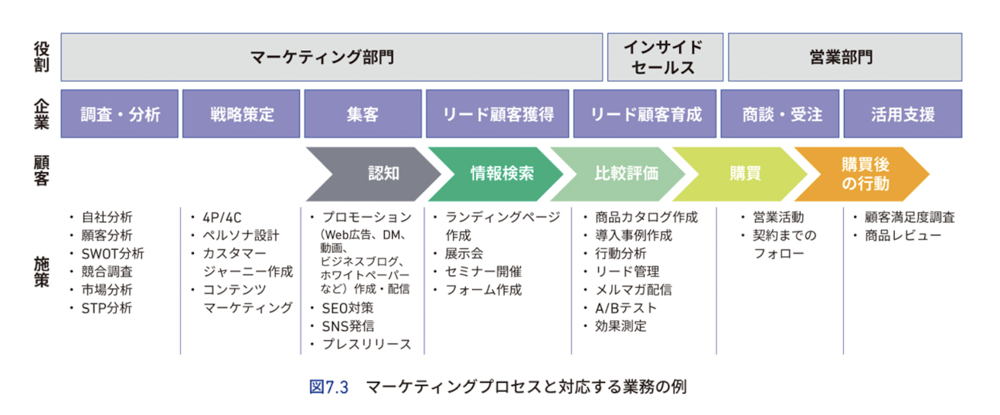
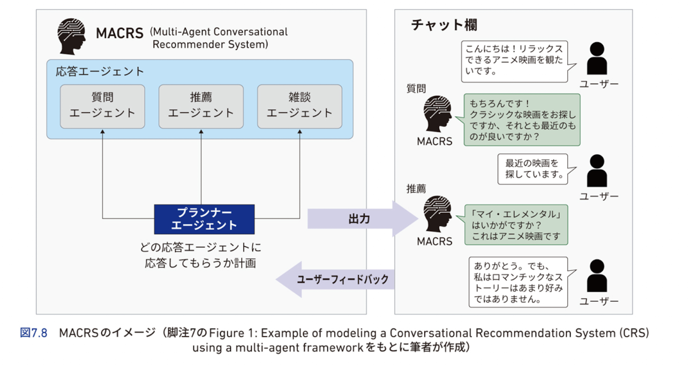
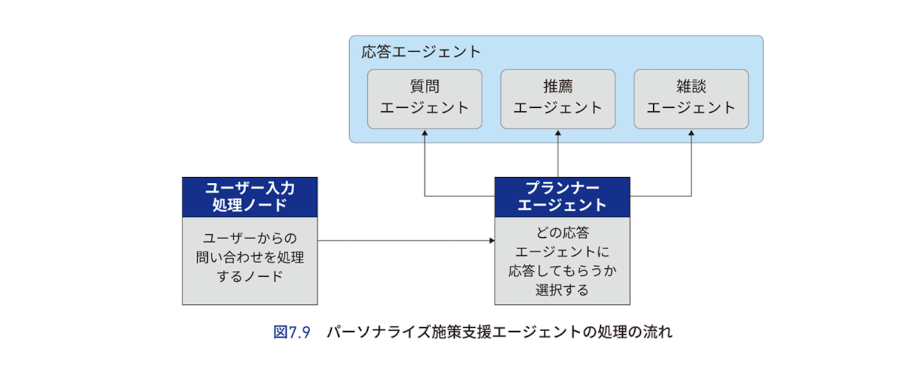

<style>
/* Google Fontsから日本語フォントを読み込み */
@import url('https://fonts.googleapis.com/css2?family=Noto+Sans+JP:wght@400;700&display=swap');

/* --- 色やフォントの基本設定 --- */
:root {
  --color-background: #f8f8f4;
  --color-foreground: #3a3b5a;
  --color-heading: #4f86c6;
  --color-hr: #000000;
  --font-default: 'Noto Sans JP', 'Hiragino Kaku Gothic ProN', 'Meiryo', sans-serif;
}

/* --- スライド全体のスタイル --- */
section {
  background-color: var(--color-background);
  color: var(--color-foreground);
  font-family: var(--font-default);
  font-weight: 400;
  box-sizing: border-box;
  border-bottom: 8px solid var(--color-hr);
  position: relative;
  line-height: 1.7;
  font-size: 22px;
  padding: 56px;
}
section:last-of-type {
  border-bottom: none;
}

/* --- 見出しのスタイル --- */
h1, h2, h3, h4, h5, h6 {
  font-weight: 700;
  color: var(--color-heading);
  margin: 0;
  padding: 0;
}

/* タイトルページ(h1)のスタイル */
h1 {
  font-size: 56px;
  line-height: 1.4;
  text-align: left;
}

/* 通常スライドのタイトル(##) */
h2 {
  position: absolute;
  top: 40px;
  left: 56px;
  right: 56px;
  font-size: 40px;
  padding-top: 0;
  padding-bottom: 16px;
}

/* h2の疑似要素(::after)を使って、短い線を実装 */
h2::after {
  content: '';
  position: absolute;
  left: 0;
  bottom: 8px;
  width: 60px;
  height: 2px;
  background-color: var(--color-hr);
}

/* h2と後続コンテンツの間のスペースを確保 */
h2 + * {
  margin-top: 112px;
}

/* サブ見出し (例: 目的, 目標) */
h3 {
  color: var(--color-foreground);
  font-size: 28px;
  margin-top: 32px;
  margin-bottom: 12px;
}

/* --- リストのスタイル --- */
ul, ol {
  padding-left: 32px;
}
li {
  margin-bottom: 10px;
}

/* フッターとして機能する、太い青いラインを実装 */
footer {
  font-size: 0;
  color: transparent;
  position: absolute;
  left: 56px;
  right: 56px;
  bottom: 40px;
  height: 8px;
  background-color: var(--color-heading);
}

/* ★★★ ロゴの配置方法を、calc()を使った最も堅牢な方法に変更 ★★★ */
header {
  font-size: 0;
  color: transparent;
  background-image: url('ロゴ.png');
  background-repeat: no-repeat;
  background-size: contain;
  background-position: top right;
  
  position: absolute;
  top: 40px;
  
  /* rightプロパティの代わりに、calc()で左からの位置を計算して配置を安定させます */
  /* 計算式: (コンテナの幅 - ロゴの幅 - 右の余白) */
  left: calc(100% - 180px - 56px);
  
  /*
    【重要】下のwidthの値を変更した場合、
    上のcalc()内の「180px」も同じ値にしてください。
  */
  width: 180px;
  height: 50px;
}

/* --- 特別なクラス --- */
section.lead {
  border-bottom: 8px solid var(--color-hr);
}

/* タイトルページではフッターラインとロゴ(header)を非表示にする */
section.lead footer,
section.lead header {
  display: none;
}


section.lead h1 {
  margin-bottom: 24px;
}
section.lead p {
  font-size: 24px;
  color: var(--color-foreground);
}

/* ガイドライン用のスタイル */
.bad-example {
  background-color: #fbe9e7;
  color: #c62828;
  padding: 8px 16px;
  border-radius: 4px;
}
</style>

# 第７章
# マーケティングを支援する

---

## 目次

1. マーケティング業務とは（7.1節）
2. マーケティング業務におけるAIエージェントの活用（7.2節）
3. ロールプレイングによる意思決定支援エージェント（7.3節・実装）
4. パーソナライズ施策支援エージェント（7.4節・実装）
5. まとめ（7.5節）

---

## 本章で作成するエージェント

### 今回実装する2つのエージェントシステム

**1. ロールプレイングによる意思決定支援エージェント（7.3節）**
- ペルソナを活用したコンテンツ評価と改善
- 4つのエージェントで構成（Persona Generator, Contents Evaluator, Contents Analyzer, Content Improver）

**2. パーソナライズ施策支援エージェント（7.4節）**
- MACRS（Multi-Agent Conversational Recommender System）
- 5つのエージェントで構成（Planner Agent, Question Agent, Recommendation Agent, ChitChat Agent, UserInput Agent）

---

## 7.1 マーケティング業務とは

### マーケティングの定義

**「売れる」仕組みを作る業務**

- かつては大量生産と広告による一方向的なアプローチ
- 現代では、個々の顧客のニーズに合わせたパーソナライズされた情報を最適なタイミングで提供

---

## マーケティングの変遷

<div style="text-align: center;">
  
</div>

---

## コトラーの「マーケティング5.0」

- **デジタル技術を活用した新たな戦略**
- AIやその他の技術を活用して、顧客の行動や潜在的なニーズを深く理解
- **パーソナライズされた体験を提供**

### 重要な視点

**「誰に、どのような価値を、いつ提供するか」**

顧客の価値観を重視したマーケティング施策が求められている

---

## 購買意思決定プロセス

<div style="text-align: center;">
  
</div>

---

## 購買意思決定プロセスの5段階

1. **認知**: 自分が抱える課題やニーズを意識する段階
2. **情報検索**: 必要な商品やサービスの情報を集める段階
3. **比較評価**: 複数の候補を比較し、最適な選択肢を絞り込む段階
4. **購買**: 実際に購入アクションを起こす段階
5. **購買後の行動**: 購入結果の評価、レビュー投稿、次の購買行動への影響

### 各段階でのマーケティング施策例

- 認知: 「XX問題を解決しましょう！」といったキャッチーなフレーズ
- 情報検索: 詳細情報の提供、比較資料の作成

---

## マーケティングプロセスと業務

<div style="text-align: center;">
  
</div>

---

## マーケティングプロセスの目的

### マーケティング業務の目的

**顧客をインサイドセールスや営業に適切に引き継ぐこと**

- **集客**: コンテンツや広告を通じて、顧客に自社や課題を認知させる
- **リード顧客獲得・育成**: メルマガ、セミナー、比較情報、導入事例の提供
- これらのプロセスを通じて、顧客の購買意欲を高め、次の段階へのスムーズな移行を目指す

---

## 7.2 マーケティング業務におけるAIエージェントの活用

### マーケティング業務の4つの課題

1. **データの多様化と分析コストの増大**
   - WebサイトやSNSなど、さまざまなチャネルから日々膨大なデータが蓄積
   - 非構造化データから深い顧客インサイトを抽出するには専門的な知識が必要

2. **パーソナライズの限界**
   - 個々の顧客の興味や行動パターンを正確に把握することが困難
   - 画一的な情報発信や施策になってしまう

---

## マーケティング業務の課題（続き）

3. **適切なタイミングでの施策実行の限界**
   - 顧客の購買意思決定プロセスに合わせた最適な情報を提供できない
   - 市場やトレンドの変化に迅速に対応することが困難

4. **マーケティングプロセスのサイクルの長期化**
   - データ分析や計画立案に時間をかけすぎると、意思決定が遅れ、市場機会を逃す
   - PDCAサイクルを効率的に回すことができない

---

## AIエージェントのメリット

### 1. マーケティングプロセスの自動化・加速化

- 分析、実行、改善の一連のワークフローを効率化
- 計画から実行、効果検証、改善まで一貫したサポート
- **PDCAサイクルをより迅速に完了**させることが可能

### 2. 顧客体験の向上とコンテンツの最適化

- 顧客の行動や興味を詳細に分析
- 個々の顧客に合わせたパーソナライズされたコンテンツやレコメンデーションを提供
- **高いエンゲージメントやコンバージョン率を達成**

---

## AIエージェントの活用事例

### Agentforce: Sales Development Representative (SDR) Agent

- リード顧客との初回接触を自動化
- 製品に関する質問に自律的に回答
- SMSやWhatsAppなどの希望するチャネルで、あらゆる言語でコミュニケーション

### Agentforce: Personal Shopper Agent

- ショッパーと対話し、パーソナライズされた商品を提案
- 情報検索から交渉、購入段階での成約まで、顧客をサポート

### JAPAN AI AGENT

- 日本の市場に特化した自然言語処理と法的コンプライアンスを備えたエージェント
- マーケティングプロセスに合わせてカスタマイズ可能

---

## 本章で扱うシナリオ

### 背景

IT企業が、AIエージェントを活用して業務効率化を目指すビジネスパーソンを対象とした**「AIエージェント実践講座」**という新サービスを立ち上げ

### 2つのケース

**ケース①: 集客・リード顧客獲得プロセス（7.3節で解決）**

- **課題**: 顧客ニーズに合った最適なコンテンツを選定することが困難
- **解決策**: ロールプレイングによる意思決定支援エージェント

**ケース②: リード顧客獲得・育成プロセス（7.4節で解決）**

- **課題**: 顧客ニーズを迅速に把握し、適切なタイミングでコンテンツを提供したい
- **解決策**: パーソナライズ施策支援エージェント（MACRS）

---

## 7.3 ロールプレイングによる意思決定支援エージェント

### 目的

ターゲットとなる顧客層に対するコンテンツの効果を**シミュレーション**することで、マーケティングチームの迅速な意思決定を支援

### 従来のA/Bテストとの違い

- **A/Bテスト**: 選択肢が限られ、十分なデータを収集するまでに時間がかかる
- **ロールプレイング**: 意思決定に必要な時間とリソースを大幅に削減

### アプローチ

ターゲットペルソナを定義し、AIエージェントがコンテンツに対するペルソナの反応をシミュレーション

---

## 意思決定支援エージェントの処理フロー

<div style="text-align: center;">
  
</div>

---

## 処理フローの詳細

1. **Persona Generator**: コンテンツ評価に適したペルソナを作成
2. **Contents Evaluator**: ペルソナの視点からコンテンツを評価
3. **Contents Analyzer**: 評価結果を分析し、改善レポートを作成
4. **Contents Improver**: レポートに基づいてコンテンツを改善

### 特徴

- **順次実行**: 4つのエージェントが順番に実行されるシンプルなフロー
- **状態管理**: `AgentState`クラスで各段階の状態を管理

---

## 実装：ワークフローの定義

### LangGraphを使用したワークフロー定義

```python
from langgraph.graph import StateGraph, START, END

workflow = StateGraph(AgentState)

# 各エージェントのノードを追加
workflow.add_node("persona_generator", 
                  self.persona_generator.run)
workflow.add_node("contents_evaluator", 
                  self.contents_evaluator.run)
workflow.add_node("contents_analyzer", 
                  self.contents_analyzer.run)
workflow.add_node("content_improver", 
                  self.content_improver.run)

# エッジの定義
workflow.set_entry_point(START)
workflow.add_edge(START, "persona_generator")
workflow.add_edge("persona_generator", "contents_evaluator")
workflow.add_edge("contents_evaluator", "contents_analyzer")
workflow.add_edge("contents_analyzer", "content_improver")
workflow.add_edge("content_improver", END)

return workflow.compile()
```

---

## 実装：Persona Generator & Contents Evaluator

### Persona Generator（ペルソナ生成エージェント）

- **役割**: コンテンツ評価に適したペルソナを5種類作成
- **プロセス**:
  1. ユーザーリクエストとコンテンツから役割リストを生成
  2. 各役割について、職業・趣味・関心・スキルを定義
  3. ペルソナプロファイルを作成

### Contents Evaluator（コンテンツ評価エージェント）

- **役割**: ペルソナの視点からコンテンツを評価
- **プロセス**: 各ペルソナに対して、アンケート形式で評価を実施

---

## 実装：Contents Analyzer & Content Improver

### Contents Analyzer（コンテンツ分析エージェント）

- **役割**: 評価結果を分析し、改善レポートを作成
- **プロセス**: ペルソナの視点を重視して評価結果を分析し、具体的な改善点を示す

### Content Improver（コンテンツ改善エージェント）

- **役割**: 評価レポートに基づいてコンテンツを改善
- **プロセス**: 改善レポートを参照して、改善後のコンテンツを生成

---

## 実装：アンケート項目

### 5つの評価項目

1. **魅力**: コンテンツのどの部分が魅力的だと感じたか
2. **訴求力**: このコンテンツの内容にどれだけ興味を持ったか
3. **理解しやすさ**: コンテンツを見たとき、内容を明確にイメージできたか
4. **興味喚起**: コンテンツはあなたの興味をどれくらい喚起したか
5. **行動喚起**: コンテンツを見た後、次のアクションを取りたくなったか

### 特徴

- **定性的な項目**: インタビュー形式の質問により、定量的なアンケートでは得られないインサイトを引き出す

---

## 実行例と結果

### ユーザーリクエスト：
```
生成AIエージェントを活用して業務効率化を目指すビジネスパーソンに
興味をもってもらえるようにコンテンツのテーマを改善して
```
**評価対象コンテンツ（3件）**:
1. **ブログ記事**: 「生成AIエージェント活用事例:業務効率化の成功ストーリー」
   - LinkedInやTwitterでシェアするためのブログ記事。生成AIエージェントを活用して業務効率化を実現した企業の成功事例を紹介し、ビジネスパーソンに興味を持たせる。
2. **ウェビナー**: 「生成AIエージェントの可能性を探る: 業界リーダーによるディスカッション」
   - 業界関連のオンラインイベントでのプレゼンテーション。生成AIエージェントの活用方法や業務効率化の具体例を業界リーダーがディスカッションするウェビナー。
3. **ポッドキャスト**: 「生成AIエージェントで変わるビジネスの未来」
   - マーケティング関連のポッドキャストでのゲスト出演。生成AIエージェントがどのようにビジネスの未来を変えるかについてのインタビューを通じて、リスナーに認知を広げる。

---

### 実際の出力結果

**生成されたペルソナ（25種類）の例**:

ペルソナ2: 企業コンサルタント
- 役割: ビジネスパーソン
- 職業: 企業コンサルタント
- 趣味・関心: テクノロジーの最新トレンド, ビジネス書の読書, ゴルフ, トレッキング
- スキルや知識: 業務効率化の専門知識, 生成AIの知見, プロジェクトマネジメント, 経営戦略の立案

**ペルソナ生成の仕組み**:
- 役割リストを生成（例: ビジネスパーソン、生成AIエージェントの専門家、業務効率化コンサルタント、マーケティング担当者、テクノロジー愛好家）
- 各役割について5種類のペルソナを生成
- 合計25種類のペルソナが生成される（設計された生成プロセス）

---

## 実行例と結果（続き1）

### 実際の評価結果の例（ペルソナ2: 企業コンサルタント）

**評価フィードバック**:
- **ブログ記事**: 非常に興味を持った。具体的な成功事例は実践的であり、業務効率化に直結する情報は非常に価値がある。改善点: 具体的な数値データやビフォーアフターの比較を加えると、さらに興味を引く。
- **ウェビナー**: 非常に興味を持った。業界リーダーの意見やディスカッションは、実践的な知識を得るための貴重な機会。改善点: 質疑応答の時間を設けることで、参加者の具体的な疑問に答える機会を増やすと良い。
- **ポッドキャスト**: 少し興味を持った。ポッドキャストは視覚的な情報がないため、具体的なイメージを持ちにくい。改善点: 具体的な事例やインタビューの要約をテキストで提供すると、理解が深まる。

---

## 実行例と結果（続き1-2）

### 実際の分析レポート（結論部分）

> **総合評価と提案**
>
> - **ブログ記事**は具体的な成功事例を通じて実用的な価値を提供し、読者の興味を強く引きつける力がありますが、データの具体性を高めることでさらに効果的になります。
> - **ウェビナー**はリアルタイムのインタラクションが可能で、参加者の関心を引き続ける力がありますが、事前情報の提供とフォローアップを強化することで、参加者の満足度を向上させることができます。
> - **ポッドキャスト**はテーマが広範で興味を引きますが、具体性を増すことでリスナーの行動を促す力を強化できます。
>
> これらの改善点を実施することで、各コンテンツ形式の効果を最大化し、ターゲットオーディエンスのニーズにより的確に応えることができるでしょう。

---

## 実行例と結果（続き2）

### 改善前後のコンテンツ比較（ブログ記事）

#### ブログ記事

**改善前**:
```
コンテンツ概要：LinkedInやTwitterでシェアするためのブログ記事。
生成AIエージェントを活用して業務効率化を実現した企業の成功事例を紹介し、
ビジネスパーソンに興味を持たせる。
```

**改善後**:
```
コンテンツ概要：LinkedInやTwitterでシェアするためのブログ記事。
生成AIエージェントを活用して業務効率化を実現した企業の成功事例を紹介し、
ビジネスパーソンに興味を持たせる。
具体的な数値データやビフォーアフターの比較を加え、
読者がコメントを残したり質問を投稿できる機能を追加し、
関連リソースへのリンクを提供します。
```

---

## 実行例と結果（続き2-1）

### 改善前後のコンテンツ比較（ウェビナー）

#### ウェビナー

**改善前**:
```
コンテンツ概要：業界関連のオンラインイベントでのプレゼンテーション。
生成AIエージェントの活用方法や業務効率化の具体例を業界リーダーが
ディスカッションするウェビナー。
```

**改善後**:
```
コンテンツ概要：業界関連のオンラインイベントでのプレゼンテーション。
生成AIエージェントの活用方法や業務効率化の具体例を業界リーダーが
ディスカッションするウェビナー。
事前にトピックや質問を共有し、フォローアップとして録画やハイライト、
関連資料を提供し、質疑応答の時間を十分に確保します。
```

---

## 実行例と結果（続き2-2）

### 改善前後のコンテンツ比較（ポッドキャスト）

#### ポッドキャスト

**改善前**:
```
コンテンツ概要：マーケティング関連のポッドキャストでのゲスト出演。
生成AIエージェントがどのようにビジネスの未来を変えるかについての
インタビューを通じて、リスナーに認知を広げる。
```

**改善後**:
```
コンテンツ概要：マーケティング関連のポッドキャストでのゲスト出演。
生成AIエージェントがどのようにビジネスの未来を変えるかについての
インタビューを通じて、リスナーに認知を広げる。
具体的な事例やデータを紹介し、エピソード概要やキーポイントを事前に提供し、
関連リソースへのリンクを提供します。
```

---

## 7.4 パーソナライズ施策支援エージェント

### MACRSとは

**Multi-Agent Conversational Recommender System**

会話を通じてユーザーの興味やニーズを理解し、柔軟にパーソナライズされたレコメンドを提供する会話型AIエージェント

---

## 従来型レコメンドとの違い

| 課題 | 従来型のレコメンド | AIエージェントによるレコメンド |
|------|-------------------|------------------------------|
| コールドスタート問題 | データが不足すると対応不可 | 文脈や外部情報を会話から取得して対応可能 |
| パーソナライズの限界 | 過去データに依存 | リアルタイム文脈やトレンドを反映 |
| 提案の多様性不足 | 類似商品に偏る | 異なるカテゴリや新しい関連性を提案 |
| フィードバックの活用 | 基本的に対応不可 | リアルタイムでの応答と提案変更が可能 |

---

## MACRSの構成

<div style="text-align: center;">
  
</div>

---

## MACRSの構成要素

### プランナーエージェント（ルーター）

- どの応答エージェントに応答してもらうか計画・選択

### 応答エージェント

1. **質問エージェント**: ユーザーの好みやニーズを引き出すために質問を生成
2. **推薦エージェント**: ユーザーの興味に基づいてコンテンツのレコメンドを行う
3. **雑談エージェント**: ユーザーと雑談を交えることで興味を引き出す

### チャット例

- ユーザー: 「こんにちは! リラックスできるアニメ映画を観たいです。」
- MACRS (質問): 「クラシックな映画をお探しですか、それとも最近のものが良いですか?」

---

## MACRSの処理フロー

<div style="text-align: center;">
  
</div>

---

## 実装：ワークフローの定義

### 条件分岐によるルーティング

```python
workflow = StateGraph(AgentState)

# 各エージェントのノードを追加
workflow.add_node("get_user_input", self.user_input_agent.run)
workflow.add_node("QuestionAgent", self.question_agent.run)
workflow.add_node("RecommendationAgent", self.recommendation_agent.run)
workflow.add_node("ChitChatAgent", self.chitchat_agent.run)
workflow.add_node("planner_agent", self.planner_agent.run)

# 条件分岐によるルーティング
workflow.add_conditional_edges(
    "planner_agent",
    lambda state: state["selected_agent"],
    path_map={
        "QuestionAgent": "QuestionAgent",
        "ChitChatAgent": "ChitChatAgent",
        "RecommendationAgent": "RecommendationAgent",
    }
)
```

---

## 実装：プランナーエージェント & ユーザー入力処理

### PlannerAgent（プランナーエージェント）

- **役割**: どの応答エージェントに応答させるか選択
- **プロセス**: ユーザーの入力や会話履歴をもとに、適切なエージェントを選択
- **出力**: `selected_agent`（QuestionAgent、ChitChatAgent、RecommendationAgentのいずれか）

### UserInputAgent（ユーザー入力処理）

- **役割**: ユーザー入力の処理と終了判定
- **プロセス**: ユーザーからの入力を取得し、`exit`が`True`なら処理を終了

---

## 実装：3つの応答エージェント

### QuestionAgent（質問エージェント）

- ユーザーとの会話履歴を参照しながら、興味を引き出す質問を生成

### RecommendationAgent（推薦エージェント）

- ユーザーとの会話履歴に基づいて、コンテンツリストから適切な推薦を行う

### ChitChatAgent（雑談エージェント）

- ユーザーとの親しみやすい会話を行う

---

## 実装：コンテンツリスト

### 購買意思決定プロセスの各フェーズに適したコンテンツ

- **認知フェーズ**: ブログ記事
- **情報検索フェーズ**: メールニュースレター
- **比較・評価フェーズ**: ダウンロード資料
- **購入フェーズ**: プロモーションメール
- **購入後の行動フェーズ**: コミュニティフォーラム

### 特徴

各フェーズに適したコンテンツを推薦することで、顧客の購買意思決定プロセスに沿ったサポートが可能

---

## 実行例と対話フロー

### 対話1回目

- **ユーザー**: 「こんにちは、AIエージェントについて学びたいと思っています。」
- **選択されたエージェント**: QuestionAgent
- **AIエージェント (質問)**: 「生成AIエージェントについて学びたいとのことですが、具体的にどのような情報をお探しですか？例えば、業務効率化の成功事例や最新情報、他のAIツールとの比較など、興味のあるトピックを教えていただければ、それに関連するコンテンツを紹介できます。」

---

## 実行例と対話フロー（続き1）

### 対話2回目

- **ユーザー**: 「ビジネス活用事例が知りたいです。」
- **選択されたエージェント**: RecommendationAgent
- **AIエージェント (レコメンド)**: 「それでは、生成AIエージェントを活用した業務効率化の成功事例に関するコンテンツをおすすめします。以下のブログ記事をご覧ください。
  - **コンテンツタイトル**: 生成AIエージェント活用事例：業務効率化の成功ストーリー
  - **コンテンツ概要**: LinkedInやTwitterでシェアするためのブログ記事。生成AIエージェントを活用して業務効率化を実現した企業の成功事例を紹介し、ビジネスパーソンに興味を持たせる。」

---

## 実行例と対話フロー（続き2）

### 対話3回目

- **ユーザー**: 「ありがとうございます。講座についての情報がありますか。」
- **選択されたエージェント**: RecommendationAgent
- **AIエージェント (レコメンド)**: 「生成AIエージェントに関する講座についての情報をお探しですね。それでは、以下のプロモーションメールをおすすめします。このメールでは、生成AIエージェントの実践講座に関する特典情報を提供しています。
  - **コンテンツタイトル**: 今だけの特典！生成AIエージェント実践講座をお得に購入
  - **コンテンツ概要**: 初回購入割引や追加リソースの提供を含むプロモーションメール。ターゲットに購入を促すための特典情報を提供。」

---

## 実行例と対話フロー（続き3）

### 対話4回目

- **ユーザー**: 「具体的には、どのようなスキルが身につきますか？」
- **選択されたエージェント**: QuestionAgent
- **AIエージェント (質問)**: 「生成AIエージェントの実践講座を受講することで、具体的にどのようなスキルが身につくのか気になりますね。例えば、業務効率化のためのAIツールの活用方法や、生成AIエージェントを使ったデータ分析のスキル、またはAIを活用したビジネス戦略の立案など、特に興味のあるスキルや分野はありますか？それに応じた情報を提供できるかもしれません。」

---

## 7.5 まとめ

### 2つのケーススタディ

1. **ロールプレイングによる意思決定支援エージェント（7.3節）**
   - ペルソナを活用した評価とフィードバック
   - マーケティングチームの迅速な意思決定を支援

2. **パーソナライズ施策支援エージェント（7.4節）**
   - MACRSによる会話型レコメンドシステム
   - プランナーエージェントが最適な応答を選択
   - ユーザーの文脈をリアルタイムで反映

### AIエージェントの役割

**顧客体験の向上やマーケティング生産性の最大化を実現する強力なツール**

---

## 実装のポイント（続き）

### 2つのエージェントシステムの違い

| 項目 | 意思決定支援エージェント | MACRS |
|------|------------------------|-------|
| 実行方式 | 順次実行 | 条件分岐ルーティング |
| 状態管理 | 単一の状態フロー | 会話履歴の蓄積 |
| エージェント数 | 4つ | 5つ（プランナー含む） |
| 用途 | コンテンツ評価・改善 | 会話型レコメンド |

---

## 質疑応答

### Q&A


### 参考文献

- フィリップ・コトラー: コトラーのマーケティング 5.0
- LangGraph Documentation: https://langchain-ai.github.io/langgraph/
- OpenAI API Documentation: https://platform.openai.com/docs
- Jiabao Fang: A Multi-Agent Conversational Recommender System (2024)
